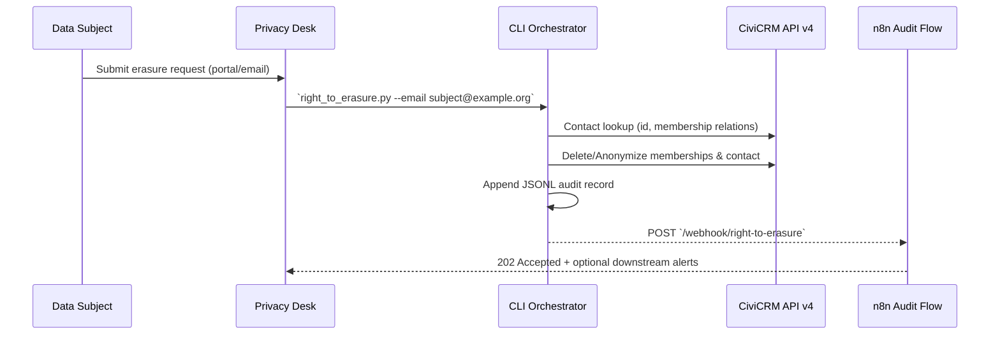

# GDPR Right to Erasure Workflow

_Last updated: 2025-10-05_

## 1. Purpose

Automates fulfilment of Article 17 deletion requests across the Menschlichkeit Österreich stack. The flow combines a CLI orchestrator, CiviCRM API calls, and an n8n audit webhook to ensure a verifiable, repeatable process.

## 2. High-Level Sequence



## 3. CLI Orchestrator

Path: `automation/privacy/right_to_erasure.py`.

### 3.1 Usage

```bash
# Dry-run to verify impact
python3 automation/privacy/right_to_erasure.py --email subject@example.org --dry-run

# Hard delete contact + memberships
python3 automation/privacy/right_to_erasure.py --email subject@example.org --mode delete

# Anonymise in place with metadata
python3 automation/privacy/right_to_erasure.py --contact-id 123 --metadata '{"ticket":"RT-2025-10"}'
```

### 3.2 Behaviour

- Resolves `CIVI_BASE_URL`, `CIVI_SITE_KEY`, `CIVI_API_KEY` from env or CLI flags.
- Pulls contact + memberships via CiviCRM API v4 (`Contact.get`, `Membership.get`).
- `--mode delete`: removes memberships, then calls `Contact.delete` (with `skip_undelete=true`).
- `--mode anonymize` (default): overwrites contact with placeholder data, sets `is_deleted=true`, preserves referential integrity.
- Appends audit JSON line to `logs/mcp/right-to-erasure.jsonl` and emits n8n webhook (`N8N_BASE_URL` + `N8N_WEBHOOK_SECRET`).
- Returns non-zero exit codes for missing contacts, Civi errors, or unexpected failures.

### 3.3 Audit Payload

```json
{
  "timestamp": "2025-10-05T18:42:10+00:00",
  "contact_id": 123,
  "original_email": "subject@example.org",
  "mode": "delete",
  "memberships_removed": [456, 789],
  "reason": "user_request",
  "metadata": {"ticket": "RT-2025-10"}
}
```

Files accumulate under `logs/mcp/right-to-erasure.jsonl` for DSFA evidence. Rotate via retention policy (Phase 1 cleanup scripts).

## 4. n8n Audit Workflow

Path: `automation/n8n/workflows/right-to-erasure.json` (inactive by default).

- Webhook `POST /webhook/right-to-erasure` accepts orchestrator events.
- HMAC validation with `X-Webhook-Signature` against `N8N_WEBHOOK_SECRET`.
- Normalises payload for downstream routing; currently responds `202 Accepted`.
- Extend with `Email Send`, `Slack`, or `OPA` nodes to integrate the compliance inbox.

## 5. Operational Checklist

1. **Capture Request** – Create ticket in privacy queue with request ID.
2. **Dry-Run** – Execute CLI with `--dry-run` to confirm affected records.
3. **Perform Deletion** – Run CLI in desired mode; verify exit code `0`.
4. **Audit Trail** – Confirm JSON line appended and n8n webhook accepted (202).
5. **Confirm Completion** – Update requester with closure artefacts, archive ticket.

## 6. Future Enhancements

- Hook CLI into Phase 1 retention automation (`npm run clean` extension) for scheduled purges.
- Add FastAPI endpoint `/privacy/erase` that wraps the CLI logic for operator UI usage.
- Extend n8n workflow to alert Security Champion + log to immutable audit bucket (Phase 3).
- Integrate Pseudonymised email receipts for requester confirmation.

## 7. References

- `docs/Repo & MCP-Server Optimierung.md` – Phase 0 tracker
- `docs/security/MCP-SERVER-THREAT-MODEL.md` – Logging and privacy controls
- `docs/security/AUTHENTICATION-FLOWS.md` – Token lifecycle impacting erasure scope
