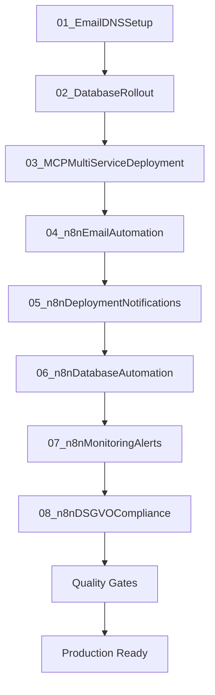

# .github Documentation Index

**Zweck:** Zentrales Verzeichnis aller Prompts, Instructions & Modes mit logischer Ausführungsreihenfolge

---

## 📋 Execution Order Overview



---

## 🚀 Deployment Prompts (Numerierte Ausführungsreihenfolge)

### Phase 1: Infrastructure Foundation

| # | Datei | Status | Beschreibung | Abhängigkeiten | Updates TODO |
|---|-------|--------|--------------|----------------|--------------|
| 01 | [01_EmailDNSSetup_DE.prompt.md](prompts/01_EmailDNSSetup_DE.prompt.md) | ✅ Complete | Email-Infrastruktur (8 Mailboxen, 20+ Aliases, DNS Security) | None | ✅ |
| 02 | [02_DatabaseRollout_DE.prompt.md](prompts/02_DatabaseRollout_DE.prompt.md) | ✅ Complete | 17-DB-Architektur (5 Plesk + 9 External MariaDB + 3 External PostgreSQL) | 01 | ✅ |
| 03 | [03_MCPMultiServiceDeployment_DE.prompt.md](prompts/03_MCPMultiServiceDeployment_DE.prompt.md) | ✅ Complete | Multi-Service Deployment (20+ Subdomains, Quality Gates, Rollback) | 01, 02 | ✅ |

### Phase 2: n8n Automation & Compliance

| # | Datei | Status | Beschreibung | Abhängigkeiten | Updates TODO |
|---|-------|--------|--------------|----------------|--------------|
| 04 | [04_n8nEmailAutomation_DE.prompt.md](prompts/04_n8nEmailAutomation_DE.prompt.md) | ✅ Complete | Email-Automatisierung (CiviMail, Autoresponder, DKIM, Bounces) | 01, 02 | ✅ |
| 05 | [05_n8nDeploymentNotifications_DE.prompt.md](prompts/05_n8nDeploymentNotifications_DE.prompt.md) | ✅ Complete | CI/CD Alerts, Quality Gates & Rollback Trigger | 01, 02, 03 | ✅ |
| 06 | [06_n8nDatabaseAutomation_DE.prompt.md](prompts/06_n8nDatabaseAutomation_DE.prompt.md) | ✅ Complete | Backups, Health Checks & Migration Tracking (17 DBs) | 02 | ✅ |
| 07 | [07_n8nMonitoringAlerts_DE.prompt.md](prompts/07_n8nMonitoringAlerts_DE.prompt.md) | ✅ Complete | Grafana Alerts, SSL Monitoring & Service Health | 03 | ✅ |
| 08 | [08_n8nDSGVOCompliance_DE.prompt.md](prompts/08_n8nDSGVOCompliance_DE.prompt.md) | ✅ Complete | Betroffenenrechte, Consent Sync & Retention-Automation | 02 | ✅ |

### Phase 3: CRM & Vereinsbuchhaltung

| # | Datei | Status | Beschreibung | Abhängigkeiten | Updates TODO |
|---|-------|--------|--------------|----------------|--------------|
| 09 | [CiviCRM_Vereinsbuchhaltung_DE.prompt.md](prompts/CiviCRM_Vereinsbuchhaltung_DE.prompt.md) | 🆕 Draft | Einrichtung & Betrieb der Vereinsbuchhaltung (Beiträge, Spenden, SEPA) | 02, 03 | 🔄 |
| 10 | [CiviCRM_n8n_Automation_DE.prompt.md](prompts/CiviCRM_n8n_Automation_DE.prompt.md) | 🆕 Draft | Automationsplan (CiviCRM + n8n + Monitoring) | 02, 03, 09 | 🔄 |

### Phase 3: MCP-Specific Operations

| # | Datei | Status | Beschreibung | Kategorie |
|---|-------|--------|--------------|-----------|
| 04 | [MCPDatabaseMigration_DE.prompt.md](prompts/MCPDatabaseMigration_DE.prompt.md) | 📝 Needs Update | DB Migrations mit PostgreSQL MCP | Database |
| 05 | [MCPFeatureImplementation_DE.prompt.md](prompts/MCPFeatureImplementation_DE.prompt.md) | 📝 Needs Update | Feature-Entwicklung mit MCP-Tools | Development |
| 06 | [MCPDSGVOComplianceAudit_DE.prompt.md](prompts/MCPDSGVOComplianceAudit_DE.prompt.md) | 📝 Needs Update | DSGVO Compliance-Prüfung | Compliance |
| 07 | [MCPSecurityIncident_DE.prompt.md](prompts/MCPSecurityIncident_DE.prompt.md) | 📝 Needs Update | Security Incident Response | Security |

### Phase 4: Development Workflows

| # | Datei | Status | Beschreibung | Use Case |
|---|-------|--------|--------------|----------|
| 10 | [CodeReview_DE.prompt.md](prompts/CodeReview_DE.prompt.md) | ✅ Complete | Code Review Guidelines | Quality |
| 11 | [SicherheitsAudit_DE.prompt.md](prompts/SicherheitsAudit_DE.prompt.md) | ✅ Complete | Security Audit Prozess | Security |
| 12 | [PerformanceOptimierung_DE.prompt.md](prompts/PerformanceOptimierung_DE.prompt.md) | ✅ Complete | Performance Optimization | Performance |
| 13 | [APIDesign_DE.prompt.md](prompts/APIDesign_DE.prompt.md) | ✅ Complete | API Design Best Practices | Architecture |
| 14 | [DatenbankSchema_DE.prompt.md](prompts/DatenbankSchema_DE.prompt.md) | ✅ Complete | Database Schema Design | Database |

### Phase 5: Documentation & Onboarding

| # | Datei | Status | Beschreibung | Audience |
|---|-------|--------|--------------|----------|
| 20 | [README_DE.prompt.md](prompts/README_DE.prompt.md) | ✅ Complete | README-Dokumentation | Developers |
| 21 | [BenutzerDokumentation_DE.prompt.md](prompts/BenutzerDokumentation_DE.prompt.md) | ✅ Complete | User Documentation | End Users |
| 22 | [Onboarding_DE.prompt.md](prompts/Onboarding_DE.prompt.md) | ✅ Complete | Developer Onboarding | New Team Members |
| 23 | [DeploymentGuide_DE.prompt.md](prompts/DeploymentGuide_DE.prompt.md) | 📝 Needs Update | Deployment Documentation | DevOps |
| 24 | [24_READMEModernization_DE.prompt.md](prompts/24_READMEModernization_DE.prompt.md) | ✅ Complete | Automatisierte README-Audits & Modernisierung | Docs Team |

### Phase 6: Planning & Strategy

| # | Datei | Status | Beschreibung | Purpose |
|---|-------|--------|--------------|---------|
| 30 | [Roadmap_DE.prompt.md](prompts/Roadmap_DE.prompt.md) | ✅ Complete | Product Roadmap | Strategy |
| 31 | [FeatureVorschlag_DE.prompt.md](prompts/FeatureVorschlag_DE.prompt.md) | ✅ Complete | Feature Proposals | Product |
| 32 | [Lokalisierungsplan_DE.prompt.md](prompts/Lokalisierungsplan_DE.prompt.md) | ✅ Complete | Localization Strategy | i18n |
| 33 | [Beitragsrichtlinien_DE.prompt.md](prompts/Beitragsrichtlinien_DE.prompt.md) | ✅ Complete | Contribution Guidelines | Community |

### n8n Prompt Library (Modular Erweiterungen)

| Datei | Kategorie | Beschreibung |
|-------|-----------|--------------|
| [n8n/06-quality-reporting.md](prompts/n8n/06-quality-reporting.md) | Quality | Codacy, Coverage & Security Reports automatisieren |
| [n8n/07-monitoring.md](prompts/n8n/07-monitoring.md) | Monitoring | Service-Health, SSL & Datenbank-Checks |
| [n8n/08-backup-automation.md](prompts/n8n/08-backup-automation.md) | Backup | Backups, Restore-Tests & Retention |

---

## 🎯 Chat Modes (Spezialisierte Conversation Contexts)

| Datei | Zweck | Aktivierung | Verfügbare MCPs |
|-------|-------|-------------|-----------------|
| [deployment-operations.mode.md](modes/deployment-operations.mode.md) | Sichere Deployments mit Quality Gates | "deployment mode", "deploy operations" | GitHub, Filesystem, PostgreSQL, Playwright, Brave Search |
| [documentation.mode.md](modes/documentation.mode.md) | Strukturierte README- & Dokumentations-Erstellung | "documentation mode", "create readme" | Filesystem, GitHub, Brave Search |
| [n8n-automation.mode.md](modes/n8n-automation.mode.md) | Geführte Automatisierungs-Workflows (n8n) | "n8n mode", "create n8n workflow" | Filesystem, GitHub, PostgreSQL, Brave Search |
| [n8n-workflows.mode.md](modes/n8n-workflows.mode.md) | Experte für Workflow-Design & Troubleshooting | "n8n workflows", "workflow coach" | Filesystem, GitHub, PostgreSQL, Brave Search |

**Geplante Modes:**
- `database-migration.mode.md` - DB Migration Operations
- `security-incident.mode.md` - Security Incident Response
- `feature-development.mode.md` - Feature Implementation
- `code-review.mode.md` - PR Review & Quality Checks

---

## 📚 Instructions (File-spezifische MCP-Anleitungen)

| Datei | Apply To | Priorität | Beschreibung |
|-------|----------|-----------|--------------|
| [codacy.instructions.md](instructions/codacy.instructions.md) | `**` | CRITICAL | Automatische Codacy-Analyse nach jedem Edit |
| [database-operations-mcp.instructions.md](instructions/database-operations-mcp.instructions.md) | `**/*.{sql,prisma,js,ts,py,php}` | HIGH | PostgreSQL MCP für 17-DB-Architektur |
| [figma-mcp.instructions.md](instructions/figma-mcp.instructions.md) | `figma-design-system/**,frontend/**,website/**` | HIGH | Design Token Sync aus Figma |
| [mcp-integration.instructions.md](instructions/mcp-integration.instructions.md) | `**/*` | HIGH | MCP Server Integration Guidelines |
| [plesk-deployment.instructions.md](instructions/plesk-deployment.instructions.md) | `deployment-scripts/**,scripts/**,**/deploy*.sh` | HIGH | Plesk SSH Deployment Config |
| [project-development.instructions.md](instructions/project-development.instructions.md) | `**/*` | HIGHEST | Vollständige Projekt-Entwicklungsregeln |
| [quality-gates.instructions.md](instructions/quality-gates.instructions.md) | `**/*` | CRITICAL | Automatische Quality Gates Enforcement |
| [documentation.instructions.md](instructions/documentation.instructions.md) | `**/*.md,**/README.md` | HIGH | Struktur & Qualitäts-Gates für Markdown & README |
| [markdown-best-practices.instructions.md](instructions/markdown-best-practices.instructions.md) | `**/*.md` | HIGH | Detaillierte Formatting- & Accessibility-Regeln |
| [n8n-automation.instructions.md](instructions/n8n-automation.instructions.md) | `automation/n8n/**,.github/prompts/0*_n8n*.md` | CRITICAL | n8n Workflow-Framework & Sicherheitsrichtlinien |

---

## 🔢 Nummerierungsschema

### Prompts (execution_order Metadaten)

```yaml
infrastructure: 01-09
  01: Email & DNS Setup
  02: Database Rollout
  03: Multi-Service Deployment
  04-09: Reserved for future infrastructure prompts

mcp_operations: 04-09
  04: MCP Database Migration
  05: MCP Feature Implementation
  06: MCP DSGVO Compliance Audit
  07: MCP Security Incident
  08-09: Reserved

development_workflows: 10-19
  10: Code Review
  11: Security Audit
  12: Performance Optimization
  13: API Design
  14: Database Schema
  15-19: Reserved

documentation: 20-29
  20: README
  21: User Documentation
  22: Onboarding
  23: Deployment Guide
  24-29: Reserved

planning: 30-39
  30: Roadmap
  31: Feature Proposal
  32: Localization Plan
  33: Contribution Guidelines
  34-39: Reserved
```

### Modes (alphabetisch, kein execution_order)

```yaml
modes:
  - code-review.mode.md
  - database-migration.mode.md
  - deployment-operations.mode.md ✅
  - civicrm-vereinsbuchhaltung.mode.md 🆕
  - civicrm-n8n-automation.mode.md 🆕
  - feature-development.mode.md
  - security-incident.mode.md
```

### Instructions (priority-based)

```yaml
critical:
  - codacy.instructions.md ✅
  - quality-gates.instructions.md ✅

highest:
  - project-development.instructions.md ✅

high:
  - database-operations-mcp.instructions.md ✅
  - figma-mcp.instructions.md ✅
  - mcp-integration.instructions.md ✅
  - plesk-deployment.instructions.md ✅
  - civicrm-vereinsbuchhaltung.instructions.md 🆕
  - civicrm-n8n-automation.instructions.md 🆕
```

---

## 📊 Status Legend

| Symbol | Bedeutung | Action Required |
|--------|-----------|-----------------|
| ✅ | Complete | Keine Action, bereit für Nutzung |
| 📝 | Needs Update | Mit aktueller Infrastruktur-Info aktualisieren |
| 🚧 | In Progress | Wird gerade bearbeitet |
| ⏸️ | On Hold | Warten auf Dependencies |
| ❌ | Deprecated | Nicht mehr verwenden |

---

## 🔄 TODO Auto-Update Integration

### Prompt Metadata (YAML Frontmatter)

Jeder numerierte Prompt enthält:

```yaml
---
description: Kurzbeschreibung
priority: critical | high | medium | low
category: deployment | database | security | etc.
execution_order: 1-99
requires: ["01_EmailDNSSetup_DE.prompt.md", "02_DatabaseRollout_DE.prompt.md"]
updates_todo: true | false
---
```

### TODO Update Trigger

Bei erfolgreicher Ausführung eines Prompts mit `updates_todo: true`:

**Manual:**
```bash
# Via Filesystem MCP:
"Update TODO.md: Mark tasks from 01_EmailDNSSetup as completed"
```

**Automated (geplant):**
```bash
# Via GitHub Actions (nach Deployment-Success)
./scripts/update-todo-from-prompt.sh 01_EmailDNSSetup_DE.prompt.md
```

**Script-Logik:**
1. Parse Prompt für Action Items `- [x]` Checkboxen
2. Identifiziere korrespondierende TODO.md Einträge
3. Update TODO.md mit Completion-Status
4. Git Commit: `chore(todo): Update from Prompt 01_EmailDNSSetup`

---

## 🛠️ Maintenance

### Monthly Review (1st of each month)

```bash
# Via Filesystem MCP:
"List all prompts with status 📝 Needs Update"

# Review:
- Aktualisiere mit neuer Infrastruktur-Info
- Verify execution_order noch korrekt
- Check requires[] Dependencies noch gültig
```

### Quarterly Audit (Q1, Q2, Q3, Q4)

```bash
# Via Brave Search MCP:
"Search for latest MCP server best practices 2025"

# Update:
- MCP Integration Instructions
- Prompt Templates mit neuen MCP-Features
- Mode-Definitionen mit erweiterten Capabilities
```

---

## 📝 Contribution Guidelines

### Neuer Prompt erstellen

1. **Nummerierung:** Wähle freie Nummer aus entsprechender Kategorie
2. **Template:** Kopiere existierenden Prompt als Vorlage
3. **Metadata:** Fülle YAML Frontmatter vollständig aus
4. **Dependencies:** Definiere `requires:` für Ausführungsreihenfolge
5. **Update Index:** Füge Eintrag in dieser Datei hinzu
6. **PR erstellen:** Via GitHub MCP mit label `documentation`

### Bestehenden Prompt aktualisieren

1. **Status ändern:** ✅ → 📝 während Bearbeitung
2. **Änderungen:** Update mit aktueller Infrastruktur-Info
3. **Metadata:** Verify `execution_order` & `requires` noch korrekt
4. **Status zurück:** 📝 → ✅ nach Completion
5. **Changelog:** Update im Prompt selbst dokumentieren

---

## 🔗 Quick Links

**Deployment:**
- [01_EmailDNSSetup](prompts/01_EmailDNSSetup_DE.prompt.md) - Email-Infrastruktur
- [02_DatabaseRollout](prompts/02_DatabaseRollout_DE.prompt.md) - 17-DB-Architektur
- [03_MCPMultiServiceDeployment](prompts/03_MCPMultiServiceDeployment_DE.prompt.md) - Multi-Service Deployment

**Development:**
- [Project Development Instructions](instructions/project-development.instructions.md) - Vollständige Dev-Guidelines
- [Quality Gates Instructions](instructions/quality-gates.instructions.md) - Automatische Quality Enforcement
- [MCP Integration Instructions](instructions/mcp-integration.instructions.md) - MCP Server Usage

**Operations:**
- [Deployment Operations Mode](modes/deployment-operations.mode.md) - Deployment Chat Mode
- [Database Operations Instructions](instructions/database-operations-mcp.instructions.md) - PostgreSQL MCP Usage
- [Plesk Deployment Instructions](instructions/plesk-deployment.instructions.md) - Plesk SSH Deployment

**Security & Secrets:**
- [SECRETS.template.md](../docs/SECRETS.template.md) - Vollständige Secrets-Matrix für 17-DB-Architektur
- [SECRETS-MANAGEMENT-SCRIPTS.md](../docs/SECRETS-MANAGEMENT-SCRIPTS.md) - Automatisierte Secrets-Verwaltung
- [`setup-github-secrets.ps1`](../scripts/setup-github-secrets.ps1) - GitHub Secrets Bulk-Upload
- [`generate-production-secrets.py`](../scripts/generate-production-secrets.py) - Sichere Credential-Generierung
- [`validate-secrets.sh`](../scripts/validate-secrets.sh) - Umfassende Service-Validation
- [`rotate-secrets.sh`](../scripts/rotate-secrets.sh) - Automatische Secret-Rotation

---

**Letzte Aktualisierung:** 2025-10-07 (SECRETS Management Scripts hinzugefügt)
**Maintainer:** Development Team via GitHub Issues
