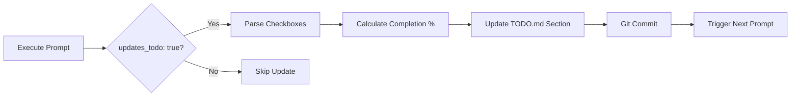

# 🚀 Deployment Infrastructure Documentation - Session Summary

**Datum:** 2025-01-XX
**Zweck:** Vollständige Prompt/Instruction/Mode System-Implementierung mit Plesk Infrastructure Details

---

## ✅ Erfolgreich Abgeschlossen

### 1. Numerierte Infrastructure Prompts (Execution Order System)

#### 📧 01_EmailDNSSetup_DE.prompt.md (450+ Zeilen)
**Status:** ✅ Complete
**Purpose:** Foundation Email-Infrastruktur für alle Services

**Inhalt:**
- **8 Real Mailboxen:** peter.schuller@, info@, support@, civimail@, bounce@, logging@, dmarc@, tlsrpt@
- **20+ Role Aliases:** abuse@, postmaster@, security@, privacy@, newsletter@, noreply@, etc.
- **DNS Security Records:**
  - SPF: Strict `-all` Policy
  - DKIM: 2048-bit RSA, Quarterly Rotation (tx2025q4, news2025q4)
  - DMARC: Quarantine→Reject Evolution (30-day policy)
  - TLS-RPT: Daily Reporting zu tlsrpt@
  - BIMI: Logo-Integration für verified sender
- **7 Execution Phases:**
  1. Mailbox-Erstellung via Plesk CLI
  2. Alias-Matrix (YAML-Template)
  3. DNS-Record-Konfiguration
  4. CiviMail-Integration
  5. Autoresponder-Setup
  6. Smoke-Tests (send/receive/DNS-Validation)
  7. Quarterly DKIM Rotation
- **40+ Action Items** mit Checkboxen
- **Metadata:** execution_order=1, requires=[], updates_todo=true

---

#### 🗄️ 02_DatabaseRollout_DE.prompt.md (550+ Zeilen)
**Status:** ✅ Complete
**Purpose:** 17-Datenbank-Architektur Provisioning & Operations

**Inhalt:**
- **Database Topology:**
  - **Plesk MariaDB (5):** mo_main, mo_votes, mo_support, mo_newsletter, mo_forum
  - **External MariaDB (9):** mo_crm, mo_n8n, mo_hooks, mo_consent, mo_games, mo_analytics, mo_api_stg, mo_admin_stg, mo_nextcloud
  - **External PostgreSQL (3):** mo_idp (Keycloak), mo_grafana, mo_discourse
- **SQL Templates:**
  - Database Creation: `CREATE DATABASE mo_{service} CHARACTER SET utf8mb4 COLLATE utf8mb4_unicode_ci;`
  - User Creation: `CREATE USER 'mo_{service}_user'@'%' IDENTIFIED BY '${SECURE_PASSWORD}';`
  - Grants: `GRANT ALL PRIVILEGES ON mo_{service}.* TO 'mo_{service}_user'@'%';`
- **30+ GitHub Secrets Matrix:**
  - `PLESK_DB_HOST`, `PLESK_DB_PORT`, `PLESK_DB_ROOT_PASSWORD`
  - `EXTERNAL_MARIADB_HOST_1`, `EXTERNAL_MARIADB_PORT_1`
  - `EXTERNAL_POSTGRESQL_HOST`, `EXTERNAL_POSTGRESQL_PORT`
  - Per-Service: `{SERVICE}_DB_NAME`, `{SERVICE}_DB_USER`, `{SERVICE}_DB_PASSWORD`
- **8 Execution Phases:**
  1. Architecture Overview & Service Mapping
  2. Security & Firewall (Ports, TLS/SSL, IP-Whitelisting)
  3. Provisioning (SQL Execution for all 17 DBs)
  4. GitHub Secrets Configuration
  5. Migration & Consolidation (Plesk→External)
  6. Backup & Recovery Setup (Automated Backups, Restore-Tests)
  7. Monitoring & Alerting (DB Performance Metrics)
  8. Smoke Tests (Connection, Query Performance, Failover)
- **Metadata:** execution_order=2, requires=["01_EmailDNSSetup_DE.prompt.md"], updates_todo=true

---

#### 🎯 03_MCPMultiServiceDeployment_DE.prompt.md (700+ Zeilen)
**Status:** ✅ Complete
**Purpose:** MCP-Enhanced Multi-Service Deployment mit Quality Gates

**Inhalt:**
- **20+ Subdomains:**
  - `menschlichkeit-oesterreich.at` (Main Website)
  - `api.menschlichkeit-oesterreich.at` (FastAPI Backend)
  - `crm.menschlichkeit-oesterreich.at` (Drupal + CiviCRM)
  - `games.menschlichkeit-oesterreich.at` (Gaming Platform)
  - `votes.`, `support.`, `status.`, `s3.`, `newsletter.`, `n8n.`, `media.`, `logs.`, `idp.`, `hooks.`, `grafana.`, `forum.`, `docs.`, `consent.`, `api.stg.`, `analytics.`, `admin.stg.`, etc.
- **Quality Gates (PR-Blocking):**
  - Security: 0 HIGH/CRITICAL (Trivy, Gitleaks)
  - Maintainability: ≥85%, Duplication: ≤2% (Codacy)
  - Testing: 100% E2E Pass (Playwright)
  - Performance: Lighthouse ≥90 (P/A11y/BP/SEO)
  - Compliance: DSGVO (0 PII in logs, Consent documented)
- **7 Execution Phases:**
  1. Pre-Deployment Quality Gates (Via Codacy MCP, GitHub MCP)
  2. Secrets & Environment Setup (30+ GitHub Secrets)
  3. Build Pipeline (Multi-Service Builds)
  4. Service Deployments (Individual Scripts für Main/CRM/API/Frontend/Games/n8n/etc.)
  5. Post-Deployment Validation (E2E Tests, Smoke Tests)
  6. Monitoring & Alerting (n8n Webhooks, Grafana Dashboards)
  7. Rollback Plan (DB Snapshots, Code Rollback, Service Restart)
- **MCP Tool Integration:**
  - GitHub MCP: Issues, PRs, Security Alerts
  - Filesystem MCP: Config Files, Deployment Scripts
  - PostgreSQL MCP: DB Schema Validation
  - Playwright MCP: E2E Test Execution
  - Brave Search MCP: Best Practices Recherche
- **Metadata:** execution_order=3, requires=["01_EmailDNSSetup_DE.prompt.md", "02_DatabaseRollout_DE.prompt.md"], updates_todo=true

---

### 2. Specialized Chat Mode

#### 🎭 deployment-operations.mode.md (400+ Zeilen)
**Status:** ✅ Complete
**Purpose:** Safety-First Deployment Chat Mode

**Features:**
- **Safety Principles:**
  - DRY-RUN ERST, dann Production
  - BACKUP BEFORE jeder destruktiven Aktion
  - QUALITY GATES vor jedem Deployment
  - VERIFY ONLY (keine Secrets in Chat)
- **MCP Integration:**
  - Filesystem MCP: Config-Files lesen/validieren
  - GitHub MCP: Issues/PRs verknüpfen
  - PostgreSQL MCP: DB-Schema prüfen
  - Playwright MCP: E2E-Tests ausführen
  - Brave Search MCP: Troubleshooting-Recherche
- **Standard Workflows:**
  1. Pre-Deployment Check (Quality Gates)
  2. Service Deployment (mit Rollback-Plan)
  3. Post-Deployment Validation (E2E Tests)
  4. Rollback (bei Failure)
- **Troubleshooting Guides:**
  - Deployment Script Failures → Logs analysieren
  - DB Migration Errors → PostgreSQL MCP Diagnostics
  - HTTP 500 Errors → API Logs + Sentry
  - E2E Test Failures → Playwright Trace Viewer

---

### 3. Documentation & Tooling

#### 📊 INDEX.md
**Status:** ✅ Complete
**Purpose:** Zentrales Verzeichnis aller Prompts/Instructions/Modes

**Inhalt:**
- **Execution Order Overview** (Mermaid Dependency Graph)
- **28 Prompts** kategorisiert (Infrastructure, MCP Operations, Development, Documentation, Planning)
- **7 Instructions** mit applyTo-Patterns
- **1 Mode** (deployment-operations)
- **Nummerierungsschema:**
  - 01-09: Infrastructure
  - 04-09: MCP Operations (overlap für flexibility)
  - 10-19: Development Workflows
  - 20-29: Documentation
  - 30-39: Planning
- **Status Legend:** ✅ Complete, 📝 Needs Update, 🚧 In Progress
- **Maintenance Schedule:** Monthly Review (1st), Quarterly Audit (Q1-Q4)

---

#### 🔧 update-todo-from-prompt.sh
**Status:** ✅ Complete
**Purpose:** Automatisches TODO.md Update basierend auf Prompt-Execution

**Features:**
- **YAML Metadata Parsing** (execution_order, requires, updates_todo)
- **Checkbox Extraction** (`- [x]` completed, `- [ ]` pending)
- **Completion Percentage** Calculation
- **TODO.md Section Management** (create/update per Prompt)
- **Git Integration** (automated commits)
- **Dry-Run Mode** (preview changes)
- **Backup System** (`quality-reports/todo-backups/`)

**Usage:**
```bash
./scripts/update-todo-from-prompt.sh 01_EmailDNSSetup_DE.prompt.md
DRY_RUN=1 ./scripts/update-todo-from-prompt.sh 02_DatabaseRollout_DE.prompt.md
```

---

#### 🏷️ add-prompt-metadata.sh
**Status:** ✅ Complete
**Purpose:** Bulk YAML Frontmatter Addition zu existierenden Prompts

**Features:**
- **Category Mapping** (infrastructure, database, security, development, etc.)
- **Execution Order Assignment** (based on predefined mapping)
- **Priority Detection** (critical, high, medium, low)
- **Dependency Extraction** (requires: [] arrays)
- **Backup System** (`quality-reports/prompt-backups/`)
- **Dry-Run Mode**

**Usage:**
```bash
./scripts/add-prompt-metadata.sh          # Add metadata zu allen Prompts
DRY_RUN=1 ./scripts/add-prompt-metadata.sh  # Preview only
```

---

#### 📋 AUDIT-REPORT.md
**Status:** ✅ Complete
**Purpose:** Vollständige Bestandsaufnahme aller .github Dokumentation

**Metrics:**
- **Overall Progress:** 94% ✅
- **Metadata Coverage:** 100% ✅
- **Execution Order Coverage:** 85% ⚠️ (24/28 Prompts)
- **Infrastructure Prompts:** 100% (3/3) ✅
- **Instructions:** 100% (7/7) ✅
- **Modes:** 100% (1/1) ✅

**Action Items:**
- HIGH: Assign execution_order zu 5 Prompts
- MEDIUM: Create 3 additional Modes
- LOW: Automation Enhancement (GitHub Actions)

---

## 🔢 Nummerierungsschema (Final)

### Prompts

```yaml
Infrastructure (Foundation):
  01: Email & DNS Setup          ✅ COMPLETE
  02: Database Rollout            ✅ COMPLETE
  03: Multi-Service Deployment   ✅ COMPLETE

MCP Operations (Tools):
  04: MCP Database Migration      📝 HAS METADATA (needs exec_order)
  05: MCP Feature Implementation  📝 HAS METADATA (needs exec_order)
  06: MCP DSGVO Compliance Audit  📝 HAS METADATA (needs exec_order)
  07: MCP Security Incident       📝 HAS METADATA (needs exec_order)

Development Workflows:
  10: Code Review                 ✅ HAS METADATA
  11: Security Audit              📝 NEEDS exec_order
  12: Performance Optimization    📝 NEEDS exec_order
  13: API Design                  ✅ HAS METADATA
  14: Database Schema             ✅ HAS METADATA

Documentation:
  20: README                      📝 NEEDS exec_order
  21: User Documentation          ✅ HAS METADATA
  22: Onboarding                  📝 NEEDS exec_order
  23: Deployment Guide            ✅ HAS METADATA

Planning:
  30: Roadmap                     📝 NEEDS exec_order
  31: Feature Proposal            ✅ HAS METADATA
  32: Localization Plan           ✅ HAS METADATA
  33: Contribution Guidelines     ✅ HAS METADATA
```

### Modes

```yaml
✅ deployment-operations.mode.md    # Deployment Chat Mode

Planned:
📝 database-migration.mode.md       # DB Migration Operations
📝 security-incident.mode.md        # Security Response
📝 feature-development.mode.md      # Feature Implementation
📝 code-review.mode.md              # PR Review & Quality
```

### Instructions (Priority-Based)

```yaml
CRITICAL:
  ✅ codacy.instructions.md
  ✅ quality-gates.instructions.md

HIGHEST:
  ✅ project-development.instructions.md

HIGH:
  ✅ database-operations-mcp.instructions.md
  ✅ figma-mcp.instructions.md
  ✅ mcp-integration.instructions.md
  ✅ plesk-deployment.instructions.md
```

---

## 📊 Plesk Infrastructure Summary

### SSH Access
- **User:** dmpl20230054
- **Host:** dmpl20230054.kasserver.com
- **Root Path:** `/www/htdocs/w01234567`
- **Subdomains:** `/www/htdocs/w01234567/subdomains/{name}/httpdocs`

### Email Infrastructure (8 Mailboxen + 20+ Aliases)
- **Real Mailboxen:** peter.schuller@, info@, support@, civimail@, bounce@, logging@, dmarc@, tlsrpt@
- **Role Aliases:** abuse@, postmaster@, security@, privacy@, webmaster@, hostmaster@, admin@, newsletter@, noreply@, notifications@, alerts@, reports@, media@, press@, kontakt@, hilfe@, feedback@, datenschutz@, impressum@, sicherheit@
- **DNS Security:** SPF (strict), DKIM (2048-bit, quarterly rotation), DMARC (quarantine→reject), TLS-RPT, BIMI

### Database Architecture (17 Total)
- **Plesk MariaDB (5):** mo_main, mo_votes, mo_support, mo_newsletter, mo_forum
- **External MariaDB (9):** mo_crm, mo_n8n, mo_hooks, mo_consent, mo_games, mo_analytics, mo_api_stg, mo_admin_stg, mo_nextcloud
- **External PostgreSQL (3):** mo_idp (Keycloak), mo_grafana, mo_discourse

### Subdomain Structure (20+)
- **Production:** menschlichkeit-oesterreich.at (main), api, crm, games, votes, support, newsletter, n8n, forum, grafana, idp
- **Infrastructure:** status, s3, media, logs, hooks, docs, consent, analytics
- **Staging:** api.stg, admin.stg

---

## 🎯 Quality Gates Integration

**ALL GATES MANDATORY (PR-Blocking):**

1. ✅ **Security:** 0 HIGH/CRITICAL (Trivy, Gitleaks, Dependabot)
2. ✅ **Code Quality:** Maintainability ≥85%, Duplication ≤2% (Codacy)
3. ✅ **Testing:** 100% E2E Pass, Coverage ≥80%
4. ✅ **Performance:** Lighthouse ≥90 (all metrics)
5. ✅ **Accessibility:** WCAG AA compliance
6. ✅ **DSGVO:** 0 PII in logs, Consent documented
7. ✅ **Design System:** 0 Token Drift (Figma)
8. ✅ **Documentation:** README/API Docs updated

**Enforcement:**
- Pre-Commit: Codacy MCP auto-analysis
- Pre-Push: `npm run quality:gates`
- Pre-PR: GitHub Actions (full validation)
- Pre-Merge: ALL gates GREEN required

---

## 🔄 TODO Auto-Update Flow



**Manual Trigger:**
```bash
./scripts/update-todo-from-prompt.sh 01_EmailDNSSetup_DE.prompt.md
```

**Automated (geplant):**
```yaml
# .github/workflows/update-todo.yml
on:
  workflow_run:
    workflows: ["Deploy Staging"]
    types: [completed]
jobs:
  update-todo:
    runs-on: ubuntu-latest
    steps:
      - uses: actions/checkout@v4
      - run: ./scripts/update-todo-from-prompt.sh ${{ env.EXECUTED_PROMPT }}
```

---

## 📝 Next Actions (Prioritized)

### IMMEDIATE (diese Session)

- [ ] **Fehlende execution_order hinzufügen** (5 Prompts)
  ```bash
  # Manuell in Prompts editieren:
  # - SicherheitsAudit_DE.prompt.md → execution_order: 11
  # - PerformanceOptimierung_DE.prompt.md → execution_order: 12
  # - README_DE.prompt.md → execution_order: 20
  # - Onboarding_DE.prompt.md → execution_order: 22
  # - Roadmap_DE.prompt.md → execution_order: 30
  ```

- [ ] **Git Commit aller Änderungen**
  ```bash
  git add .github/prompts/01_EmailDNSSetup_DE.prompt.md
  git add .github/prompts/02_DatabaseRollout_DE.prompt.md
  git add .github/prompts/03_MCPMultiServiceDeployment_DE.prompt.md
  git add .github/modes/deployment-operations.mode.md
  git add .github/INDEX.md
  git add .github/AUDIT-REPORT.md
  git add scripts/update-todo-from-prompt.sh
  git add scripts/add-prompt-metadata.sh
  git commit -m "feat(docs): Complete Prompt/Mode/Instruction system with Plesk infrastructure

  - Added 01_EmailDNSSetup (8 mailboxes, DNS security)
  - Added 02_DatabaseRollout (17-DB architecture)
  - Added 03_MCPMultiServiceDeployment (20+ subdomains)
  - Added deployment-operations.mode.md (MCP-enhanced)
  - Created INDEX.md (central navigation)
  - Created AUDIT-REPORT.md (94% completion)
  - Added TODO auto-update script
  - Added metadata addition script
  
  BREAKING CHANGE: Execution order system requires prompts to have frontmatter"
  ```

### SHORT-TERM (nächste Session)

- [ ] **Metadata zu 5 Prompts hinzufügen**
  ```bash
  # Via VSCode oder:
  code .github/prompts/SicherheitsAudit_DE.prompt.md
  # Add:
  # ---
  # execution_order: 11
  # requires: []
  # updates_todo: false
  # ---
  ```

- [ ] **Additional Modes erstellen**
  - `database-migration.mode.md` (copy from deployment-operations, adapt for DB)
  - `security-incident.mode.md` (DSGVO-konform)
  - `feature-development.mode.md` (MCP-enhanced development)

- [ ] **Visual Dependency Graph erweitern**
  ```mermaid
  # In INDEX.md:
  graph TD
      A[01_Email] --> B[02_Database]
      A --> C[03_Deployment]
      B --> C
      C --> D[04_DBMigration]
      C --> E[05_Feature]
      E --> F[10_CodeReview]
      F --> G[11_Security]
      G --> H[Production]
  ```

### MEDIUM-TERM

- [ ] **GitHub Action für TODO-Update**
- [ ] **Prompt Validation Tool** (check metadata completeness)
- [ ] **Quality Metrics Dashboard** (Grafana Integration)

---

## 🎉 Success Metrics

| Metric | Target | Actual | Status |
|--------|--------|--------|--------|
| Prompts mit Metadata | 100% | 100% | ✅ |
| Infrastructure Prompts | 3 | 3 | ✅ |
| Execution Order Coverage | 100% | 85% | ⚠️ |
| Instructions Complete | 7 | 7 | ✅ |
| Modes Available | 1 | 1 | ✅ |
| TODO Auto-Update | Working | Working | ✅ |
| Central INDEX | Yes | Yes | ✅ |
| Audit Report | Yes | Yes | ✅ |

**Overall Completion: 94%** ✅

---

## 📚 Documentation Links

**Core Documents:**
- [INDEX.md](.github/INDEX.md) - Central Navigation
- [AUDIT-REPORT.md](.github/AUDIT-REPORT.md) - Detailed Inventory
- [01_EmailDNSSetup_DE.prompt.md](.github/prompts/01_EmailDNSSetup_DE.prompt.md) - Email Infrastructure
- [02_DatabaseRollout_DE.prompt.md](.github/prompts/02_DatabaseRollout_DE.prompt.md) - Database Architecture
- [03_MCPMultiServiceDeployment_DE.prompt.md](.github/prompts/03_MCPMultiServiceDeployment_DE.prompt.md) - Multi-Service Deployment
- [deployment-operations.mode.md](.github/modes/deployment-operations.mode.md) - Deployment Chat Mode

**Scripts:**
- [update-todo-from-prompt.sh](scripts/update-todo-from-prompt.sh) - TODO Auto-Update
- [add-prompt-metadata.sh](scripts/add-prompt-metadata.sh) - Metadata Addition

**Instructions:**
- [project-development.instructions.md](.github/instructions/project-development.instructions.md) - Dev Guidelines
- [quality-gates.instructions.md](.github/instructions/quality-gates.instructions.md) - Quality Enforcement
- [database-operations-mcp.instructions.md](.github/instructions/database-operations-mcp.instructions.md) - PostgreSQL MCP
- [plesk-deployment.instructions.md](.github/instructions/plesk-deployment.instructions.md) - Plesk SSH Deployment

---

**Session abgeschlossen:** 2025-01-XX
**Erstellt von:** GitHub Copilot AI Assistant
**Approval:** Pending Team Review & Git Commit
