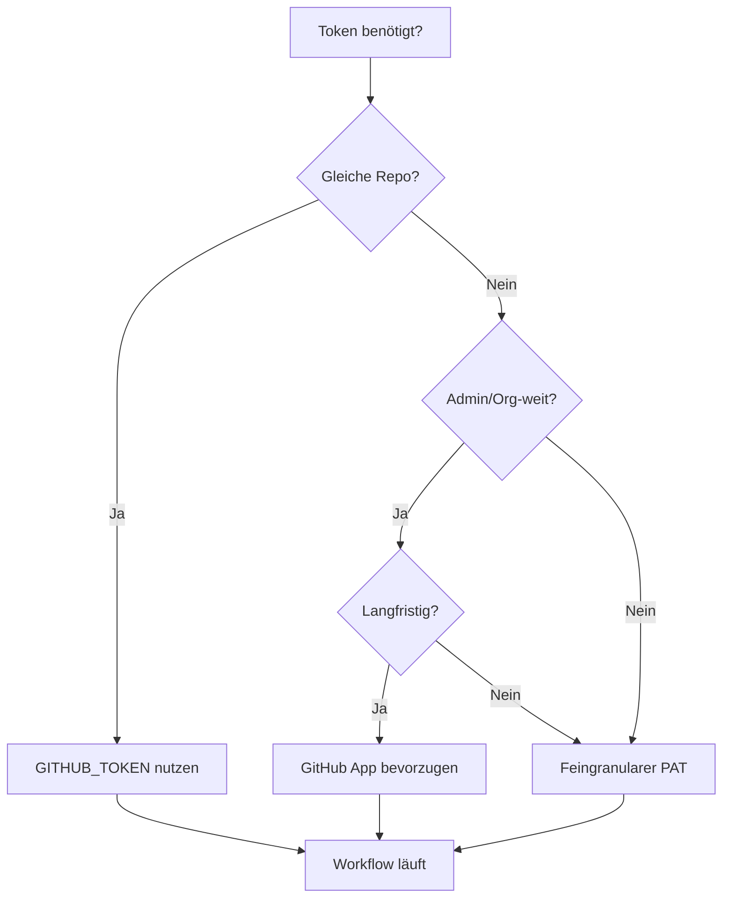

# 🔑 GitHub PAT – Optimal genutzt, sicher betrieben

**Rolle (an Copilot):**
Handle als DevOps/Security-Engineer. Implementiere **Least-Privilege-Nutzung**, **sichere Ablage**, **automatisierte Workflows** und **Rotation** für den GitHub-PAT (`GH_TOKEN`, gültig bis 18.10.2026). Keine Tokens im Klartext ins Repo.

---

## 0. Entscheidungslogik (wann welcher Token?)



**Prioritäts-Reihenfolge:**

1. **GITHUB_TOKEN** (Actions-Standard) – Vorgänge im gleichen Repo
2. **GitHub App** (langfristig, Org-weit, feingranular) – Integrationen/Bots
3. **Feingranularer PAT** (`GH_TOKEN`) – Nur wenn nötig:
   - Repo-übergreifend
   - Administration
   - Secrets-Management
   - Codespaces-Administration
   - Merge-Queue
   - Attestations
4. **OIDC** (Federation) – Cloud-Deployments ohne PAT

> **Copilot-Regel:** Nutze PAT **nur**, wenn `GITHUB_TOKEN`/GitHub App nicht ausreichen. Prüfe je Workflow explizit.

---

## 1. Sichere Ablage & Laden

### 1.1 Lokal (Entwickler)

**`.env.local`** (in `.gitignore`):

```dotenv
# NIEMALS committen!
GH_TOKEN=github_pat_11A43OH4Y0...
```

**VS Code Settings** (`.vscode/settings.json`):

```json
{
  "github.gitAuthentication": true,
  "terminal.integrated.env.windows": {
    "GH_TOKEN": "${env:GH_TOKEN}"
  },
  "terminal.integrated.env.linux": {
    "GH_TOKEN": "${env:GH_TOKEN}"
  },
  "terminal.integrated.env.osx": {
    "GH_TOKEN": "${env:GH_TOKEN}"
  }
}
```

**PowerShell Profile** (`$PROFILE`):

```powershell
# GitHub CLI Auto-Auth
if (Test-Path "$PSScriptRoot/.env.local") {
    Get-Content "$PSScriptRoot/.env.local" | ForEach-Object {
        if ($_ -match '^GH_TOKEN=(.+)$') {
            $env:GH_TOKEN = $Matches[1]
        }
    }
}
```

**Bash/Zsh Profile** (`~/.bashrc` / `~/.zshrc`):

```bash
# GitHub CLI Auto-Auth
if [ -f "$HOME/.env.local" ]; then
    export GH_TOKEN=$(grep '^GH_TOKEN=' "$HOME/.env.local" | cut -d'=' -f2)
fi
```

---

### 1.2 GitHub Actions (CI/CD)

**Repository Secrets** (Settings → Secrets and variables → Actions):

- `GH_TOKEN` (PAT)
- Optional: `GH_APP_ID`, `GH_APP_PRIVATE_KEY` (für spätere App-Migration)

**Zugriff in Workflow:**

```yaml
env:
  GH_TOKEN: ${{ secrets.GH_TOKEN }}
```

**WICHTIG:** Niemals `echo $GH_TOKEN` oder `set -x` bei Token-Operationen.

---

## 2. Standard-Workflows mit Token-Strategie

### 2.1 CI / PR (bevorzugt OHNE PAT)

**`.github/workflows/ci.yml`**

```yaml
name: CI
on:
  pull_request:
  push:
    branches: [main]

permissions:
  contents: read
  pull-requests: write

jobs:
  test:
    runs-on: ubuntu-latest
    steps:
      - uses: actions/checkout@v4  # Nutzt GITHUB_TOKEN automatisch

      - uses: actions/setup-node@v4
        with:
          node-version: 22

      - run: npm ci
      - run: npm test

      - name: Comment PR (mit GITHUB_TOKEN)
        if: github.event_name == 'pull_request'
        run: gh pr comment ${{ github.event.number }} --body "✅ Tests passed"
        env:
          GH_TOKEN: ${{ github.token }}  # GITHUB_TOKEN, NICHT secrets.GH_TOKEN
```

---

### 2.2 Admin/Repo-übergreifend (PAT erforderlich)

**`.github/workflows/admin-ops.yml`**

```yaml
name: Admin Operations
on:
  workflow_dispatch:
    inputs:
      operation:
        description: 'Operation (sync-labels|close-stale|update-secrets)'
        required: true
        type: choice
        options:
          - sync-labels
          - close-stale
          - update-secrets

permissions:
  contents: write
  discussions: write
  issues: write
  actions: write

jobs:
  admin-task:
    runs-on: ubuntu-latest
    steps:
      - uses: actions/checkout@v4
        with:
          token: ${{ secrets.GH_TOKEN }}  # Explizit PAT für cross-repo

      - name: Sync labels org-weit
        if: inputs.operation == 'sync-labels'
        run: |
          gh label clone peschull/menschlichkeit-oesterreich-development \
            --repo $GITHUB_REPOSITORY --force
        env:
          GH_TOKEN: ${{ secrets.GH_TOKEN }}

      - name: Close stale issues
        if: inputs.operation == 'close-stale'
        run: |
          gh issue list --state open --json number,updatedAt --jq \
            '.[] | select(.updatedAt < (now - 7776000)) | .number' | \
          xargs -I{} gh issue close {} --reason "not planned"
        env:
          GH_TOKEN: ${{ secrets.GH_TOKEN }}

      - name: Update repository secrets
        if: inputs.operation == 'update-secrets'
        run: |
          # Beispiel: Secret aus Vault holen und setzen
          gh secret set DATABASE_URL --body "$NEW_SECRET" --repo "$GITHUB_REPOSITORY"
        env:
          GH_TOKEN: ${{ secrets.GH_TOKEN }}
          NEW_SECRET: ${{ secrets.NEW_DATABASE_URL }}
```

---

### 2.3 Releases + Attestations (SLSA)

**`.github/workflows/release.yml`**

```yaml
name: Release
on:
  push:
    tags: ['v*.*.*']

permissions:
  contents: write
  attestations: write
  id-token: write

jobs:
  build-sign-release:
    runs-on: ubuntu-latest
    steps:
      - uses: actions/checkout@v4
        with:
          token: ${{ secrets.GH_TOKEN }}

      - uses: actions/setup-node@v4
        with:
          node-version: 22

      - name: Build
        run: |
          npm ci
          npm run build
          tar -czf artifact.tar.gz dist/

      - name: Generate provenance
        uses: actions/attest-build-provenance@v1
        with:
          subject-path: artifact.tar.gz

      - name: Create GitHub Release
        run: |
          gh release create "$GITHUB_REF_NAME" \
            artifact.tar.gz \
            --generate-notes \
            --verify-tag
        env:
          GH_TOKEN: ${{ secrets.GH_TOKEN }}

      - name: Attest artifact (SLSA)
        run: |
          gh attestation sign artifact.tar.gz \
            --repo "$GITHUB_REPOSITORY" \
            --predicate-type "https://slsa.dev/provenance/v1"
        env:
          GH_TOKEN: ${{ secrets.GH_TOKEN }}
```

---

### 2.4 Codespaces (gh CLI in devcontainer)

**`.devcontainer/devcontainer.json`**

```json
{
  "name": "Menschlichkeit Österreich Dev",
  "image": "mcr.microsoft.com/devcontainers/typescript-node:22",

  "features": {
    "ghcr.io/devcontainers/features/github-cli:1": {}
  },

  "postCreateCommand": "bash .devcontainer/post-create.sh",

  "remoteEnv": {
    "GH_TOKEN": "${localEnv:GH_TOKEN}"
  }
}
```

**`.devcontainer/post-create.sh`**

```bash
#!/bin/bash
set -e

# GitHub CLI Auth (falls GH_TOKEN gesetzt)
if [ -n "$GH_TOKEN" ]; then
    echo "$GH_TOKEN" | gh auth login --with-token
    gh auth status
fi

# Dependencies installieren
npm ci
```

---

## 3. Secrets, Variablen & Umgebungen

### 3.1 Kategorien

| Typ | Verwendung | Beispiel |
|-----|------------|----------|
| **Secrets** | Vertrauliche Daten (Tokens, Keys) | `GH_TOKEN`, `DATABASE_URL` |
| **Variables** | Unvertrauliche Konfiguration | `DEPLOY_ENV=prod` |
| **Environments** | Scoped Secrets + Approval-Regeln | `staging`, `production` |

### 3.2 Environment-basierte Deployments

**`.github/workflows/deploy.yml`**

```yaml
name: Deploy
on:
  workflow_dispatch:
    inputs:
      environment:
        description: 'Target Environment'
        required: true
        type: choice
        options: [staging, production]

jobs:
  deploy:
    runs-on: ubuntu-latest
    environment: ${{ inputs.environment }}  # Nutzt Environment Secrets

    steps:
      - uses: actions/checkout@v4

      - name: Deploy via SSH
        run: |
          ssh $DEPLOY_USER@$DEPLOY_HOST "cd /var/www && git pull"
        env:
          DEPLOY_USER: ${{ vars.DEPLOY_USER }}      # Variable (nicht Secret)
          DEPLOY_HOST: ${{ vars.DEPLOY_HOST }}      # Variable
          SSH_KEY: ${{ secrets.SSH_PRIVATE_KEY }}   # Secret (scoped per Environment)
```

**Environment Configuration** (Settings → Environments):

- **staging:** No protection rules
- **production:**
  - ✅ Required reviewers: @peschull
  - ✅ Wait timer: 5 minutes
  - ✅ Environment secrets: `SSH_PRIVATE_KEY_PROD`

---

## 4. Rechte-Optimierung (Least-Privilege)

### 4.1 Token-Scopes Audit

**Aktueller PAT-Scope (GH_TOKEN):**

```yaml
# Vollzugriff (zu weitreichend für CI/CD!)
repo: all
workflow: all
admin:org: all
admin:repo_hook: all
delete_repo: all
...
```

**Empfohlene Segmentierung:**

| Token | Scopes | Verwendung |
|-------|--------|-----------|
| `GH_TOKEN_CI` | `repo:status`, `repo:public_repo` | CI/PR Checks |
| `GH_TOKEN_ADMIN` | `admin:org`, `admin:repo_hook` | Admin-Operationen |
| `GH_TOKEN_PACKAGES` | `write:packages`, `delete:packages` | Package Registry |
| `GH_TOKEN_CODESPACES` | `codespace`, `codespace:secrets` | Devcontainer Management |

### 4.2 Workflow Permissions

**Minimal Permissions (Best Practice):**

```yaml
# Standard-Workflow (nur lesen)
permissions:
  contents: read
  pull-requests: write

# Release-Workflow (schreiben + signieren)
permissions:
  contents: write
  attestations: write
  id-token: write

# Admin-Workflow (alles)
permissions:
  contents: write
  actions: write
  discussions: write
  issues: write
  packages: write
```

**Copilot-Regel:** Setze `permissions:` **immer explizit**, auch wenn Workflow PAT nutzt.

---

## 5. Token-Rotation & Ablauf

### 5.1 Expiry-Reminder-Workflow

**`.github/workflows/pat-expiry-reminder.yml`**

```yaml
name: PAT Expiry Reminder
on:
  schedule:
    - cron: '0 7 * * *'  # Täglich 07:00 UTC (09:00 CEST)
  workflow_dispatch:

permissions:
  issues: write

jobs:
  check-expiry:
    runs-on: ubuntu-latest
    steps:
      - name: Calculate days until expiry
        id: calc
        run: |
          EXPIRY="2026-10-18"
          DAYS=$(( ( $(date -u -d "$EXPIRY" +%s) - $(date -u +%s) ) / 86400 ))
          echo "days=$DAYS" >> $GITHUB_OUTPUT

      - name: Create issue if ≤30 days
        if: steps.calc.outputs.days <= 30
        run: |
          DAYS=${{ steps.calc.outputs.days }}
          gh issue create \
            --title "🚨 PAT läuft in $DAYS Tagen ab" \
            --body "**Aktion erforderlich:**

          1. Neuen PAT erstellen: https://github.com/settings/tokens
          2. Secret \`GH_TOKEN\` aktualisieren
          3. Test-Workflow starten
          4. Alten PAT widerrufen

          **Siehe:** \`docs/security/GH-PAT-ROTATION.md\`" \
            --label "P0-Critical,security,automation"
        env:
          GH_TOKEN: ${{ secrets.GH_TOKEN }}
```

---

### 5.2 Rotation-Playbook

**`docs/security/GH-PAT-ROTATION.md`**

```markdown
# GitHub PAT Rotation – Schritt-für-Schritt

## 1. Vorbereitung (1 Woche vor Ablauf)

- [ ] Reminder-Issue prüfen (Auto-generiert bei ≤30 Tagen)
- [ ] Aktuellen PAT-Scope dokumentieren: `gh auth status`

## 2. Neuen PAT erstellen

**URL:** https://github.com/settings/tokens?type=beta

**Scopes (Minimum für CI/CD):**
- ✅ Contents: Read/Write
- ✅ Actions: Read/Write
- ✅ Secrets: Read/Write
- ✅ Attestations: Write
- ❌ Administration (nur wenn nötig)

**Ablauf:** 1 Jahr (2026-10-18 → 2027-10-18)

## 3. Secret aktualisieren

```bash
# GitHub UI: Settings → Secrets → GH_TOKEN → Update

# Oder via gh CLI (benötigt alten PAT):
echo "NEW_PAT_HERE" | gh secret set GH_TOKEN --repo peschull/menschlichkeit-oesterreich-development
```

## 4. Lokal updaten

```bash
# .env.local aktualisieren
nano .env.local  # GH_TOKEN=github_pat_NEW...

# Test
gh auth status
```

## 5. Workflow-Tests

```bash
# Test-Workflow manuell starten
gh workflow run ci.yml --ref main

# Logs prüfen
gh run list --workflow=ci.yml --limit 1
gh run view <RUN_ID> --log
```

## 6. Alten PAT widerrufen

**URL:** https://github.com/settings/tokens

- Alten PAT finden (z.B. "GH_TOKEN 2025-2026")
- **Delete** klicken
- Bestätigung: ✅

## 7. Dokumentation

- [ ] Rotation-Datum in `SECRETS-INVENTORY.md` eintragen
- [ ] Issue schließen: `gh issue close <ISSUE_NUMBER>`
- [ ] Audit-Log prüfen: Settings → Audit log → "token"

## Rollback (bei Problemen)

1. Alten PAT **NICHT** widerrufen (24h Wartezeit)
2. Secret zurücksetzen auf alten PAT
3. Workflows prüfen
4. Root-Cause-Analysis
```

---

## 6. Schutzmaßnahmen (Security Hardening)

### 6.1 Repository Settings

**Settings → Code security and analysis:**

- ✅ **Secret scanning** aktiviert
- ✅ **Push protection** aktiviert (blockiert Token-Commits)
- ✅ **Dependency graph** aktiviert
- ✅ **Dependabot alerts** aktiviert
- ✅ **Code scanning** (CodeQL) aktiviert

### 6.2 Branch Protection

**Settings → Branches → `main`:**

- ✅ Require pull request reviews (1+ Reviewer)
- ✅ Require status checks (CI, Security Scan)
- ✅ Require signed commits (GPG)
- ✅ Restrict push (nur Admins)
- ✅ Require linear history

### 6.3 Workflow-Sicherheit

**Nie in Logs/Artifacts:**

```yaml
# ❌ FALSCH – Token landet in Logs
- run: echo "Token: $GH_TOKEN"
  env:
    GH_TOKEN: ${{ secrets.GH_TOKEN }}

# ✅ RICHTIG – Token wird maskiert
- run: |
    set +x  # Debug-Modus aus
    gh api user --silent
  env:
    GH_TOKEN: ${{ secrets.GH_TOKEN }}
```

**Audit-Logging:**

```yaml
- name: Log operation (ohne Token)
  run: |
    echo "::notice::User authenticated as $(gh api user -q .login)"
  env:
    GH_TOKEN: ${{ secrets.GH_TOKEN }}
```

---

## 7. Admin-Aktionen (gh CLI + PAT)

### 7.1 Script-Sammlung

**`scripts/gh/repo-settings.sh`**

```bash
#!/bin/bash
# Repository-Einstellungen setzen (benötigt admin:repo Scope)

set -euo pipefail

REPO="${1:-peschull/menschlichkeit-oesterreich-development}"

# Sicherheits-Features aktivieren
gh api -X PATCH "repos/$REPO" \
  -f has_issues=true \
  -f has_wiki=true \
  -f has_discussions=true \
  -f allow_squash_merge=true \
  -f allow_merge_commit=false \
  -f allow_rebase_merge=false \
  -f delete_branch_on_merge=true

echo "✅ Repo-Settings aktualisiert: $REPO"
```

**`scripts/gh/webhook-setup.sh`**

```bash
#!/bin/bash
# Webhook für Deployment-Benachrichtigungen

REPO="$1"
WEBHOOK_URL="$2"

gh api "repos/$REPO/hooks" \
  -f name=web \
  -F config.url="$WEBHOOK_URL" \
  -F config.content_type=json \
  -F config.secret="$WEBHOOK_SECRET" \
  -f events[]="push" \
  -f events[]="pull_request" \
  -F active=true

echo "✅ Webhook konfiguriert: $WEBHOOK_URL"
```

**`scripts/gh/secret-sync.sh`**

```bash
#!/bin/bash
# Secrets zwischen Repos synchronisieren

SOURCE_REPO="peschull/menschlichkeit-oesterreich-development"
TARGET_REPO="peschull/website-prod"
SECRET_NAME="DATABASE_URL"

# Secret aus Source-Repo holen (Achtung: Nicht möglich via API!)
# Stattdessen: Manuell kopieren oder GitHub Apps nutzen

gh secret set "$SECRET_NAME" \
  --repo "$TARGET_REPO" \
  --body "$(cat .env.local | grep "^$SECRET_NAME=" | cut -d'=' -f2)"

echo "✅ Secret synchronisiert: $SECRET_NAME → $TARGET_REPO"
```

---

### 7.2 Code-Scanning-Alerts

```bash
# Alle Alerts auflisten
gh api repos/peschull/menschlichkeit-oesterreich-development/code-scanning/alerts

# Alert schließen
gh api -X PATCH repos/peschull/menschlichkeit-oesterreich-development/code-scanning/alerts/123 \
  -f state=dismissed \
  -f dismissed_reason="false positive"
```

---

## 8. VS Code Tasks

**`.vscode/tasks.json`**

```json
{
  "version": "2.0.0",
  "tasks": [
    {
      "label": "gh: Auth Status",
      "type": "shell",
      "command": "gh auth status",
      "problemMatcher": []
    },
    {
      "label": "gh: List Repos",
      "type": "shell",
      "command": "gh repo list --limit 50 --json name,visibility,updatedAt",
      "problemMatcher": []
    },
    {
      "label": "gh: List Issues (Open)",
      "type": "shell",
      "command": "gh issue list --state open --json number,title,labels",
      "problemMatcher": []
    },
    {
      "label": "gh: Create Issue",
      "type": "shell",
      "command": "gh issue create --title '${input:issueTitle}' --body '${input:issueBody}'",
      "problemMatcher": []
    },
    {
      "label": "gh: Run Workflow (Admin Ops)",
      "type": "shell",
      "command": "gh workflow run admin-ops.yml --ref main -f operation=sync-labels",
      "problemMatcher": []
    }
  ],
  "inputs": [
    {
      "id": "issueTitle",
      "type": "promptString",
      "description": "Issue-Titel"
    },
    {
      "id": "issueBody",
      "type": "promptString",
      "description": "Issue-Beschreibung"
    }
  ]
}
```

---

## 9. Definition of Done (DoD)

### Checklist (vor Merge)

- [ ] **GITHUB_TOKEN** wird bevorzugt (außer wo PAT zwingend)
- [ ] `GH_TOKEN` ist als **Repository-Secret** gesetzt
- [ ] Lokal nur in `.env.local` (nicht `.env`!)
- [ ] `permissions:` in Workflows **minimal gesetzt**
- [ ] **Expiry-Reminder-Workflow** aktiv (PAT-Ablauf ≤30 Tage)
- [ ] **Admin-Skripte** funktionieren (`scripts/gh/*.sh`)
- [ ] **Dokumentation** vollständig:
  - `docs/security/GH-TOKEN-USAGE.md`
  - `docs/security/GH-PAT-ROTATION.md`
- [ ] **Secret-Scanning** & **Push-Protection** aktiv
- [ ] **Keine Tokens in Logs/Artifacts** (Audit durchgeführt)
- [ ] **.env.example** aktualisiert (Platzhalter, keine Werte)

### Audit-Kommandos

```bash
# 1. Token-Leaks in Git-History suchen
git log -p | grep -i "github_pat_" && echo "❌ LEAK GEFUNDEN!" || echo "✅ Keine Leaks"

# 2. Workflows auf PAT-Nutzung prüfen
grep -r "secrets.GH_TOKEN" .github/workflows/ | wc -l

# 3. Permissions-Audit (sollte minimal sein)
grep -A5 "permissions:" .github/workflows/*.yml

# 4. Secret-Scanning-Status
gh api repos/peschull/menschlichkeit-oesterreich-development/secret-scanning/alerts
```

---

## 10. Migration zu GitHub Apps (langfristig)

### Warum GitHub Apps > PAT?

| Kriterium | PAT | GitHub App |
|-----------|-----|------------|
| **Ablauf** | 1 Jahr max | Kein Ablauf |
| **Rechte** | User-basiert (zu weitreichend) | Repo/Org-spezifisch |
| **Audit** | Schwer nachvollziehbar | Jede Aktion geloggt |
| **Rate-Limits** | 5000/h | 15000/h |
| **Installation** | Manuell | Org-weit automatisch |

### Migration-Playbook (Zukunft)

1. **GitHub App erstellen:** Settings → Developer settings → GitHub Apps
2. **Scopes setzen:** Minimal (nur `contents:read`, `actions:write`)
3. **Workflows migrieren:**
   ```yaml
   - uses: actions/create-github-app-token@v1
     id: app-token
     with:
       app-id: ${{ vars.APP_ID }}
       private-key: ${{ secrets.APP_PRIVATE_KEY }}

   - run: gh api user
     env:
       GH_TOKEN: ${{ steps.app-token.outputs.token }}
   ```
4. **PAT auslaufen lassen** (nicht erneuern)

---

## 11. Troubleshooting

### Problem: "Resource not accessible by token"

**Ursache:** Token-Scope reicht nicht aus.

**Lösung:**
```bash
# 1. Token-Scopes prüfen
gh auth status

# 2. Fehlenden Scope in GitHub UI hinzufügen:
#    Settings → Tokens → GH_TOKEN → Regenerate → Scopes anpassen
```

---

### Problem: "Bad credentials" in Workflow

**Ursache:** Secret `GH_TOKEN` nicht gesetzt oder abgelaufen.

**Lösung:**
```bash
# 1. Secret prüfen (Admin-Zugriff erforderlich)
gh secret list --repo peschull/menschlichkeit-oesterreich-development

# 2. Neu setzen
echo "NEW_TOKEN" | gh secret set GH_TOKEN --repo peschull/menschlichkeit-oesterreich-development
```

---

### Problem: Workflow nutzt `GITHUB_TOKEN` statt PAT

**Symptom:** Cross-Repo-Operation schlägt fehl.

**Lösung:**
```yaml
# Checkout mit PAT (nicht GITHUB_TOKEN)
- uses: actions/checkout@v4
  with:
    token: ${{ secrets.GH_TOKEN }}  # Explizit PAT
```

---

## 12. Referenzen

**Interne Dokumentation:**
- `.github/instructions/dsgvo-compliance.instructions.md` (Datenschutz bei Token-Logging)
- `docs/security/GH-TOKEN-USAGE.md` (Quick-Start-Guide)
- `docs/security/GH-PAT-ROTATION.md` (Rotation-Playbook)
- `scripts/gh/` (Admin-Skripte)

**Externe Quellen:**
- [GitHub PAT Best Practices](https://docs.github.com/en/authentication/keeping-your-account-and-data-secure/managing-your-personal-access-tokens)
- [Fine-grained PATs](https://github.blog/2022-10-18-introducing-fine-grained-personal-access-tokens-for-github/)
- [GitHub Apps vs PATs](https://docs.github.com/en/apps/creating-github-apps/authenticating-with-a-github-app/about-authentication-with-a-github-app)
- [Actions OIDC](https://docs.github.com/en/actions/deployment/security-hardening-your-deployments/about-security-hardening-with-openid-connect)

---

**Erstellt:** 2025-10-18
**Token-Ablauf:** 2026-10-18
**Nächste Review:** 2026-09-18 (1 Monat vor Ablauf)
**Owner:** Security Analyst + DevOps Engineer
**Status:** ACTIVE
