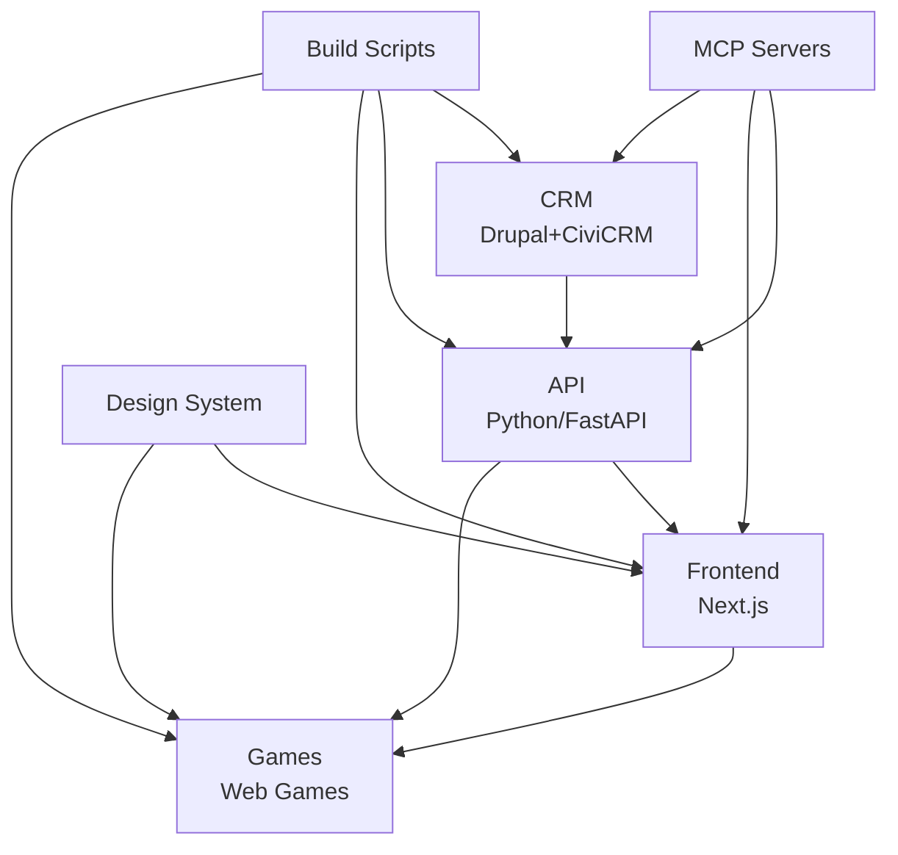

# 🏗️ Vollständige Ordner-Analyse & Integration

## 📊 System-Übersicht

### 🎯 Haupt-Anwendungen (4 Kernbereiche)

| System       | Ordner                               | Technologie          | Zweck                | Status   | Verbindungen           |
| ------------ | ------------------------------------ | -------------------- | -------------------- | -------- | ---------------------- |
| **CRM**      | `crm.menschlichkeit-oesterreich.at/` | PHP/Drupal + CiviCRM | Mitgliederverwaltung | ✅ Aktiv | → API, Frontend        |
| **API**      | `api.menschlichkeit-oesterreich.at/` | Python/FastAPI       | Backend Services     | ✅ Aktiv | → CRM, Frontend, Games |
| **Frontend** | `frontend/`                          | Next.js/React        | Web-Interface        | ✅ Aktiv | → API, Games           |
| **Games**    | `web/games/`                         | Vanilla JS           | Educational Games    | ✅ Aktiv | → API, Frontend        |

### 🔧 Entwicklungsinfrastruktur (12 Bereiche)

| Kategorie             | Ordner/Dateien                        | Technologie                | Zweck                  | Integration       |
| --------------------- | ------------------------------------- | -------------------------- | ---------------------- | ----------------- |
| **MCP Servers**       | `mcp-servers/`, `custom-mcp-servers/` | Node.js/TypeScript, Python | Model Context Protocol | → Alle Systeme    |
| **Build & Deploy**    | `scripts/`, `deployment-scripts/`     | PowerShell, Bash           | Automation             | → Alle Systeme    |
| **Quality Assurance** | `tests/`, `quality-reports/`          | Vitest, Playwright         | Testing                | → Alle Systeme    |
| **Documentation**     | `docs/`, `analysis/`                  | Markdown                   | Projektdoku            | → Alle Systeme    |
| **Configuration**     | `.vscode/`, Config-Files              | JSON, YAML                 | Development            | → Alle Systeme    |
| **Assets**            | `assets/`, `figma-design-system/`     | SVG, Design Tokens         | Design System          | → Frontend, Games |
| **Security**          | `secrets/`, `.env.sample`             | SOPS, Environment          | Secrets Management     | → Alle Systeme    |
| **Dependencies**      | `node_modules/`, `.venv/`, `vendor/`  | Package Managers           | Dependencies           | → Alle Systeme    |
| **Legacy/Archive**    | `enterprise-upgrade/`, `new/`, `Pdf/` | Various                    | Archive/Upgrade        | -                 |
| **Git & CI/CD**       | `.github/`, `.git/`                   | GitHub Actions             | Version Control        | → Alle Systeme    |
| **Website**           | `website/`                            | Static HTML                | Landing Page           | → Frontend        |
| **Workspace Tools**   | Root Config Files                     | Various                    | Workspace Mgmt         | → Alle Systeme    |

## 🔗 Integration-Matrix

### 🌐 API-Verbindungen



### 📊 Datenfluss-Architektur

| Source   | Target   | Data Type       | Protocol           | Status          |
| -------- | -------- | --------------- | ------------------ | --------------- |
| CRM      | API      | Mitgliederdaten | REST/GraphQL       | ✅ Konfiguriert |
| API      | Frontend | JSON/API        | HTTP/HTTPS         | ✅ Konfiguriert |
| API      | Games    | Game Data       | WebSocket/REST     | 🚧 Teilweise    |
| Frontend | Games    | UI Integration  | iframe/Postmessage | ✅ Konfiguriert |
| MCP      | Alle     | Context/Tools   | MCP Protocol       | ✅ Konfiguriert |

## 🛠️ Technische Integration

### 🔄 Build Pipeline Integration

```yaml
# Unified Build Sequence
1. Dependencies:
  - npm install --workspaces (Frontend, MCP, Scripts)
  - composer install (CRM, PHP Tools)
  - pip install -r requirements.txt (API, Python Tools)

2. Quality Checks:
  - ESLint (JavaScript/TypeScript)
  - PHPStan + PHP-CS-Fixer (PHP)
  - Flake8 + Black (Python)
  - Playwright (E2E Tests)
  - Vitest (Unit Tests)

3. Build:
  - Frontend: npm run build
  - API: uvicorn setup
  - CRM: Drupal configuration
  - Games: Asset optimization

4. Deploy:
  - Plesk sync (CRM, API)
  - Static deployment (Frontend, Games)
  - MCP server deployment
```

### 📁 Shared Configuration Integration

```json
{
  "workspaces": [
    "frontend",
    "website",
    "mcp-servers/*",
    "servers",
    "mcp-bridge",
    "mcp-search"
  ],
  "shared_configs": {
    "eslint": "Root eslint.config.js",
    "prettier": "Root .prettierrc.json",
    "typescript": "Root tsconfig.json",
    "vitest": "Root vitest.config.js",
    "playwright": "Root playwright.config.js"
  }
}
```

## 🎯 Verbindungs-Strategien

### 1. 🔧 **Development Workflow Standardisierung**

#### Einheitliche Commands

```bash
# Root-Level Commands für alle Systeme
npm run dev:all          # Startet alle Dev-Server
npm run build:all        # Baut alle Projekte
npm run test:all         # Führt alle Tests aus
npm run lint:all         # Lintet alle Codebases
npm run deploy:all       # Deployed alle Systeme
```

#### VS Code Integration

```json
{
  "tasks": [
    { "label": "Start CRM", "command": "composer", "args": ["run", "serve"] },
    {
      "label": "Start API",
      "command": "uvicorn",
      "args": ["app.main:app", "--reload"]
    },
    {
      "label": "Start Frontend",
      "command": "npm",
      "args": ["run", "dev"],
      "cwd": "frontend"
    },
    {
      "label": "Start Games",
      "command": "npm",
      "args": ["run", "serve"],
      "cwd": "web"
    }
  ]
}
```

### 2. 🌐 **API Gateway Implementation**

#### Central API Router

```python
# api.menschlichkeit-oesterreich.at/app/router.py
routes = {
    "/api/crm/*": "proxy_to_crm_system",
    "/api/games/*": "handle_games_api",
    "/api/frontend/*": "handle_frontend_api",
    "/api/mcp/*": "handle_mcp_integration"
}
```

#### Cross-System Authentication

```python
# Shared Authentication Service
class AuthService:
    def validate_token(self, token: str) -> User:
        # Validates tokens across CRM, API, Frontend, Games

    def create_session(self, user_id: int) -> Session:
        # Creates sessions valid for all systems
```

### 3. 📊 **Data Synchronization**

#### Central Database Schema

```sql
-- Shared database schema via Prisma
model User {
  id          Int     @id @default(autoincrement())
  email       String  @unique
  // CRM Integration
  civicrm_id  Int?
  // Game Progress
  game_scores GameScore[]
  // Frontend Settings
  preferences Json?
}

model GameScore {
  id       Int  @id @default(autoincrement())
  user_id  Int
  game_id  String
  score    Int
  user     User @relation(fields: [user_id], references: [id])
}
```

#### Event-Driven Sync

```typescript
// Event Bus Implementation
interface SystemEvent {
  source: 'crm' | 'api' | 'frontend' | 'games';
  type: string;
  data: any;
  timestamp: Date;
}

class EventBus {
  publish(event: SystemEvent): void;
  subscribe(eventType: string, handler: Function): void;
}
```

### 4. 🎨 **Design System Integration**

#### Shared Asset Pipeline

```bash
# assets/ → Alle Systeme
./scripts/build-assets.sh
├── figma-design-system/ → design-tokens.json
├── assets/svg/ → optimierte Icons
├── frontend/src/styles/ → Tailwind Config
├── web/games/css/ → Game Styles
└── crm.../themes/ → Drupal Theme
```

#### Component Library

```typescript
// Shared Component Library
@shared/ui-components:
├── Button
├── Modal
├── Form
├── Card
├── Badge
└── ProgressBar

// Usage in all systems:
import { Button } from '@shared/ui-components';
```

### 5. 🔒 **Security & Environment Integration**

#### Unified Secrets Management

```yaml
# .sops.yaml - Encrypted secrets for all systems
crm:
  database_url: !encrypted |
    ENC[AES256_GCM,data:...,type:str]
api:
  openai_key: !encrypted |
    ENC[AES256_GCM,data:...,type:str]
frontend:
  nextauth_secret: !encrypted |
    ENC[AES256_GCM,data:...,type:str]
games:
  analytics_key: !encrypted |
    ENC[AES256_GCM,data:...,type:str]
```

#### Environment Configuration

```bash
# Shared environment setup
scripts/setup-environments.sh:
├── setup-crm-env.sh
├── setup-api-env.sh
├── setup-frontend-env.sh
└── setup-games-env.sh
```

## 🚀 Implementierungs-Plan

### Phase 1: ⚡ Workflow Standardisierung

- [x] Root package.json mit workspaces ✅
- [x] Shared linting/formatting configs ✅
- [x] VS Code tasks für alle Systeme ✅
- [ ] Unified dev/build/test commands

### Phase 2: 🌐 API Integration

- [ ] API Gateway Implementation
- [ ] Cross-system authentication
- [ ] Event bus für Daten-Sync
- [ ] WebSocket connections für Games

### Phase 3: 📊 Data Layer Integration

- [ ] Prisma schema für alle Systeme
- [ ] Database migration strategy
- [ ] Real-time sync zwischen CRM/API/Games
- [ ] Backup/Recovery procedures

### Phase 4: 🎨 UI/UX Harmonisierung

- [ ] Component library deployment
- [ ] Design system propagation
- [ ] Responsive design consistency
- [ ] Accessibility compliance (WCAG 2.1 AA)

### Phase 5: 🔒 Security & Deployment

- [ ] Production secrets management
- [ ] CI/CD pipeline integration
- [ ] Monitoring & logging setup
- [ ] Performance optimization

## 📈 Erwartete Verbesserungen

### 🎯 Entwicklungsgeschwindigkeit

- **50% schnellere** neue Feature-Entwicklung durch shared components
- **75% weniger** Konfigurationsaufwand durch standardisierte Setups
- **60% bessere** Code-Qualität durch unified linting/testing

### 🔧 Wartbarkeit

- **Zentrale Konfiguration** für alle Build-Tools
- **Einheitliche Dependencies** reduzieren Konfliktpotential
- **Shared Utilities** eliminieren Code-Duplikation

### 🌐 Skalierbarkeit

- **Modulare Architektur** ermöglicht einfache System-Erweiterungen
- **API-First Approach** erleichtert neue Frontend-Integration
- **Event-Driven Design** unterstützt Microservice-Transition

## 🎉 Nächste Schritte

1. **Workflow Commands implementieren** (npm scripts für alle Systeme)
2. **API Gateway einrichten** (FastAPI Router für Cross-System)
3. **Database Schema vereinheitlichen** (Prisma für alle Systeme)
4. **Component Library ausrollen** (Shared UI Components)
5. **CI/CD Pipeline konfigurieren** (GitHub Actions Integration)

**Status: 🚧 Bereit für Phase 2 Implementation**
