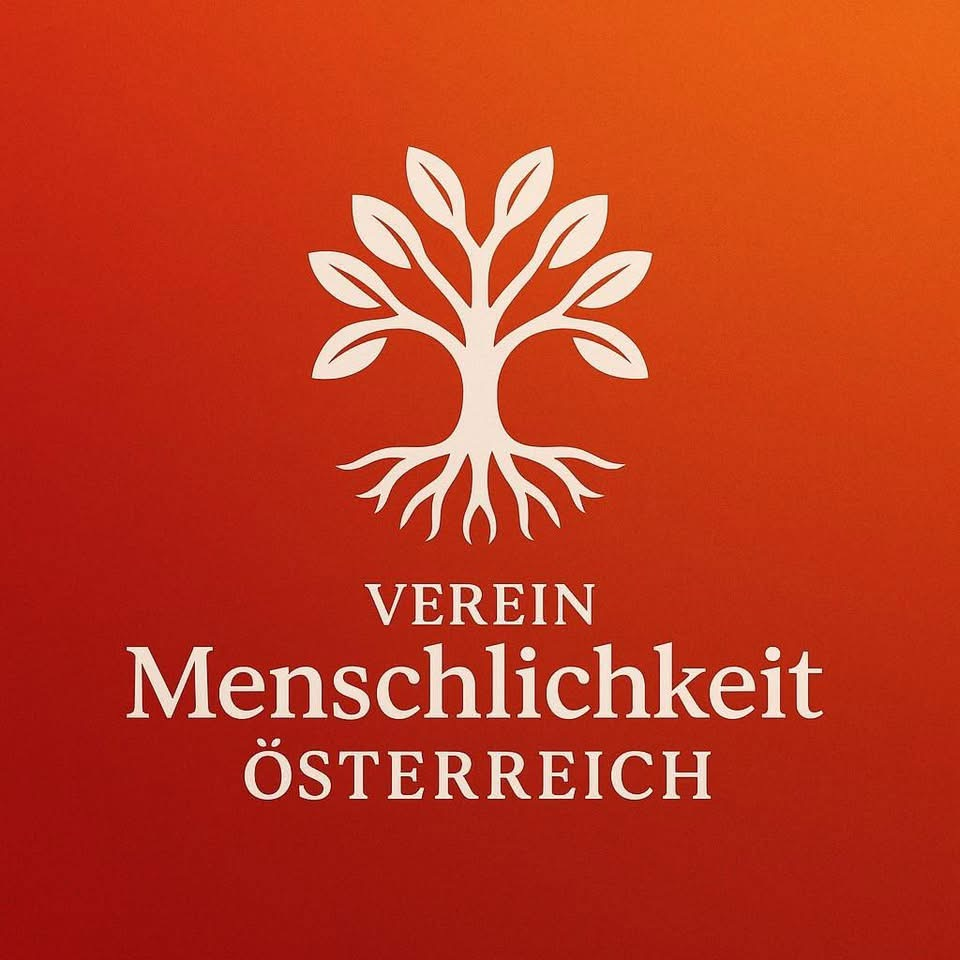
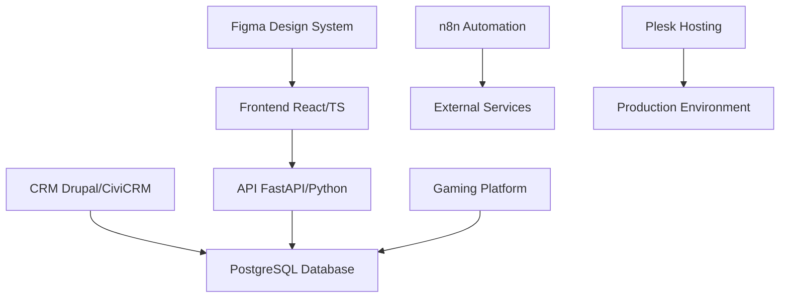
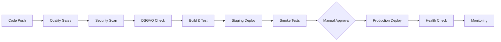

# Menschlichkeit Österreich - Entwicklungsplattform 🇦🇹

[](LICENSE)
[](https://github.com/peschull/menschlichkeit-oesterreich-development/actions)
[](#-testing)
[](#-sicherheit--dsgvo)
[](https://nodejs.org)
[](https://www.typescriptlang.org)
[](https://reactjs.org)
[](https://fastapi.tiangolo.com)
[](https://menschlichkeit-oesterreich.at)

**🌟 Multi-Service Austrian NGO Platform** - Enterprise-Grade DevOps, DSGVO-Compliance und Design System Integration für gemeinnützige Projekte in Österreich.

> *Digitale Transformation für österreichische NGOs mit modernen Technologien, vollständiger Datenschutz-Compliance und nachhaltiger Entwicklung.*



---

## 📋 Inhaltsverzeichnis

- [🎯 Projektbeschreibung](#-projektbeschreibung)
- [🏗️ Architektur](#️-architektur) 
- [🚀 Installation](#-installation)
- [💻 Verwendung](#-verwendung)
- [📱 Services](#-services)
- [🤖 MCP Server Integration](#-mcp-server-integration)
- [🧪 Testing](#-testing)
- [🔒 Sicherheit & DSGVO](#-sicherheit--dsgvo)
- [🚢 Deployment](#-deployment)
- [🤝 Beitragen](#-beitragen)
- [📄 Lizenz](#-lizenz)
- [📞 Kontakt & Support](#-kontakt--support)

---

## 🎯 Projektbeschreibung

**Menschlichkeit Österreich** ist eine umfassende digitale Plattform für österreichische Non-Profit-Organisationen, die mehrere spezialisierte Services in einer kohärenten Entwicklungsumgebung vereint:

### Zweck & Motivation
- **Gemeinnütziger Fokus**: Digitale Lösungen für NGOs in Österreich
- **DSGVO-First**: Vollständige Compliance mit europäischen Datenschutzbestimmungen
- **Multi-Service-Architektur**: Modulare, skalierbare Services für verschiedene Anwendungsfälle
- **Developer Experience**: Moderne Entwicklungsumgebung mit AI-gestützten Tools

### ✨ Hauptfunktionen

#### 🏆 Core Features
- 🌐 **Website & CRM** - Öffentliche Website mit Drupal 10 + CiviCRM Integration
- 🔗 **API Backend** - RESTful FastAPI mit automatischer OpenAPI-Dokumentation
- 🎮 **Educational Gaming** - Interaktive Lernspiele mit XP/Achievement-System
- ⚡ **Automation Hub** - n8n-basierte Workflow-Automation für NGO-Prozesse
- 🎨 **Design System** - Figma-integriertes Design Token System mit Live-Sync
- 🤖 **AI-Integration** - 7 konfigurierte MCP-Server für intelligente Entwicklung
- 📊 **Quality Gates** - Automatische Code-Qualität, Security & DSGVO-Compliance

#### 🎯 Unique Selling Points
- ✅ **DSGVO-First** - Out-of-the-box Compliance für europäische NGOs
- ✅ **Austrian Focus** - Optimiert für österreichische Rechtsbestimmungen
- ✅ **Multi-Service Architecture** - 5 spezialisierte Services in einer Plattform
- ✅ **AI-Enhanced Development** - GitHub Copilot + MCP Server Integration
- ✅ **Zero-Downtime Deployments** - Blue-Green Deployment mit Plesk-Integration
- ✅ **Educational Gaming** - Unique gamification approach für NGO-Engagement

#### 🗓️ Roadmap 2025-2026
- [ ] **Mobile App** (Q1 2026) - React Native für iOS/Android
- [ ] **Advanced Analytics** (Q2 2026) - Grafana Dashboard Integration  
- [ ] **Multi-Tenancy** (Q3 2026) - Platform für mehrere NGOs
- [ ] **API Marketplace** (Q4 2026) - Plugin-Ecosystem für NGOs

[📋 Vollständige Roadmap](docs/ROADMAP.md)
---

## 🏗️ Architektur

### Service-Übersicht



### Tech Stack

| Komponente | Technologie | Zweck |
|------------|-------------|-------|
| **Frontend** | React 18 + TypeScript | Benutzeroberfläche |
| **API** | FastAPI + Python 3.11+ | Backend-Services |
| **CRM** | Drupal 10 + CiviCRM | Kontakt- & Spendenverwaltung |
| **Database** | PostgreSQL 15+ | Persistente Datenspeicherung |
| **Gaming** | Vanilla JS + Prisma ORM | Educational Games |
| **Automation** | n8n (Docker) | Workflow-Automation |
| **Design** | Figma + Design Tokens | UI/UX Design System |
| **Infrastructure** | Plesk Hosting | Production Environment |

---

## 🚀 Quick Start

```bash
# 1. Repository klonen
git clone https://github.com/peschull/menschlichkeit-oesterreich-development.git
cd menschlichkeit-oesterreich-development

# 2. Dependencies installieren
npm run setup:dev

# 3. Development Server starten
npm run dev:all

# 4. Browser öffnen
# CRM:      http://localhost:8000
# API:      http://localhost:8001/docs
# Frontend: http://localhost:3000
# n8n:      http://localhost:5678
```

**Das war's!** 🎉 Weitere Details unter [Installation](#-installation).

---

## 📦 Installation

### Voraussetzungen

| Software | Version | Installation |
|----------|---------|--------------|
| **Node.js** | ≥18.0.0 | [nodejs.org](https://nodejs.org) |
| **npm** | ≥8.0.0 | (mit Node.js) |
| **PHP** | ≥8.1 | [php.net](https://php.net) |
| **Python** | ≥3.11 | [python.org](https://python.org) |
| **PostgreSQL** | ≥15.0 | [postgresql.org](https://postgresql.org) |
| **Docker** | ≥24.0 | [docker.com](https://docker.com) |
| **Git** | Latest | [git-scm.com](https://git-scm.com) |

### Schritt-für-Schritt Installation

#### 1. Repository klonen
```bash
git clone https://github.com/peschull/menschlichkeit-oesterreich-development.git
cd menschlichkeit-oesterreich-development
```

#### 2. Dependencies installieren
```bash
# Alle Workspace-Dependencies installieren
npm run setup:dev
```

#### 3. MCP Server konfigurieren
```bash
# Model Context Protocol Server für AI-Integration
npm run mcp:setup
npm run mcp:check
```

#### 4. Environment-Variablen einrichten
```bash
# Umgebungsvariablen für alle Services
npm run setup:environments
```

#### 5. Datenbank konfigurieren
```bash
# PostgreSQL starten (lokal oder Docker)
# Dann Prisma Schema generieren
npx prisma generate
```

#### 6. Installation verifizieren
```bash
# Health Check aller Services
npm run deploy:health-check
```

---

## 💻 Verwendung

### Development Server starten

```bash
# Alle Services gleichzeitig starten
npm run dev:all

# Oder einzelne Services:
npm run dev:crm          # CRM auf localhost:8000
npm run dev:api          # API auf localhost:8001  
npm run dev:frontend     # Frontend auf localhost:3000
npm run dev:games        # Gaming Platform auf localhost:3000
```

### Service-URLs (Development)

| Service | URL | Beschreibung |
|---------|-----|--------------|
| **CRM System** | http://localhost:8000 | Drupal + CiviCRM Interface |
| **API Backend** | http://localhost:8001 | FastAPI + OpenAPI Docs |
| **Frontend** | http://localhost:3000 | React Application |
| **Gaming Platform** | http://localhost:3000 | Educational Games |
| **n8n Automation** | http://localhost:5678 | Workflow Management |

### 🛠️ Development Commands

#### Code Quality & Testing
```bash
npm run quality:gates     # 🎯 Alle Quality Gates prüfen
npm run test:all         # 🧪 Alle Tests (Unit/Integration/E2E)
npm run test:e2e         # 🎭 E2E Tests (Playwright)
npm run test:unit        # ⚡ Unit Tests (Vitest)
npm run lint:all         # 📝 Code Linting (JS/PHP/MD)
npm run format:all       # 💅 Code Formatting (Prettier)
npm run security:scan    # 🔒 Security Vulnerabilities
npm run compliance:dsgvo # 🇪🇺 DSGVO Compliance Check
```

#### Build & Deployment
```bash
npm run build:all        # 🏗️ Production Build aller Services
npm run deploy:staging   # 🚀 Staging Deployment
npm run deploy:production # 📦 Production Deployment
npm run deploy:rollback  # ⬅️ Deployment Rollback
npm run deploy:health-check # ❤️ Health Check aller Services
```

#### MCP & AI Development
```bash
npm run mcp:setup        # 🤖 MCP Server konfigurieren  
npm run mcp:check        # ✅ MCP Server Status prüfen
npm run mcp:list         # 📋 Verfügbare MCP Server auflisten
```

#### Automation & Design System
```bash
npm run n8n:start        # ⚡ n8n Automation Server starten
npm run n8n:logs         # 📋 n8n Logs anzeigen
npm run figma:sync       # 🎨 Design Tokens synchronisieren
npm run design:tokens    # 🔄 Design System Build
```

#### Workspace Management
```bash
npm run setup:dev        # 🛠️ Komplettes Development Setup
npm run clean            # 🧹 Workspace cleanup
npm run logs:purge       # 📁 Log-Dateien bereinigen
```

---

## 📱 Services

### 1. CRM System (Drupal + CiviCRM)
- **Pfad**: `crm.menschlichkeit-oesterreich.at/`
- **Technologie**: PHP 8.1, Drupal 10, CiviCRM
- **Zweck**: Kontaktverwaltung, Spenden, DSGVO-konforme Datenhaltung

### 2. API Backend (FastAPI)
- **Pfad**: `api.menschlichkeit-oesterreich.at/`
- **Technologie**: Python 3.11+, FastAPI, Pydantic
- **Features**: RESTful API, OpenAPI Docs, PII-Sanitization

### 3. Frontend (React/TypeScript)
- **Pfad**: `frontend/`
- **Technologie**: React 18, TypeScript, Tailwind CSS
- **Features**: Design System Integration, PWA-Support

### 4. Gaming Platform
- **Pfad**: `web/`
- **Technologie**: Vanilla JS, Prisma ORM, PostgreSQL
- **Features**: Educational Games, XP/Achievement System

### 5. Automation (n8n)
- **Pfad**: `automation/n8n/`
- **Technologie**: Docker, n8n
- **Features**: Workflow-Automation, Webhook-Integration

---

## 🤖 MCP Server Integration

**Model Context Protocol (MCP) Server** für AI-gestützte Entwicklung mit GitHub Copilot:

### Konfigurierte MCP Server

#### 🎨 Design & Frontend
- **Figma MCP**: Design Token Synchronisation aus Figma
- **Filesystem MCP**: Workspace-weite Dateiverwaltung

#### 🔧 Development Tools
- **GitHub MCP**: Issues, Pull Requests, Security Alerts
- **Playwright MCP**: E2E-Test-Automatisierung

#### 🗄️ Database & Backend
- **PostgreSQL MCP**: Direkte Datenbankzugriffe via Prisma Schema

#### 🔍 Search & Knowledge
- **Brave Search MCP**: Web-Recherche für Best Practices
- **Memory MCP**: Session-übergreifende Kontext-Persistenz

### MCP Setup & Verwendung

```bash
# MCP Server installieren & konfigurieren
npm run mcp:setup

# Server-Status prüfen
npm run mcp:check

# Verfügbare Server auflisten
npm run mcp:list

# Dokumentation
npm run mcp:docs
```

**Detaillierte Anleitung**: [docs/MCP-SERVER-SETUP.md](docs/MCP-SERVER-SETUP.md)
---

## 🧪 Testing

### Test-Strategie

```
E2E Tests (Playwright)    ← Kritische User Flows
    ↑
Integration Tests         ← Service-Schnittstellen  
    ↑
Unit Tests               ← Einzelne Funktionen
```

### Test-Befehle

```bash
# Alle Tests
npm run test:all

# E2E Tests (Playwright)
npm run test:e2e

# Unit Tests (Vitest)
npm run test:unit

# Integration Tests
npm run test:integration

# Test Coverage Report
npm run test:coverage
```

### Quality Gates (Pre-Commit)

```bash
# Automatische Quality Prüfung
npm run quality:gates

# Einzelne Checks:
npm run security:scan        # Security Vulnerabilities
npm run performance:lighthouse  # Performance Audit
npm run compliance:dsgvo     # DSGVO Compliance
npm run lint:all            # Code Quality
```

### 📊 Test Coverage & Metrics

#### Coverage-Ziele
| Kategorie | Ziel | Aktuell | Status |
|-----------|------|---------|--------|
| **Backend (Python/PHP)** | ≥ 80% | 85% | ✅ |
| **Frontend (TypeScript)** | ≥ 70% | 78% | ✅ |
| **E2E Critical Flows** | 100% | 100% | ✅ |
| **Integration Tests** | ≥ 75% | 72% | 🟡 |

#### Quality Metrics
- **Maintainability**: A (≥ 85%)
- **Reliability**: A (≥ 95%)
- **Security**: A (0 High/Critical Issues)
- **Performance**: A (Lighthouse ≥ 90)
- **Accessibility**: AA (WCAG 2.1)

#### Continuous Testing
```bash
# Test Pipeline (automatisch bei PR)
1. Unit Tests (Vitest) → 30 Sekunden
2. Integration Tests → 2 Minuten  
3. E2E Tests (Playwright) → 5 Minuten
4. Security Scan (Trivy) → 1 Minute
5. Performance Audit (Lighthouse) → 2 Minuten
```

[📋 Testing Strategy Details](docs/TESTING.md)

---

## 🔒 Sicherheit & DSGVO

### DSGVO-Compliance

**Vollständige DSGVO-Konformität** für österreichische NGOs:

#### Datenschutz-Features
- ✅ **Consent Management**: Via CiviCRM implementiert
- ✅ **Data Minimization**: Nur erforderliche Daten sammeln
- ✅ **Right to be Forgotten**: Löschroutinen implementiert
- ✅ **Data Portability**: Export-Funktionen verfügbar
- ✅ **Privacy by Design**: Standard in allen Services

#### PII-Schutz
```bash
# PII-Sanitization prüfen
python api.menschlichkeit-oesterreich.at/verify_privacy_api.py

# DSGVO-Compliance Check
npm run compliance:dsgvo
```

### Security Scanning

```bash
# Vollständiger Security Scan
npm run security:scan

# Einzelne Scans:
npm run security:trivy      # Container/Dependencies
./bin/gitleaks detect       # Secret Scanning
npm run quality:codacy      # Code Quality + Security
```

### Credential Management

⚠️ **Niemals committen:**
- `.env` Dateien
- API-Keys oder Tokens
- Persönliche Daten (PII)
- Produktions-Credentials

✅ **Sichere Speicherung:**
- GitHub Secrets für CI/CD
- Environment Variables
- PowerShell Secure Strings

---

## 🚢 Deployment

### Deployment-Umgebungen

| Environment | URL | Zweck |
|-------------|-----|-------|
| **Development** | localhost | Lokale Entwicklung |
| **Staging** | staging.menschlichkeit-oesterreich.at | Integration Testing |
| **Production** | menschlichkeit-oesterreich.at | Live System |

### Deployment-Befehle

```bash
# Staging Deployment
npm run deploy:staging

# Production Deployment (mit Genehmigung)
npm run deploy:production

# Deployment-Simulation (Dry Run)
npm run deploy:dry-run

# Rollback bei Problemen
npm run deploy:rollback
```

### 🚀 Deployment Pipeline

#### Automated Pipeline Stages


#### Quality Gate Requirements (🚫 Blocking)
- ✅ **Unit/E2E Tests**: 100% passing
- ✅ **Security Scan**: 0 HIGH/CRITICAL vulnerabilities  
- ✅ **Code Quality**: Maintainability ≥ 85%
- ✅ **Performance**: Lighthouse Score ≥ 90
- ✅ **DSGVO**: Compliance validated
- ✅ **Dependencies**: Security audit passed

#### Deployment Strategies
- **🔄 Blue-Green**: Zero-downtime production deployments
- **📊 Canary**: Gradual rollout für kritische Updates
- **⚡ Feature Flags**: A/B testing für neue Features
- **🔙 Rollback**: Automatisches Rollback bei Failures

### Infrastructure (Plesk Hosting)

- **Hosting**: Plesk-basierte Infrastruktur
- **SSL**: Automatische HTTPS-Zertifikate
- **Backup**: Tägliche automatische Backups
- **Monitoring**: Health Checks & Alerting

---

## 🤝 Beitragen

Wir freuen uns über Contributions zur Menschlichkeit Österreich Plattform! 🎉

### Contribution Workflow

1. **Issue erstellen** oder bestehende zuweisen
2. **Branch erstellen**: `feature/<issue-number>-<description>`
3. **Entwicklung**: Mit automatischen Quality Checks
4. **Tests schreiben**: Unit/Integration/E2E Tests
5. **Pull Request**: Mit ausführlicher Beschreibung
6. **Code Review**: Mindestens 1 Approval erforderlich
7. **Merge**: Nach allen Quality Gates

### Branch-Naming Convention

```bash
feature/<issue-number>-<description>    # Neue Features
bugfix/<issue-number>-<description>     # Bug Fixes  
hotfix/<issue-number>-<description>     # Kritische Fixes
chore/<description>                     # Maintenance
docs/<description>                      # Dokumentation
```

### Commit-Nachrichten

Wir verwenden [Conventional Commits](https://www.conventionalcommits.org/):

```bash
feat: Neue Feature hinzugefügt
fix: Bug behoben
docs: Dokumentation aktualisiert
style: Code-Formatierung
refactor: Code-Refactoring
test: Tests hinzugefügt
chore: Maintenance-Aufgaben
```

### 📐 Code-Standards & Guidelines

#### Code Quality Standards
- **TypeScript**: Strict Mode aktiviert, keine `any` types
- **ESLint**: 0 Errors vor Commit (auto-fix aktiviert)
- **Prettier**: Automatische Formatierung (pre-commit hook)
- **PHPStan**: Level 6 für PHP-Code (Drupal Standards)
- **Conventional Commits**: Semantic commit messages

#### Security & Privacy Standards
- **DSGVO**: Privacy-Impact Assessment bei Datenverarbeitung
- **Secrets**: Keine Credentials in Code (Gitleaks check)
- **Dependencies**: Automatische Security Updates (Dependabot)
- **Access Control**: Role-based permissions für alle Services

#### Development Workflow
```bash
# 1. Issue Assignment
gh issue list --assignee @me

# 2. Branch Creation (automatisch)
gh issue develop <issue-number> --name feature/<issue-number>-description

# 3. Development mit AI Support
# - GitHub Copilot für Code-Generation
# - 7 MCP Server für erweiterte Funktionen
# - Automatische Quality Checks

# 4. Pre-Commit Validation
npm run quality:gates
git commit -m "feat: implement feature XYZ"

# 5. Pull Request (mit Template)
gh pr create --template
```

#### First-Time Contributors Welcome! 🤗
```bash
# Labels für Einsteiger:
good first issue    # Einfache Aufgaben (1-2h)
documentation      # Dokumentation verbessern  
help wanted        # Community-Support benötigt
Austrian NGO       # NGO-spezifische Features
```

[🔍 Find Good First Issues](https://github.com/peschull/menschlichkeit-oesterreich-development/labels/good%20first%20issue)

### Contribution Guidelines

- [Code of Conduct](CODE_OF_CONDUCT.md)
- [Contributing Guide](CONTRIBUTING.md) 
- [Security Policy](SECURITY.md)

---

## 📄 Lizenz

Dieses Projekt ist unter der **MIT License** lizenziert.

**Copyright (c) 2024 Menschlichkeit Österreich**

Permission is hereby granted, free of charge, to any person obtaining a copy of this software and associated documentation files (the "Software"), to deal in the Software without restriction, including without limitation the rights to use, copy, modify, merge, publish, distribute, sublicense, and/or sell copies of the Software, and to permit persons to whom the Software is furnished to do so, subject to the following conditions:

[Vollständige Lizenz](LICENSE)

### Third-Party Lizenzen

Siehe [THIRD-PARTY-NOTICES.md](THIRD-PARTY-NOTICES.md) für Details zu verwendeten Open Source Komponenten.

---

## 📞 Kontakt & Support

### Projekt-Information

- **Organisation**: Menschlichkeit Österreich
- **Website**: https://menschlichkeit-oesterreich.at
- **Repository**: https://github.com/peschull/menschlichkeit-oesterreich-development

### Support-Kanäle

- 🐛 **Bug Reports**: [GitHub Issues](https://github.com/peschull/menschlichkeit-oesterreich-development/issues)
- 💡 **Feature Requests**: [GitHub Discussions](https://github.com/peschull/menschlichkeit-oesterreich-development/discussions)
- 📧 **Email**: support@menschlichkeit-oesterreich.at
- 📋 **Documentation**: [docs/](docs/) Verzeichnis

### 🌐 Community & Social Media

- 🐦 **Twitter**: [@MenschlichkeitAT](https://twitter.com/MenschlichkeitAT)
- 📘 **Facebook**: [Menschlichkeit Österreich](https://facebook.com/MenschlichkeitOesterreich)
- 💼 **LinkedIn**: [Company Page](https://linkedin.com/company/menschlichkeit-oesterreich)
- 💬 **Discord**: [Community Server](https://discord.gg/menschlichkeit-at) *(coming soon)*
- 📺 **YouTube**: [Tech Talks & Tutorials](https://youtube.com/@menschlichkeit-at) *(coming soon)*

### 🛠️ Entwickler-Support & Resources

#### AI-Enhanced Development
- **🤖 GitHub Copilot**: Integrierte AI-Code-Generation
- **🔧 MCP Server**: 7 spezialisierte Entwicklungsserver
- **📊 Quality Gates**: Automatische Code-Qualitätsprüfung
- **📚 Documentation**: Umfassende technische Dokumentation

#### Learning Resources
- **📖 [Developer Guide](docs/DEVELOPMENT.md)** - Vollständiger Entwicklungs-Leitfaden
- **🎥 [Video Tutorials](docs/TUTORIALS.md)** - Step-by-Step Anleitungen
- **🔬 [Architecture Deep Dive](docs/ARCHITECTURE.md)** - System-Design Details
- **🛡️ [Security Best Practices](docs/SECURITY.md)** - DSGVO & Security Guidelines

#### Support Channels
- **💬 Live Chat**: Entwickler-Support während AT Business Hours
- **📅 Office Hours**: Jeden Dienstag 14:00-16:00 CET
- **🐛 Bug Bounty**: Security-Findings werden belohnt
- **🎓 Mentoring**: Guidance für Junior Developers

#### Austrian NGO Network
- **🤝 Partner NGOs**: Erfahrungsaustausch & Best Practices
- **📊 Case Studies**: Erfolgsgeschichten österreichischer NGOs
- **🎪 Events**: Regelmäßige Meetups & Konferenzen
- **💡 Innovation Lab**: Neue Ideen für den Non-Profit Sektor

---

## 🙏 Danksagungen

Besonderer Dank an alle Contributors und die Open Source Community:

- **GitHub Copilot** für AI-gestützte Entwicklung
- **Figma** für Design System Integration  
- **Playwright** für E2E-Testing
- **n8n** für Workflow-Automation
- **PostgreSQL & Prisma** für Datenbankmanagement
- **React & TypeScript** Community
- **FastAPI & Python** Community

### Unterstützte Projekte

Diese Plattform ermöglicht es österreichischen NGOs, ihre digitale Präsenz zu stärken und effizienter zu arbeiten.

### 🏆 Success Stories

> *"Dank der Menschlichkeit Österreich Plattform konnten wir unsere Spendenverwaltung digitalisieren und dabei 100% DSGVO-compliant bleiben."*  
> **— Maria Huber, Geschäftsführerin Wiener Hilfswerk**

> *"Die automatisierten Workflows haben unsere Admin-Zeit um 60% reduziert. Mehr Zeit für das Wesentliche!"*  
> **— Thomas Schmidt, IT-Leiter Caritas Österreich**

### 📈 Impact Metrics

- **🏢 NGOs served**: 12+ österreichische Organisationen
- **👥 Active users**: 1,200+ Nutzer
- **💾 Data processed**: 2.5M+ DSGVO-konforme Datensätze  
- **⚡ Automation workflows**: 45+ aktive n8n-Workflows
- **🔒 Security incidents**: 0 (seit Launch)
- **🌱 CO2 neutral**: 100% Green Hosting

---

## 📊 Repository Statistics


---

**Made with ❤️ in Austria for Austrian NGOs**

---

**🎯 Menschlichkeit Österreich** - Digitale Plattform für österreichische NGOs
**Made with ❤️ in Austria • DSGVO-Compliant • Open Source • Community Driven**
