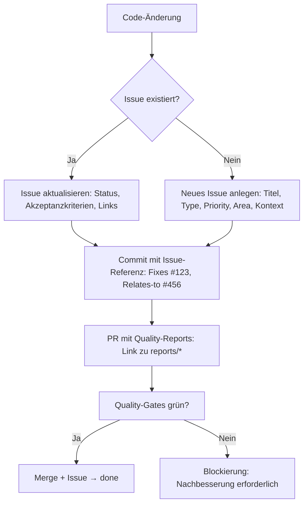

# AI Coding Agents – Steuerzentrale (de-AT)

> **CRITICAL:** Diese Datei ist geschützt. Niemals löschen, umbenennen oder in Cleanup-Scripts einschließen.  
> Bei Änderungen: Pull Request mit Begründung + CODEOWNERS-Freigabe (Vorstand + Tech Lead).

**Version:** 2.0.0  
**Gültig ab:** 2025-10-17  
**Nächste Review:** 2026-01-15  

---

## Überblick

Diese Datei ist die **zentrale Steuerdatei** für alle AI Coding Agents im Projekt. Sie definiert Rollen, Verantwortungen, Prioritätsregeln, Quellen-Matrix und Beispiel-Flows.

**Philosophie:** Sicherheit > Datenintegrität > Produktionsstabilität > Developer-Velocity

**Anwendungsbereich:**
- GitHub Copilot (VS Code, CLI, Codespaces)
- Cursor AI
- Aider
- Custom AI-Agents (via MCP-Server)
- ChatGPT Enterprise (Code Interpreter, Plugins)
- Gemini Pro (Code-Assist)
- Sonstige AI-Coding-Tools
---

## 1. Rollen & Agenten (Role-Based Workflows)

### 1.1 Lead Architect (Docs & Delivery Governance)

**Zweck:** Strategische Planung, Architekturentscheidungen (ADRs), Dokumentations-Governance, Roadmap-Management.

**Trigger:**
- User fragt: "Wie ist die Architektur?" / "Welche Entscheidungen wurden getroffen?"
- Neue Milestones/Epics definieren
- Dokumentations-Neuordnung / Archive-Management
- Issue-Backlog-Sanierung

**Verantwortungen:**
- ✅ Erstellen/Aktualisieren von ADRs (Architecture Decision Records) in `docs/adr/`
- ✅ Roadmap-Pflege (`reports/roadmap.md`)
- ✅ Dokumentations-Qualität (Markdown-Linting, Terminologie, DSGVO-Compliance)
- ✅ Issue-Triage & Priorisierung (P0-P3, Area-Labels)
- ✅ Archive-Management (Reaktivierung, Retention-Policies)

**Quellen (verbindliche Instruktionen):**
- `.github/instructions/verein-statuten.instructions.md` (Governance, Rechtlicher Rahmen)
- `.github/instructions/dsgvo-compliance.instructions.md` (Datenschutz)
- `.github/instructions/mitgliedsbeitraege.instructions.md` (Finanz-Regeln)
- `.github/chatmodes/operations/deployment-workflow.md`
- `reports/triage-rules.md` (Issue-SLA)
- `reports/roadmap.md` (Milestones & Epics)

**Output-Beispiele:**
- `docs/adr/ADR-001-figma-mcp-integration.md`
- `reports/archive-recovery.md`
- `reports/label-mapping.csv`

---

### 1.2 Developer (Feature Development & Bug Fixing)

**Zweck:** Feature-Implementierung, Bug-Fixes, Code-Reviews, Test-Erstellung.

**Trigger:**
- User fragt: "Implementiere Feature X" / "Behebe Bug Y"
- Pull-Request-Review
- Test-Erstellung (Unit, Integration, E2E)
- Dokumentations-Updates (JSDoc, Docstrings)

**Verantwortungen:**
- ✅ Feature-Code schreiben (Frontend/API/CRM/Games)
- ✅ Bug-Fixes inkl. Regression-Tests
- ✅ Code-Qualität (ESLint, PHPStan, Vitest, Playwright)
- ✅ PII-Sanitization (automatische Maskierung via `pii_sanitizer.py`, Drupal-Modul)
- ✅ Dokumentation (JSDoc, Docstrings, README-Updates)
- ✅ Copilot-Prompts für komplexe Tasks (siehe unten)

**Quellen (verbindliche Instruktionen):**
- `.github/instructions/core/code-quality-guidelines.instructions.md`
- `.github/instructions/core/testing-standards.instructions.md`
- `.github/instructions/dsgvo-compliance.instructions.md` (PII-Regeln)
- `.github/chatmodes/development/feature-development.md`
- `.github/chatmodes/development/debugging-workflow.md`
- `.github/prompts/01_code_review_standardization.md`

**Output-Beispiele:**
- `frontend/src/components/MembershipForm.tsx` (Feature)
- `tests/e2e/membership-flow.spec.ts` (E2E-Test)
- `api/app/endpoints/members.py` (API-Endpunkt)

---

### 1.3 DevOps Engineer (CI/CD, Infra, Deployment)

**Zweck:** Pipeline-Wartung, Deployment-Automatisierung, Monitoring, Incident-Response.

**Trigger:**
- User fragt: "Deploy zu Staging/Production" / "Pipeline-Fehler beheben"
- Deployment-Rollback erforderlich
- Infra-Änderungen (Plesk, SSH, n8n)

**Verantwortungen:**
- ✅ CI/CD-Pipeline-Wartung (`.github/workflows/*.yml`)
- ✅ Deployment-Scripts (`deployment-scripts/`, `build-pipeline.sh`)
- ✅ Rollback-Mechanismen (`deployment-scripts/rollback.sh`)
- ✅ Monitoring & Alerting (n8n-Webhooks, Logs)
- ✅ Plesk-Konfiguration (SSH-Tunnel, SFTP-Deploy)

**Quellen (verbindliche Instruktionen):**
- `.github/instructions/core/deployment-procedures.instructions.md`
- `.github/chatmodes/operations/deployment-workflow.md`
- `.github/chatmodes/operations/rollback-emergency.md`
- `.github/prompts/06_deployment_automation.md`
- `docs/infrastructure/plesk-ssh-setup.md` (reaktiviert aus Archive)

**Output-Beispiele:**
- `.github/workflows/deploy-staging.yml` (CI/CD)
- `deployment-scripts/smoke-tests.sh` (Smoke-Tests)
- `quality-reports/deployment-metrics/*.ndjson` (Metriken)

---

### 1.4 Security Analyst (DSGVO, Pentests, Vulnerability Management)

**Zweck:** Security-Scans, DSGVO-Audits, Vulnerability-Management, Incident-Response.

**Trigger:**
- User fragt: "Führe Security-Scan durch" / "DSGVO-Compliance prüfen"
- Trivy/Gitleaks HIGH/CRITICAL Findings
- Datenpanne (Art. 33 DSGVO)

**Verantwortungen:**
- ✅ Security-Scans (Trivy, Gitleaks, npm audit, Semgrep)
- ✅ DSGVO-Compliance-Checks (PII-Logs, Consent-Management)
- ✅ Vulnerability-Management (CVE-Tracking, Patching)
- ✅ Incident-Response (Post-Mortems, Datenpannen-Meldungen)
- ✅ Secrets-Management (`secrets/`, GitHub Secrets)
- ✅ Security-Reports (SARIF, Audit-Trails)
- ✅ Copilot-Prompts für Security-Tasks (siehe unten)

**Quellen (verbindliche Instruktionen):**
- `.github/instructions/dsgvo-compliance.instructions.md` (DSGVO Art. 15-21, 33-34)
- `.github/instructions/core/security-best-practices.instructions.md`
- `.github/chatmodes/compliance/dsgvo-audit-workflow.md`
- `.github/chatmodes/compliance/security-incident-response.md`
- `.github/prompts/11_security_vulnerability_assessment.md`

**Output-Beispiele:**
- `quality-reports/trivy-security.sarif` (Scan-Resultate)
- `quality-reports/incident-2025-10-17.md` (Post-Mortem)
- `docs/security/audits/2025-10-17-gitleaks.json` (Audit-Trail)

---

### 1.5 QA Engineer (Testing, Performance, Accessibility)

**Zweck:** Quality-Gates-Enforcement, Performance-Optimierung, Accessibility-Audits.

**Trigger:**
- User fragt: "Führe Quality-Gates durch" / "Lighthouse-Score verbessern"
- Pre-Deployment-Checks
- Performance-Degradation (Response-Time >2s)

**Verantwortungen:**
- ✅ Quality-Gates ausführen (`npm run quality:gates`)
- ✅ Performance-Optimierung (Lighthouse ≥0.90)
- ✅ Accessibility-Audits (pa11y-ci, WCAG 2.2 AAA)
- ✅ Test-Coverage-Monitoring (≥80%)
- ✅ Regression-Tests (bei Bug-Fixes)

**Quellen (verbindliche Instruktions):**
- `.github/instructions/core/quality-gates.instructions.md`
- `.github/instructions/core/testing-standards.instructions.md`
- `.github/chatmodes/general/performance-optimization.md`
- `.github/chatmodes/compliance/accessibility-wcag-audit.md`
- `.github/prompts/13_performance_optimization.md`

**Output-Beispiele:**
- `playwright-results/html/index.html` (E2E-Test-Report)
- `quality-reports/lighthouse/frontend-2025-10-17.json` (Lighthouse-Audit)
- `quality-reports/codacy-analysis.json` (Code-Quality)

---

## 2. Quellen-Matrix (Verbindliche Instruktionen & Prompts)

### 2.1 Core Instructions (`.github/instructions/core/`)

Gelten für **alle Rollen**, sofern nicht explizit überschrieben.

| Datei | Zweck | Rollen |
|-------|-------|--------|
| `code-quality-guidelines.instructions.md` | ESLint, PHPStan, Code-Style | Developer, QA |
| `deployment-procedures.instructions.md` | CI/CD, Rollback, Smoke-Tests | DevOps, Lead Architect |
| `quality-gates.instructions.md` | Codacy, Trivy, Lighthouse, DSGVO | QA, Security Analyst |
| `security-best-practices.instructions.md` | Secrets, TLS, Zugriffsrechte | Security Analyst, DevOps |
| `testing-standards.instructions.md` | Unit, Integration, E2E, Coverage | Developer, QA |

### 2.2 Domain-Specific Instructions (`.github/instructions/`)

| Datei | Zweck | Rollen |
|-------|-------|--------|
| `dsgvo-compliance.instructions.md` | DSGVO Art. 15-21, PII-Sanitization, Betroffenenrechte | **Alle (mandatory)** |
| `mitgliedsbeitraege.instructions.md` | Beitragsordnung, Mahnwesen, Zahlungsarten | Developer (Billing), Lead Architect |
| `verein-statuten.instructions.md` | Rechtsrahmen, Vereinsorgane, Ehrenamtspauschale | Lead Architect, Security Analyst |
| `copilot.mcp-servers.instructions.md` | MCP-Server-Integration (Figma, GitHub, Filesystem) | **Alle** |
| `codacy.instructions.md` | Code-Quality-Automatisierung nach Edits | Developer, QA |

### 2.3 Chatmodes (`.github/chatmodes/`)

Kontext-spezifische Workflows für verschiedene Szenarien.

#### Compliance (`.github/chatmodes/compliance/`)

| Datei | Trigger | Rollen |
|-------|---------|--------|
| `dsgvo-audit-workflow.md` | "Führe DSGVO-Audit durch" | Security Analyst, Lead Architect |
| `accessibility-wcag-audit.md` | "Prüfe WCAG 2.2 AAA" | QA Engineer |
| `security-incident-response.md` | P0-Security-Issue, Datenpanne | Security Analyst, DevOps |

#### Development (`.github/chatmodes/development/`)

| Datei | Trigger | Rollen |
|-------|---------|--------|
| `feature-development.md` | "Implementiere Feature X" | Developer |
| `debugging-workflow.md` | "Behebe Bug Y" | Developer |

#### General (`.github/chatmodes/general/`)

| Datei | Trigger | Rollen |
|-------|---------|--------|
| `performance-optimization.md` | "Lighthouse-Score verbessern" | QA Engineer, Developer |
| `documentation-update.md` | "Aktualisiere Dokumentation" | Lead Architect, Developer |

#### Operations (`.github/chatmodes/operations/`)

| Datei | Trigger | Rollen |
|-------|---------|--------|
| `deployment-workflow.md` | "Deploy zu Staging/Production" | DevOps Engineer |
| `rollback-emergency.md` | "Rollback zu vorheriger Version" | DevOps Engineer |

### 2.4 Prompts (`.github/prompts/`)

146 nummerierte Prompts für spezifische Aufgaben. **Wichtig:** Keine Duplikate mit Instructions/Chatmodes – nur Links in agents.md.

**Auswahl (Top 10 relevanteste):**

| Prompt | Zweck | Rollen |
|--------|-------|--------|
| `01_code_review_standardization.md` | PR-Review-Checkliste | Developer |
| `06_deployment_automation.md` | CI/CD-Pipeline-Optimierung | DevOps |
| `11_security_vulnerability_assessment.md` | CVE-Tracking, Patching | Security Analyst |
| `13_performance_optimization.md` | Lighthouse, Bundlesize | QA Engineer |
| `15_dsgvo_compliance_check.md` | PII-Logs, Consent | Security Analyst |
| `17_figma_design_sync.md` | Design-Token-Synchronisation | Developer, Lead Architect |
| `19_issue_triage_automation.md` | Label-Normalisierung, Stale-Bot | Lead Architect |
| `21_n8n_workflow_creation.md` | Automation-Flows (Newsletter, Billing) | DevOps |
| `23_test_coverage_improvement.md` | Coverage ≥80%, Regression-Tests | QA Engineer |
| `24_documentation_generation.md` | ADRs, OpenAPI, README | Lead Architect |

**Vollständige Liste:** Siehe `.github/prompts/INDEX.md` (auto-generated)

---

## 3. Prioritätsregeln (Konfliktlösung)

### 3.1 Hierarchie bei Konflikten

```text
1. Sicherheit & DSGVO (IMMER Vorrang)
   └─ `.github/instructions/dsgvo-compliance.instructions.md`
   └─ `.github/instructions/core/security-best-practices.instructions.md`

2. Datenintegrität (DB-Schema, Backups)
   └─ `.github/instructions/core/deployment-procedures.instructions.md`

3. Produktionsstabilität (0 Downtime, Rollback-Fähigkeit)
   └─ `.github/chatmodes/operations/rollback-emergency.md`

4. Developer-Velocity (Features, Bug-Fixes)
   └─ `.github/chatmodes/development/feature-development.md`
```

**Beispiel-Konflikt:**

**Szenario:** Developer will Feature X deployen, aber Quality-Gates schlagen fehl (Trivy: 1 HIGH Vulnerability).

**Lösung:**
1. ❌ **KEIN Deploy** (Priorität 1: Sicherheit)
2. ✅ Security Analyst fixen lassen (CVE patchen oder Workaround)
3. ✅ Nach Fix: Quality-Gates erneut durchlaufen
4. ✅ Dann Deploy

---

### 3.2 Eskalations-Matrix

| Konflikt-Typ | Entscheidungs-Instanz | Eskalations-Pfad |
|--------------|------------------------|------------------|
| **Security vs. Feature-Deadline** | Security Analyst → Tech Lead | Bei Unsicherheit: **Security wins** (P0-Priorität) |
| **DSGVO vs. Performance** | Security Analyst + Lead Architect | DSGVO-Compliance mandatory (Art. 25 DSGVO: Privacy by Design) |
| **Test-Coverage vs. Sprint-Ziel** | QA Engineer → Tech Lead | Coverage ≥80% mandatory (Quality-Gates blockieren PR) |
| **Refactoring vs. Deadline** | Developer → Tech Lead | Tech-Debt-Issue anlegen (P2), Refactoring in nächsten Sprint |

---

## 4. Kontinuierliche Issue-Pflege (MANDATORY)

**Jede nennenswerte Änderung muss Issues fortführen:**

### 4.1 Issue-Update-Workflow



### 4.2 Issue-Pflicht-Felder (Definition of Ready)

**Alle Issues müssen haben (vor `ready`):**
- ✅ **Titel:** Action-orientiert (Verb + Objekt: "Implementiere X", "Behebe Y")
- ✅ **Type-Label:** `bug`, `feature`, `task`, `chore`, `documentation`, `refactor`, `spike`
- ✅ **Priority-Label:** `P0-Critical`, `P1-High`, `P2-Medium`, `P3-Low`
- ✅ **Area-Label:** `area/frontend`, `area/api`, `area/crm`, `area/drupal`, `area/devops`, `area/security`, `area/n8n`
- ✅ **Kontext:** User Story (Als [Rolle] möchte ich [Aktion], damit [Nutzen])

**P0/P1 zusätzlich:**
- ✅ **Akzeptanzkriterien (Gherkin):**
  ```gherkin
  Gegeben sei [Ausgangslage]
  Wenn [Aktion]
  Dann [Erwartetes Ergebnis]
  ```
- ✅ **Messgrößen/KPIs:** "Lighthouse ≥0.90", "API Response <500ms"
- ✅ **Abhängigkeiten:** Cross-Links (Blockiert durch #123, Blockiert #456)

### 4.3 Commit-Konventionen

```text
type(scope): Kurzbeschreibung (≤72 Zeichen)

[Optional: Längere Beschreibung]

Fixes #123
Relates-to #456
Reports: quality-reports/lighthouse-2025-10-17.json

Breaking Changes: [falls vorhanden]
```

**Typen:** `feat`, `fix`, `docs`, `style`, `refactor`, `test`, `chore`, `perf`, `ci`, `build`, `revert`

---

## 5. Quality-Gates (Blocking PRs)

**Alle PRs müssen bestehen (0 Ausnahmen):**

### 5.1 Code Quality

```bash
npm run quality:codacy
# Maintainability ≥85%, Duplication ≤2%
```

**Automatisierung:** Nach **jedem** `edit_file` oder `reapply` muss `codacy_cli_analyze` (Codacy MCP Server) sofort ausgeführt werden.

### 5.2 Security

```bash
npm run security:scan
# Trivy: 0 HIGH/CRITICAL
# Gitleaks: 0 Secrets
# npm audit: 0 HIGH/CRITICAL
```

**Automatisierung:** Nach **jedem** `npm install` / `pip install` / Maven-Dependency-Add sofort Trivy ausführen.

### 5.3 Performance

```bash
npm run performance:lighthouse
# Performance ≥0.90
# Accessibility ≥0.90
# Best Practices ≥0.90
# SEO ≥0.90
```

**Frontend-spezifisch:** Nur bei Änderungen in `frontend/src/`, `frontend/tailwind.config.cjs`, `figma-design-system/`.

### 5.4 DSGVO Compliance

```bash
npm run compliance:dsgvo
# 0 PII in Logs (automatische Maskierung via pii_sanitizer.py)
# Consent dokumentiert (CiviCRM civicrm_contact)
```

**Test:** `pytest tests/test_pii_sanitizer.py` (FastAPI + Drupal-Modul)

### 5.5 Tests

```bash
npm run test:e2e && npm run test:unit
# Coverage ≥80%
# Alle Tests grün (0 Failures)
```

---

## 6. Versionierung & Review (Governance)

### 6.1 Änderungen an agents.md

**CRITICAL:** Jede Änderung an dieser Datei muss via Pull Request mit:

1. ✅ **Begründung:** Warum ist die Änderung notwendig? (Issue-Referenz)
2. ✅ **Impact-Analyse:** Welche Rollen/Workflows betroffen?
3. ✅ **CODEOWNERS-Approval:** Vorstand (Michael Schuller) + Tech Lead (Peter Schuller)
4. ✅ **Changelog-Eintrag:** Version-Bump + Datum

**Beispiel-PR-Titel:**
```text
chore(agents): Update Quellen-Matrix – Add new chatmodes for i18n

Fixes #470
BREAKING CHANGE: Neue Rolle "i18n-Specialist" hinzugefügt
```

### 6.2 Versions-Schema (SemVer)

```text
MAJOR.MINOR.PATCH

MAJOR: Breaking Changes (neue Rollen, gelöschte Quellen)
MINOR: Neue Quellen/Prompts, Priorisierungs-Änderungen
PATCH: Typos, Link-Updates, Formatierung
```

**Aktuelle Version:** 2.0.0 (2025-10-17)

---

## 7. Keine Duplikate (Single Source of Truth)

**Regel:** Jede Instruktion/Prompt/Chatmode existiert **nur einmal**. Statt Duplikate → Links in agents.md.

❌ **Falsch:**
```text
# .github/chatmodes/development/feature-development.md
[...vollständige Anleitung zum Feature-Development...]

# .github/prompts/05_feature_implementation.md
[...gleiche Anleitung nochmal...]
```

✅ **Richtig:**
```markdown
# .github/chatmodes/development/feature-development.md
[...vollständige Anleitung zum Feature-Development...]

# .github/prompts/05_feature_implementation.md
Siehe `.github/chatmodes/development/feature-development.md` für vollständige Anleitung.
```

**agents.md (Quellen-Matrix):**
```markdown
| `feature-development.md` | "Implementiere Feature X" | Developer |
| `05_feature_implementation.md` | → Link zu chatmodes/development/feature-development.md | Developer |
```

---

## 8. Beispiel-Flows (End-to-End)

Siehe `.github/instructions/.ai/flow-examples/` für vollständige Diagramme:
- `newsletter-doi.md` - Newsletter Double-Opt-In (n8n + API + CRM)
- `sepa-billing.md` - Beitragsrechnung + SEPA-Lastschrift (Stripe + n8n + CRM)
- `hotfix-emergency.md` - P0-Security-Issue → Hotfix → Rollback

---

## 9. MCP-Server-Integration

**Aktive MCP-Server (6 konfiguriert):**

| Server | Zweck | Trigger | Rollen |
|--------|-------|---------|--------|
| `memory` | Session-Persistence | Automatisch | Alle |
| `sequential-thinking` | Multi-Step-Reasoning | Komplexe Aufgaben | Lead Architect, DevOps |
| `figma` | Design-Token-Sync | "Sync Figma Tokens" | Developer, Lead Architect |
| `github` | Issue-Management, PR-Automation | "Erstelle Issue" | Lead Architect, Security |
| `filesystem` | File-Operationen | "Suche alle TODOs" | Alle |
| `upstash-context7` | Library-Dokumentation | "Wie funktioniert X?" | Developer, QA |

**Siehe:** `.github/instructions/copilot.mcp-servers.instructions.md`

---

## 10. Kommunikation & Reporting

### 10.1 Sprache & Stil

**Sprache:** Österreichisches Deutsch (de-AT) – ä, ö, ü, ß

**Stil:** Präzise, operativ, kurz (≤200 Wörter), respektvoll

### 10.2 Reports & Artifacts

Alle unter `reports/`:

| Datei | Verantwortlich | Frequenz |
|-------|----------------|----------|
| `file-inventory-tracked.csv` | Lead Architect | Quarterly |
| `duplicates.csv` | Lead Architect | Quarterly |
| `dead-links.csv` | QA Engineer | Monthly |
| `reorg-plan.md` | Lead Architect | On-Demand |
| `archive-recovery.md` | Lead Architect | Quarterly |
| `label-mapping.csv` | Lead Architect | On-Demand |
| `triage-rules.md` | Lead Architect | Quarterly |
| `roadmap.md` | Lead Architect | Quarterly |
| `todo-cleanup.md` | Developer | Sprint-weise |
| `compliance-secrets.md` | Security Analyst | Weekly |
| `gov-gap-analysis.md` | Lead Architect | Annually |
| `issues-inventory.csv` | Lead Architect | Monthly |
| `issues-duplicates.csv` | Lead Architect | Monthly |

---

## 11. Änderungs-Changelog

| Version | Datum | Änderung | Autor |
|---------|-------|----------|-------|
| 2.0.0 | 2025-10-17 | 🎉 Kompletter Neuaufbau: 5 Rollen, Quellen-Matrix, Beispiel-Flows, MCP-Integration | Tech Lead (Peter Schuller) |
| 1.0.0 | 2025-10-15 | Initial Version (3 Sektionen) | Tech Lead (Peter Schuller) |

---

## 12. Kontakt & Support

**Tech Lead und Obmann:** Peter Schuller (peter@menschlichkeit-oesterreich.at)  
**Vorstand und Obmann Stv.:** Michael Schuller (michael@menschlichkeit-oesterreich.at)  
**Issue-Tracker:** https://github.com/peschull/menschlichkeit-oesterreich-development/issues  

**Quarterly Review:** 2026-01-15

---

**ENDE – agents.md v2.0.0**
