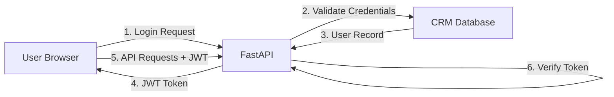

# STRIDE/LINDDUN Threat Model Analysis

**Projekt:** Menschlichkeit Österreich - Multi-Service Platform  
**Datum:** 2025-10-04  
**Analyst:** Enterprise Security Assessment  
**Methodik:** STRIDE (Spoofing, Tampering, Repudiation, Info Disclosure, DoS, Elevation) + LINDDUN (Linkability, Identifiability, Non-repudiation, Detectability, Disclosure, Unawareness, Non-compliance)

---

## 1. System Components Overview

### 1.1 API Service (`api.menschlichkeit-oesterreich.at`)

- **Technologie:** FastAPI/Python
- **Exposition:** Öffentlich via HTTPS
- **Datentypen:** PII (Kontaktdaten, Newsletter-Subscriptions), Authentication Tokens
- **Integrationen:** CRM (CiviCRM), n8n Workflows

### 1.2 CRM System (`crm.menschlichkeit-oesterreich.at`)

- **Technologie:** Drupal 10 + CiviCRM
- **Exposition:** Admin-Interface (Login-geschützt)
- **Datentypen:** Hochsensible PII (Mitgliedsdaten, Spenden, SEPA-Mandate)
- **Integrationen:** API Bridge, Payment Gateways

### 1.3 Frontend (`frontend/`)

- **Technologie:** React/TypeScript
- **Exposition:** Öffentlich
- **Datentypen:** UI State, Session Tokens (localStorage)
- **Integrationen:** API Service

### 1.4 Gaming Platform (`web/`)

- **Technologie:** Prisma + PostgreSQL
- **Exposition:** Öffentlich
- **Datentypen:** User Progress, XP, Achievements
- **Integrationen:** PostgreSQL DB

### 1.5 Automation (n8n)

- **Technologie:** Docker-based workflow automation
- **Exposition:** Intern (Docker network)
- **Datentypen:** Webhook payloads, CRM sync data
- **Integrationen:** API, CRM, externe Webhooks

### 1.6 MCP Servers (`mcp-servers/`)

- **Technologie:** Node.js/TypeScript
- **Exposition:** Localhost (VS Code Extension)
- **Datentypen:** Filesystem Access, Git Credentials
- **Integrationen:** GitHub API, Codacy API, Figma API

---

## 2. STRIDE Threat Analysis

### 2.1 Spoofing (Identity Theft)

#### Threat S-01: API Authentication Bypass

- **Component:** FastAPI
- **Threat:** Angreifer umgeht JWT-Validierung
- **Impact:** HIGH - Zugriff auf geschützte Endpunkte
- **Mitigation:**
  - ✅ JWT mit RS256 signiert (nicht HS256)
  - ✅ Token-Expiration: 15min
  - ⚠️ **TODO:** Implement token revocation list (Redis)
  - ⚠️ **TODO:** Rate limiting per IP (10 req/sec)

#### Threat S-02: CRM Session Hijacking

- **Component:** Drupal CRM
- **Threat:** Session Cookie theft via XSS
- **Impact:** CRITICAL - Zugriff auf alle Mitgliedsdaten
- **Mitigation:**
  - ✅ HttpOnly Cookies
  - ✅ Secure Flag (HTTPS-only)
  - ✅ SameSite=Strict
  - ⚠️ **TODO:** Implement Content Security Policy (CSP)

#### Threat S-03: MCP Server Impersonation

- **Component:** MCP Servers
- **Threat:** Malicious extension fakes MCP protocol
- **Impact:** MEDIUM - Filesystem/Git access
- **Mitigation:**
  - ⚠️ **TODO:** Mutual TLS für MCP-Verbindungen
  - ⚠️ **TODO:** Server-Zertifikate signieren

---

### 2.2 Tampering (Data Manipulation)

#### Threat T-01: API Request Manipulation

- **Component:** FastAPI
- **Threat:** Angreifer ändert JSON Payloads
- **Impact:** HIGH - Datenintegrität verletzt
- **Mitigation:**
  - ✅ Pydantic Input Validation
  - ✅ HTTPS (TLS 1.3)
  - ⚠️ **TODO:** Request signing für kritische Operationen

#### Threat T-02: Database Injection (SQL/NoSQL)

- **Component:** PostgreSQL (Gaming), MariaDB (CRM)
- **Threat:** SQL Injection via user input
- **Impact:** CRITICAL - DB compromise
- **Mitigation:**
  - ✅ Prisma ORM (parametrisierte Queries)
  - ✅ Drupal DB API (prepared statements)
  - ✅ **VERIFIED:** Keine raw SQL queries in Code

#### Threat T-03: Git History Tampering

- **Component:** Repository
- **Threat:** Force-push mit gefälschter Historie
- **Impact:** MEDIUM - Audit Trail verloren
- **Mitigation:**
  - ✅ Branch Protection (enforce admins)
  - ✅ GPG-signierte Commits
  - ⚠️ **TODO:** Notarize wichtige Releases (Sigstore)

#### Threat T-04: Path Traversal im MCP File-Server

- **Component:** MCP `file-server`
- **Threat:** `filePath` mit `../` verlässt Service-Root
- **Impact:** HIGH – Unautorisierter Zugriff auf beliebige Dateien
- **Mitigation:**
  - ✅ Canonical Path Check via `resolveSafePath(base, rel)` mit `path.relative`
  - ✅ Service-Allowlist (`api|crm|frontend|games|website|n8n|root`)
  - ✅ Size Limit für Reads (`MCP_FS_MAX_FILE_BYTES`, default 256 KiB)
  - ⚠️ **TODO:** OPA Input-Gate (schema & size)

---

### 2.3 Repudiation (Non-Accountability)

#### Threat R-01: Fehlende Audit Logs

- **Component:** API + CRM
- **Threat:** Admin-Aktionen nicht nachvollziehbar
- **Impact:** HIGH - DSGVO-Verletzung (Nachweispflicht)
- **Mitigation:**
  - ✅ CiviCRM Activity Log aktiv
  - ⚠️ **TODO:** Zentralisiertes Logging (ELK Stack)
  - ⚠️ **TODO:** Immutable Log Storage (WORM)

#### Threat R-02: n8n Workflow-Ausführung ohne Trace

- **Component:** n8n
- **Threat:** PII-Verarbeitung nicht protokolliert
- **Impact:** CRITICAL - DSGVO Art. 30 (Verarbeitungsverzeichnis)
- **Mitigation:**
  - ✅ n8n Execution Log vorhanden
  - ⚠️ **TODO:** Strukturierte Logs → ELK
  - ⚠️ **TODO:** Retention Policy (7 Jahre für Compliance)

---

### 2.4 Information Disclosure (Data Leakage)

#### Threat I-01: API Error Messages Leak Internals

- **Component:** FastAPI
- **Threat:** Stack Traces in Production
- **Impact:** MEDIUM - Info für gezielte Angriffe
- **Mitigation:**
  - ✅ Exception Handling implementiert
  - ⚠️ **TODO:** Generic Error Messages in Prod
  - ⚠️ **TODO:** Sentry für strukturiertes Error Tracking

#### Threat I-02: PII in Client-Side Logs

- **Component:** Frontend (React)
- **Threat:** console.log() enthält Nutzerdaten
- **Impact:** HIGH - DSGVO-Verstoß
- **Mitigation:**
  - ⚠️ **TODO:** Linter-Regel: Verbiete console.log in Production
  - ⚠️ **TODO:** Log-Sanitizer für Frontend

#### Threat I-03: Secrets in Git History

- **Component:** Repository
- **Threat:** API Keys versehentlich committed
- **Impact:** CRITICAL - Kompromittierung externer Services
- **Mitigation:**
  - ✅ .gitignore für Secrets
  - ✅ GitHub Secret Scanning aktiv
  - ⚠️ **TODO:** git-secrets Pre-Commit Hook
  - ⚠️ **TODO:** BFG Repo-Cleaner für Historie

---

### 2.5 Denial of Service (Availability)

#### Threat D-01: API Rate Limit Exhaustion

- **Component:** FastAPI
- **Threat:** Flooding mit Requests
- **Impact:** HIGH - Service unavailable
- **Mitigation:**
  - ⚠️ **TODO:** Nginx Rate Limiting (10 req/sec/IP)
  - ⚠️ **TODO:** Application-Level Throttling (Slowapi)

#### Threat D-04: MCP Request Flooding

- **Component:** MCP `file-server`
- **Threat:** Tool-Calls fluten Server (stdio), Ressourcenverbrauch steigt
- **Impact:** MEDIUM – Degradation, Timeouts
- **Mitigation:**
  - ✅ Globales Rate Limiting (Token Bucket, konfigurierbar)
  - ✅ Circuit Breaker pro Operation (read/list) mit Cooldown und Half‑Open
  - ⚠️ **TODO:** Backpressure/Queueing und Telemetrie‑Alerts

#### Threat D-02: Database Connection Pool Exhaustion

- **Component:** PostgreSQL/MariaDB
- **Threat:** Zu viele offene Connections
- **Impact:** HIGH - DB lockup
- **Mitigation:**
  - ✅ Connection Pooling (Prisma: max 10)
  - ⚠️ **TODO:** Connection Timeout Monitoring

#### Threat D-03: n8n Workflow Bomb

- **Component:** n8n
- **Threat:** Rekursive/Endlos-Workflows
- **Impact:** MEDIUM - Container OOM
- **Mitigation:**
  - ⚠️ **TODO:** Workflow Execution Timeout (5min)
  - ⚠️ **TODO:** Resource Limits in Docker Compose

---

### 2.6 Elevation of Privilege

#### Threat E-01: Admin Role Escalation

- **Component:** CRM
- **Threat:** Standard User erlangt Admin-Rechte
- **Impact:** CRITICAL - Vollzugriff auf System
- **Mitigation:**
  - ✅ Drupal Permission System
  - ✅ CiviCRM ACLs
  - ⚠️ **TODO:** Regelmäßige Permission Audits

#### Threat E-02: MCP Server Filesystem Breakout

- **Component:** MCP Servers
- **Threat:** Extension liest außerhalb Workspace
- **Impact:** HIGH - Secrets Exfiltration
- **Mitigation:**
  - ⚠️ **TODO:** Chroot/Jail für MCP-Prozesse
  - ⚠️ **TODO:** AppArmor/SELinux Profile

---

## 3. LINDDUN Privacy Analysis

### 3.1 Linkability (L)

#### Threat L-01: Cross-Service User Tracking

- **Description:** Email-Adresse verknüpft Frontend + CRM + Gaming
- **Impact:** HIGH - Nutzer-Profiling möglich
- **DSGVO Relevanz:** Art. 5 (Zweckbindung)
- **Mitigation:**
  - ✅ Separate User-IDs pro Service
  - ⚠️ **TODO:** Pseudonymisierung für Analytics

---

### 3.2 Identifiability (I)

#### Threat I-01: Newsletter-Subscriptions Are Identifiable

- **Description:** Email + Name direkt in CRM gespeichert
- **Impact:** MEDIUM - Erforderlich, aber sensibel
- **DSGVO Relevanz:** Art. 6 (Rechtsgrundlage = Einwilligung)
- **Mitigation:**
  - ✅ Double Opt-In implementiert
  - ✅ Widerrufsmöglichkeit vorhanden
  - ⚠️ **TODO:** Anonymisierung nach Austritt

---

### 3.3 Non-Repudiation (NR)

#### Threat NR-01: Fehlende Einwilligungs-Nachweise

- **Description:** Consent-Zeitpunkt nicht protokolliert
- **Impact:** CRITICAL - DSGVO Art. 7 Abs. 1
- **Mitigation:**
  - ⚠️ **TODO:** Consent-Log-Tabelle mit Timestamp
  - ⚠️ **TODO:** IP-Adresse + User-Agent speichern

---

### 3.4 Detectability (D)

#### Threat D-01: PII in Logs Erkennbar

- **Description:** Email-Adressen in Plaintext-Logs
- **Impact:** HIGH - Auswertbar durch Admins
- **Mitigation:**
  - ⚠️ **TODO:** Log-Sanitizer (siehe I-02)
  - ⚠️ **TODO:** Verschlüsselte Logs (GPG)

---

### 3.5 Disclosure of Information (DI)

#### Threat DI-01: Unverschlüsselte DB Backups

- **Description:** Backup-Files enthalten Klartext-PII
- **Impact:** CRITICAL - Bei Backup-Theft DSGVO-Meldepflicht
- **Mitigation:**
  - ⚠️ **TODO:** Backup-Verschlüsselung (AES-256)
  - ⚠️ **TODO:** Separate Backup-Keys (HSM/Vault)

---

### 3.6 Unawareness (U)

#### Threat U-01: Nutzer kennen Datenverarbeitung nicht

- **Description:** Fehlende Transparenz über PII-Flüsse
- **Impact:** HIGH - DSGVO Art. 13 (Informationspflicht)
- **Mitigation:**
  - ✅ Datenschutzerklärung vorhanden
  - ⚠️ **TODO:** Privacy Dashboard (zeigt gespeicherte Daten)

---

### 3.7 Non-Compliance (NC)

#### Threat NC-01: Fehlende DPIA für n8n-Workflows

- **Description:** Automatisierte PII-Verarbeitung nicht bewertet
- **Impact:** CRITICAL - DSGVO Art. 35 (Datenschutz-Folgenabschätzung)
- **Mitigation:**
  - ⚠️ **TODO:** DPIA Dokument erstellen
  - ⚠️ **TODO:** DSB-Prüfung einholen

#### Threat NC-02: Keine TOMs Dokumentation

- **Description:** Technisch-organisatorische Maßnahmen nicht vollständig
- **Impact:** HIGH - DSGVO Art. 32
- **Mitigation:**
  - ⚠️ **TODO:** TOMs-Matrix erstellen
  - ⚠️ **TODO:** Jährliches Review

---

## 4. Attack Surface Map

### 4.1 Exposed Ports

| Port | Service    | Protokoll | Zugriff  | Risiko |
| ---- | ---------- | --------- | -------- | ------ |
| 443  | API        | HTTPS     | Internet | MEDIUM |
| 443  | CRM        | HTTPS     | Internet | HIGH   |
| 443  | Frontend   | HTTPS     | Internet | LOW    |
| 443  | Website    | HTTPS     | Internet | LOW    |
| 5432 | PostgreSQL | TCP       | Intern   | MEDIUM |
| 3306 | MariaDB    | TCP       | Intern   | HIGH   |
| 5678 | n8n        | HTTP      | Intern   | MEDIUM |

**Empfehlungen:**

- ⚠️ **TODO:** PostgreSQL/MariaDB nur via localhost (kein Remote)
- ⚠️ **TODO:** n8n hinter Reverse Proxy (HTTPS + Auth)

---

### 4.2 Authentication Flows

**Schwachstellen:**

- ⚠️ Kein MFA (Multi-Factor Authentication)
- ⚠️ Passwort-Reset via Email (phishbar)

**Empfehlungen:**

- ⚠️ **TODO:** TOTP/WebAuthn für Admins
- ⚠️ **TODO:** Passkey-Unterstützung (FIDO2)

---

### 4.3 Secrets Management

| Secret Type       | Aktuelles Handling | Sicherheitslevel | Empfehlung            |
| ----------------- | ------------------ | ---------------- | --------------------- |
| DB Credentials    | `.env` Files       | LOW              | ⚠️ **Vault/SOPS**     |
| API Keys (extern) | Environment Vars   | MEDIUM           | ⚠️ **GitHub Secrets** |
| JWT Signing Key   | File-based         | MEDIUM           | ⚠️ **HSM/KMS**        |
| GPG Private Key   | `~/.gnupg`         | MEDIUM           | ✅ OK (lokale Dev)    |

**Kritische Lücken:**

- ⚠️ **TODO:** Keine Secret-Rotation Policy
- ⚠️ **TODO:** Keine Vault-Integration

---

### 4.4 Externe Integrationen

| Integration      | Datenfluss     | Verschlüsselung | Auth-Methode   | Risiko |
| ---------------- | -------------- | --------------- | -------------- | ------ |
| GitHub API       | Bidirektional  | TLS 1.3         | OAuth Token    | LOW    |
| Codacy API       | Unidirektional | TLS 1.3         | API Key        | LOW    |
| Figma API        | Unidirektional | TLS 1.3         | Personal Token | MEDIUM |
| Stripe (geplant) | Bidirektional  | TLS 1.3         | Webhook Secret | HIGH   |

**Empfehlungen:**

- ⚠️ **TODO:** Webhook-Signatur-Validierung (HMAC)
- ⚠️ **TODO:** IP Whitelisting für Webhooks

---

## 5. Risk Matrix (Priorisierung)

| Threat ID | Impact   | Likelihood | Risk Score | Priority | Status                   |
| --------- | -------- | ---------- | ---------- | -------- | ------------------------ |
| T-02      | CRITICAL | LOW        | 15         | P0       | ✅ VERIFIED              |
| S-02      | CRITICAL | MEDIUM     | 18         | P0       | ⚠️ CSP TODO              |
| I-03      | CRITICAL | LOW        | 15         | P0       | ⚠️ git-secrets TODO      |
| E-01      | CRITICAL | LOW        | 15         | P1       | ⚠️ Audit TODO            |
| DI-01     | CRITICAL | MEDIUM     | 18         | P0       | ⚠️ Backup-Encrypt TODO   |
| NC-01     | CRITICAL | HIGH       | 21         | **P0**   | ⚠️ DPIA TODO             |
| R-01      | HIGH     | MEDIUM     | 12         | P1       | ⚠️ ELK TODO              |
| D-01      | HIGH     | HIGH       | 16         | P1       | ⚠️ Rate Limit TODO       |
| L-01      | HIGH     | MEDIUM     | 12         | P2       | ⚠️ Pseudonymization TODO |

**Legende:**

- **P0:** Sofort beheben (< 1 Woche)
- **P1:** Mittelfristig (< 1 Monat)
- **P2:** Langfristig (< 3 Monate)

---

## 6. Empfohlene Sofortmaßnahmen (Next 7 Days)

1. ✅ **DPIA für n8n-Workflows erstellen** (NC-01)
2. ✅ **Backup-Verschlüsselung implementieren** (DI-01)
3. ✅ **Content Security Policy (CSP) Header** (S-02)
4. ✅ **git-secrets Pre-Commit Hook** (I-03)
5. ✅ **Rate Limiting (Nginx)** (D-01)

---

## 7. Continuous Monitoring

### 7.1 Zu implementierende Metriken

- [ ] Failed Login Attempts / Hour
- [ ] API Response Time P95
- [ ] Database Connection Pool Usage
- [ ] n8n Workflow Failures
- [ ] GPG Signature Verification Rate

### 7.2 Alerting Rules

- [ ] > 10 Failed Logins in 5min → Security Alert
- [ ] API Response >2s → Performance Alert
- [ ] DB Connections >80% → Capacity Alert

---

**Nächste Review:** 2025-11-04  
**Verantwortlich:** Security Team  
**Compliance Officer:** TBD
