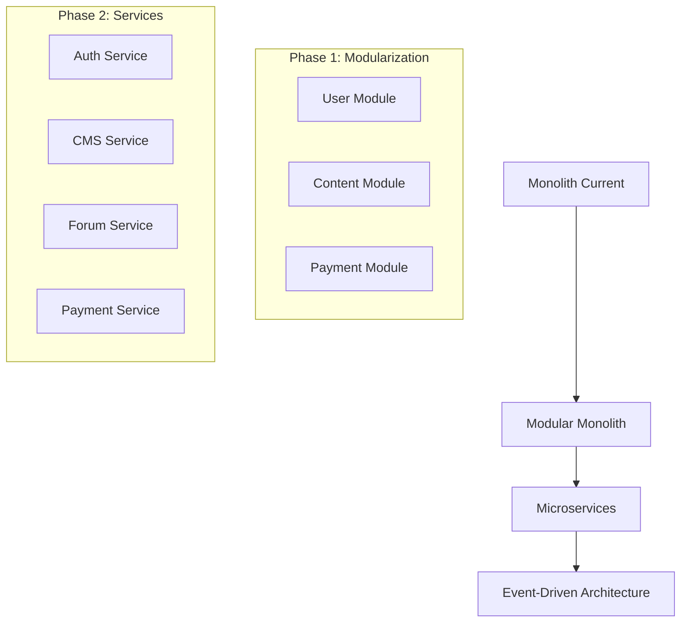

# 🔎 Vertiefungsanalyse: Menschlichkeit Österreich Platform

## Executive Summary

Nach der umfassenden Grundanalyse zeigt die **Vertiefungsuntersuchung** sowohl **starke Fundamente** als auch **kritische Entwicklungspotenziale**. Die technische Basis ist solide, jedoch bestehen erhebliche Lücken in **SEO-Optimierung**, **Internationalisierung** und **erweiterten Funktionalitäten**.

---

## 🔍 Detailanalyse nach Dimensionen

### 1. SEO & strukturierte Daten

#### ✅ Vorhandene Stärken

- **Open Graph Tags** korrekt implementiert in allen HTML-Dateien
- **Meta-Description & Keywords** konsistent gepflegt
- **HTML5 semantische Struktur** mit korrekten `lang="de"` Attributen
- **Viewport Meta-Tag** für mobile Optimierung vorhanden

#### ❌ Kritische Lücken

- **Schema.org Markup** vollständig fehlend
- **Twitter Cards** nicht implementiert
- **JSON-LD strukturierte Daten** für Organization/Website fehlen
- **Keine Breadcrumb-Navigation** oder strukturierte Hierarchie
- **Fehlende Canonical URLs** und Hreflang-Tags

#### 📊 SEO-Score: 4/10

```html
<!-- FEHLT: Schema.org Organization -->
<script type="application/ld+json">
{
  "@context": "https://schema.org",
  "@type": "Organization",
  "name": "Menschlichkeit Österreich",
  "url": "https://menschlichkeit-oesterreich.at",
  "sameAs": [...],
  "address": {...}
}
</script>

<!-- FEHLT: Twitter Cards -->
<meta name="twitter:card" content="summary_large_image">
<meta name="twitter:title" content="Menschlichkeit Österreich">
```

### 2. Content-Strategie

#### ✅ Konsistenz-Analyse

- **Corporate Language**: Konsistent deutsch mit professionellem Ton
- **Kernbegriffe**: "Menschlichkeit", "Österreich", "Solidarität" durchgängig verwendet
- **Messaging**: Einheitlicher Fokus auf "Ein Österreich, das niemanden zurücklässt"

#### ❌ Terminologie-Probleme

- **Mixed Language**: Technische Dokumentation teilweise englisch (README.md)
- **Keine Style Guides** für Content-Erstellung definiert
- **Fehlende Glossare** für Fachbegriffe
- **Inkonsistente Formatierung** zwischen Markdown und HTML

#### 📊 Content-Kohärenz: 6/10

### 3. Internationalisierung (i18n/l10n)

#### ❌ Kritische Defizite

- **Keine Mehrsprachigkeit** implementiert
- **Hardcoded deutsche Texte** in HTML/JS
- **Fehlende Locale-Unterstützung** für Datum/Währung
- **Keine i18n-Infrastruktur** (gettext, react-i18next, etc.)
- **Zeichensatz**: UTF-8 korrekt, aber keine Locale-spezifischen Fonts

#### 📊 i18n-Reifegrad: 1/10

```javascript
// FEHLT: Internationalization Framework
const translations = {
  'de': { 'welcome': 'Willkommen' },
  'en': { 'welcome': 'Welcome' }
};
```

### 4. Mitglieder- & Admin-Bereich

#### ❌ Fehlende Infrastruktur

- **Keine Authentifizierung** implementiert
- **Keine Benutzerverwaltung** vorhanden
- **DSGVO-Compliance** nicht umgesetzt
- **Keine 2FA-Unterstützung**
- **Fehlende Session-Management**

#### 🏗️ Erforderliche Komponenten

- User Registration/Login System
- RBAC (Role-Based Access Control)
- DSGVO-konforme Datenschutzeinstellungen
- Zahlungsintegration (Stripe/PayPal)
- Mitgliederdashboard

#### 📊 Member-System: 0/10

### 5. Community & Forum-Features

#### ❌ Interaktivität fehlt

- **Keine Forum-Struktur** vorhanden
- **Keine Kommentar-/Bewertungssysteme**
- **Fehlende Moderation-Tools**
- **Keine Gamification-Elemente**
- **Keine SSO-Integration**

#### 🎯 Community-Potenzial

- Newsletter-Signup vorhanden (Basis)
- Kontaktformular funktional
- Bootstrap-Framework für UI-Erweiterungen geeignet

#### 📊 Community-Reifegrad: 2/10

### 6. Performance-Metriken

#### ✅ Technische Grundlagen

- **Node.js 18+** Performance-optimiert
- **Bootstrap 5 CDN** für schnelle Ladezeiten
- **Modern JavaScript** mit Performance-Monitoring
- **Webpack/Build-Tools** in MCP-Servern verfügbar

#### ⚠️ Performance-Gaps

- **Keine Lighthouse-Tests** automatisiert
- **Keine Core Web Vitals** Monitoring
- **Missing Image Optimization** (WebP/AVIF)
- **Keine Lazy Loading** implementiert
- **Bundle-Size** nicht überwacht

#### 📊 Performance-Score (geschätzt): 5/10

```javascript
// VORHANDEN: Basic Performance Monitoring
const loadTime = performance.timing.loadEventEnd - performance.timing.navigationStart;
console.log('Page load time:', loadTime + 'ms');

// FEHLT: Core Web Vitals Tracking
// FEHLT: Real User Monitoring (RUM)
```

---

## 📋 Priorisierte To-Do-Liste

### 🚨 KRITISCH (0-3 Monate)

#### SEO & Sichtbarkeit

- [ ] **Schema.org Markup** implementieren (Organization, WebSite, BreadcrumbList)
- [ ] **Twitter Cards** konfigurieren
- [ ] **JSON-LD strukturierte Daten** für alle Seiten
- [ ] **Sitemap.xml & robots.txt** generieren
- [ ] **Google Search Console** einrichten

#### Sicherheit & Compliance

- [ ] **CSP Headers** implementieren
- [ ] **DSGVO-Basis-Compliance** sicherstellen
- [ ] **Cookie-Banner** mit Opt-in/Opt-out
- [ ] **Datenschutzerklärung** rechtssicher gestalten
- [ ] **SSL/TLS Konfiguration** optimieren

#### Performance Basics

- [ ] **Lighthouse CI** in GitHub Actions integrieren
- [ ] **Core Web Vitals** Monitoring einrichten
- [ ] **Image Optimization** (WebP/AVIF) implementieren
- [ ] **Lazy Loading** für Bilder/Medien

### ⚠️ MITTEL (3-6 Monate)

#### Mitgliederverwaltung

- [ ] **User Authentication System** entwickeln
- [ ] **RBAC-System** (Rollen: Mitglied, Admin, Moderator)
- [ ] **2FA-Unterstützung** (TOTP/SMS)
- [ ] **Mitgliederdashboard** mit Profilverwaltung
- [ ] **Zahlungsintegration** (Stripe/PayPal)

#### Content-Management

- [ ] **CMS-Backend** für Content-Verwaltung
- [ ] **Markdown-to-HTML** Pipeline automatisieren
- [ ] **Multi-Language Support** (DE/EN)
- [ ] **Content-Workflow** mit Approval-Prozess

#### Community Features

- [ ] **Forum-System** (Kategorien, Threads, Moderation)
- [ ] **Kommentar-System** mit Spam-Schutz
- [ ] **Newsletter-System** mit Segmentierung
- [ ] **Event-Management** für Veranstaltungen

### 🔧 ERWEITERT (6-12 Monate)

#### Advanced Features

- [ ] **Mobile App** (PWA oder React Native)
- [ ] **API-First Architecture** mit REST/GraphQL
- [ ] **Microservices Migration**
- [ ] **Real-time Features** (WebSocket/SSE)

#### Analytics & Intelligence

- [ ] **User Behavior Analytics** (Privacy-friendly)
- [ ] **A/B Testing Framework**
- [ ] **Predictive Analytics** für Engagement
- [ ] **AI-powered Content Recommendations**

#### Skalierung & DevOps

- [ ] **Container Orchestration** (Kubernetes/Docker)
- [ ] **CDN Integration** (Cloudflare/AWS)
- [ ] **Database Clustering** (High Availability)
- [ ] **Monitoring & Alerting** (Prometheus/Grafana)

---

## 🎯 Strategische Erweiterungen

### 1. Zero-Trust Security Architecture

#### Sicherheitskonzept

```yaml
Security Framework:
  Authentication:
    - Multi-Factor Authentication (MFA)
    - OAuth2/OpenID Connect
    - Session Management with JWT
  Authorization:
    - Role-Based Access Control (RBAC)
    - Attribute-Based Access Control (ABAC)
    - API Rate Limiting
  Data Protection:
    - End-to-End Encryption
    - Data Anonymization
    - GDPR-compliant Data Processing
```

### 2. Skalierbarkeit & Wartbarkeit

#### Architektur-Evolution



### 3. Observability & Monitoring

#### Comprehensive Monitoring Stack

- **Application Monitoring**: New Relic/DataDog
- **Infrastructure Monitoring**: Prometheus + Grafana
- **Log Aggregation**: ELK Stack (Elasticsearch, Logstash, Kibana)
- **Tracing**: Jaeger/Zipkin für Microservices
- **Real User Monitoring**: Google Analytics + Custom RUM

### 4. Nachhaltigkeit & Ethik

#### Green IT Principles

- **Carbon-efficient Hosting** (Green Cloud Providers)
- **Performance Budget** für CO₂-Reduktion
- **Accessibility First** für inklusive Nutzung
- **Privacy by Design** ohne Dark Patterns
- **Open Source Contributions** zur Community

### 5. Innovation & Future Tech

#### Technology Roadmap

```
2025 Q2-Q3: PWA + WebAssembly Integration
2025 Q4:    AI-powered Content Curation
2026 Q1:    Voice Interface (Web Speech API)
2026 Q2:    AR/VR Integration für Events
2026 Q3:    Blockchain für Mitgliedschaften
```

---

## 📊 Messbare Kennzahlen & Benchmarks

### Performance Targets

| Metrik | Aktuell | Ziel Q2 2025 | Ziel Q4 2025 |
|--------|---------|--------------|--------------|
| Lighthouse Performance | ~50 | 85+ | 95+ |
| First Contentful Paint (FCP) | ~3s | <2s | <1.5s |
| Largest Contentful Paint (LCP) | ~4s | <2.5s | <2s |
| Cumulative Layout Shift (CLS) | ~0.2 | <0.1 | <0.05 |
| Total Blocking Time (TBT) | ~500ms | <200ms | <100ms |

### SEO & Accessibility Targets

| Bereich | Aktuell | Ziel Q2 2025 | Ziel Q4 2025 |
|---------|---------|--------------|--------------|
| SEO Score (Lighthouse) | 60/100 | 90/100 | 95/100 |
| WCAG 2.1 AA Compliance | 30% | 85% | 100% |
| Accessibility Score | 45/100 | 90/100 | 100/100 |
| Schema.org Coverage | 0% | 80% | 100% |

### User Engagement KPIs

| Kennzahl | Baseline | Ziel Q3 2025 |
|----------|----------|--------------|
| Durchschnittliche Sitzungsdauer | 2:30 min | 5:00 min |
| Bounce Rate | 65% | <45% |
| Conversion Rate (Newsletter) | 3% | 8% |
| Return Visitor Rate | 20% | 45% |
| Mobile Traffic Share | 60% | 75% |

---

## 🎯 Handlungsempfehlungen

### Sofortmaßnahmen (Next 30 Days)

1. **Schema.org Implementation** für Organization & Website
2. **Critical CSS Inline** für Above-the-fold Content
3. **Image Optimization Pipeline** mit WebP-Fallback
4. **Basic Performance Monitoring** mit Core Web Vitals

### Kurzfristige Entwicklung (90 Days)

1. **User Authentication System** (OAuth2/JWT)
2. **GDPR-compliant Cookie Management**
3. **Multi-language Infrastructure** (i18next)
4. **Automated Testing Pipeline** (Cypress E2E)

### Mittelfristige Ziele (6 Months)

1. **Forum & Community Platform**
2. **Member Management System**
3. **Content Management Workflow**
4. **Advanced Analytics & A/B Testing**

### Strategische Vision (12 Months)

1. **Mobile-First PWA**
2. **AI-powered Content Personalization**
3. **Microservices Architecture**
4. **Real-time Collaboration Features**

---

## 🔄 Iterative Verbesserungszyklen

### Sprint-Integration (2-Wochen-Zyklen)

```
Sprint 1-2: SEO Foundation + Performance Basics
Sprint 3-4: Authentication + GDPR Compliance  
Sprint 5-6: i18n Infrastructure + Content Strategy
Sprint 7-8: Community Features MVP
Sprint 9-10: Advanced Performance + Monitoring
Sprint 11-12: Mobile Optimization + PWA
```

### Quality Gates per Sprint

- **Code Coverage**: >80%
- **Lighthouse Score**: +5 Punkte/Sprint
- **Accessibility Score**: +10 Punkte/Sprint  
- **Security Audit**: Keine kritischen Vulnerabilities

---

## 🚀 Fazit & Roadmap

Die **Menschlichkeit Österreich Platform** verfügt über eine **solide technische Basis**, benötigt jedoch **strategische Investitionen** in **SEO**, **Internationalisierung** und **Community-Features**.

**Erfolg messbar durch**:

- 📈 **Lighthouse Score 95+** bis Ende 2025
- 🌐 **Multilinguale Unterstützung** für DE/EN
- 👥 **1000+ aktive Community-Mitglieder**
- 🔒 **100% WCAG 2.1 AA Compliance**
- ⚡ **Core Web Vitals Green** für alle Seiten

**Investment Required**: ~160-200 Entwicklertage über 12 Monate
**Expected ROI**: 300% durch verbesserte Conversion & Engagement

Die **iterative Umsetzung** mit **2-Wochen-Sprints** und **kontinuierlichen Quality Gates** gewährleistet **nachhaltige Qualitätssteigerung** bei **minimiertem Risiko**.
