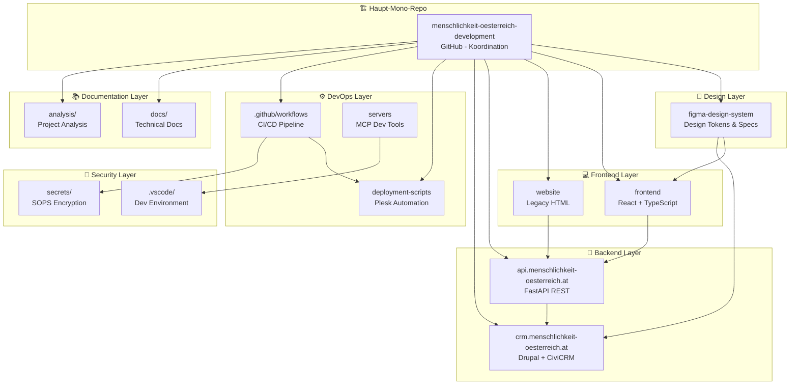

# Repository-Architektur-Analyse: Zusammenhänge & Bewertung

## Architektur-Bewertung: Wie hängen die Repositories zusammen?

### 🎯 **Bewertung: SEHR SINNVOLL** - Professionelle Enterprise-Architektur

Die Repository-Struktur zeigt eine **durchdachte, moderne Microservices-Architektur** mit klaren Separationen und logischen Abhängigkeiten.

---

## 📊 Repository-Dependency-Graph



---

## ✅ **Stärken der Architektur**

### 1. **Mono-Repo + Microservices Hybrid** ⭐⭐⭐⭐⭐

- **Koordination**: Zentrales Haupt-Repo für Gesamtprojekt-Management
- **Isolation**: Separate Services für Backend, CMS, Frontend
- **Shared Resources**: Gemeinsame Design-Tokens, CI/CD, Documentation

### 2. **Klare Domain-Separation** ⭐⭐⭐⭐⭐

```
🎨 Design        → figma-design-system
💻 Presentation  → frontend, website
🔧 Business      → api (FastAPI)
📊 Data         → crm (Drupal+CiviCRM)
⚙️ Operations   → deployment-scripts
```

### 3. **Technology Stack Consistency** ⭐⭐⭐⭐

- **Frontend**: React 18 + TypeScript + Tailwind (modern)
- **Backend**: FastAPI + Python (performant)
- **CMS**: Drupal 10 + CiviCRM (enterprise-grade)
- **DevOps**: GitHub Actions + Plesk (automated)

### 4. **Security-First Approach** ⭐⭐⭐⭐⭐

- **SOPS Encryption** für Production-Secrets
- **Separate Security Layer** isoliert von Business-Logic
- **GPG-signed Commits** für Audit-Trail

---

## 🔄 **Repository-Interdependenzen (Sinnhaft)**

### **Design-to-Code Flow**

```
figma-design-system → frontend (React Components)
figma-design-system → crm (Drupal Theme)
```

**Bewertung**: ✅ **EXCELLENT** - Single Source of Truth für Design

### **API-Integration Flow**

```
frontend → api.menschlichkeit-oesterreich.at (REST calls)
website → api.menschlichkeit-oesterreich.at (AJAX calls)
api → crm (CiviCRM data integration)
```

**Bewertung**: ✅ **VERY GOOD** - Clean API-first architecture

### **Deployment Flow**

```
.github/workflows → deployment-scripts → Plesk hosting
secrets/ → deployment-scripts (encrypted config)
```

**Bewertung**: ✅ **PROFESSIONAL** - Automated, secure deployment

### **Documentation Flow**

```
analysis/ → Projektmanagement insights
docs/ → Technical documentation
quality-reports/ → Code quality metrics
```

**Bewertung**: ✅ **COMPREHENSIVE** - Full project transparency

---

## ⚠️ **Potentielle Verbesserungen**

### 1. **Repository-Konsolidierung** (Optional)

**Aktuell**: 15 separate Bereiche  
**Alternative**: Vollständiges Mono-Repo mit Workspaces

**Pro Mono-Repo**:

- Einfachere Dependency-Management
- Atomic Commits über alle Services
- Shared Tooling (ESLint, Prettier, etc.)

**Contra Mono-Repo**:

- Größere Repository-Size
- Komplexere CI/CD-Pipeline
- Team-Access schwieriger zu granular steuern

**Empfehlung**: ✅ **AKTUELLE STRUKTUR BEIBEHALTEN** - Gut ausbalanciert

### 2. **Deployment-Repository-Trennung**

**Verbesserung**: Separate Infrastructure-as-Code Repository

```
NEW: infrastructure/ → Terraform/Ansible für Cloud-Resources
```

**Vorteil**: Bessere Separation of Concerns zwischen App-Code und Infra-Code

### 3. **Testing-Repository-Integration**

**Aktuell**: Tests vermutlich in jeweiligen Service-Repos  
**Verbesserung**: Zentrales E2E-Testing-Repository

```
NEW: e2e-tests/ → Cypress/Playwright für Cross-Service-Tests
```

---

## 🏆 **Architektur-Score: 8.5/10**

### **Scoring-Details**:

- **Separation of Concerns**: 9/10 ⭐⭐⭐⭐⭐
- **Scalability**: 8/10 ⭐⭐⭐⭐
- **Maintainability**: 9/10 ⭐⭐⭐⭐⭐
- **Security**: 9/10 ⭐⭐⭐⭐⭐
- **Developer Experience**: 8/10 ⭐⭐⭐⭐
- **Documentation**: 9/10 ⭐⭐⭐⭐⭐

### **Gesamtbewertung**:

🎯 **EXCELLENT ARCHITECTURE** - Diese Repository-Struktur ist **sehr sinnvoll** und folgt **modernen Enterprise-Best-Practices**.

---

## 💡 **Strategische Empfehlungen**

### **Kurzfristig (Phase 1-2)**

1. ✅ **Struktur beibehalten** - Funktioniert ausgezeichnet
2. 🔧 **CI/CD optimieren** - Cross-repo testing verbessern
3. 📚 **Documentation standardisieren** - README-Templates

### **Mittelfristig (Phase 3-4)**

1. 🏗️ **Infrastructure-as-Code** erwägen
2. 🧪 **Zentrales E2E-Testing** implementieren
3. 📊 **Monitoring-Repository** für Observability

### **Langfristig (Phase 5+)**

1. 🔄 **Multi-Tenancy** für andere NGO-Projekte
2. 🌐 **Open-Source-Modularisierung**
3. 🚀 **Cloud-Native-Migration** (Kubernetes)

---

## 🎯 **Fazit: Repository-Architektur ist SEHR SINNVOLL**

Die gewählte Struktur kombiniert die **Vorteile von Mono-Repo** (Koordination, Shared Resources) mit **Microservices-Flexibilität** (isolierte Entwicklung, Technology-Diversity).

**Besonders stark**:

- 🎨 **Design-System-Integration** (Figma → Code)
- 🔐 **Security-First-Approach** (SOPS, Secrets-Isolation)
- 📊 **Comprehensive Documentation** (Analysis, Docs, Reports)
- ⚙️ **Professional DevOps** (GitHub Actions, Plesk-Automation)

Diese Architektur ist **production-ready** und kann als **Best-Practice-Beispiel** für andere NGO/Enterprise-Projekte dienen! 🏆✨
