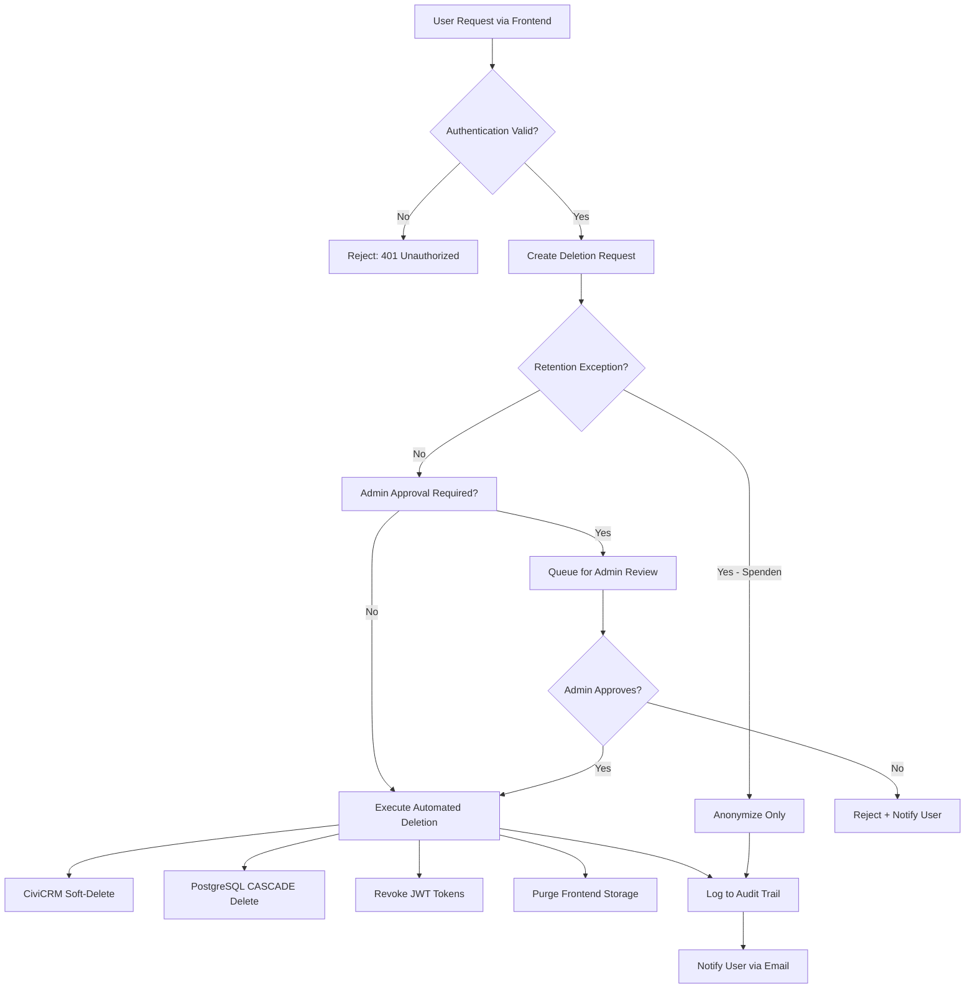

# Right to Erasure Procedures (DSGVO Art. 17)

**Dokumentstatus:** ✅ Phase 0 Compliance
**Erstellt:** 2024-10-04
**Letzte Aktualisierung:** 2024-10-04
**Verantwortlich:** DevOps & Legal Compliance Team
**DSGVO-Referenz:** Art. 17 DSGVO (Recht auf Löschung/"Recht auf Vergessenwerden")

---

## Executive Summary

Dieses Dokument definiert **technische und organisatorische Verfahren** zur Umsetzung des Rechts auf Löschung gemäß DSGVO Art. 17 für die Menschlichkeit Österreich Multi-Service-Plattform. Es umfasst:

- **Self-Service User Deletion** (Frontend-initiiert)
- **Admin-Assisted Erasure** (CRM-Dashboard)
- **Automated Cascade Deletion** (Datenbank-Ebene)
- **Legal Retention Exceptions** (Aufbewahrungspflichten)
- **Audit Trail Requirements** (Compliance-Nachweis)

---

## 1. Rechtliche Grundlagen & Scope

### 1.1 DSGVO Art. 17 Anforderungen

Die betroffene Person hat das Recht, die **unverzügliche Löschung** sie betreffender personenbezogener Daten zu verlangen, wenn:

1. ✅ **Zweckerfüllung:** Daten nicht mehr notwendig für ursprünglichen Zweck
2. ✅ **Widerruf Einwilligung:** Consent wurde zurückgezogen (Art. 6 Abs. 1 lit. a)
3. ✅ **Widerspruch:** Widerspruch gem. Art. 21 DSGVO
4. ✅ **Unrechtmäßige Verarbeitung:** Daten wurden unrechtmäßig verarbeitet
5. ✅ **Gesetzliche Löschpflicht:** Erfüllung rechtlicher Verpflichtung (Art. 6 Abs. 1 lit. c)
6. ✅ **Kinder-Daten:** Daten wurden bei Diensten der Informationsgesellschaft von Kindern erhoben (Art. 8 Abs. 1)

### 1.2 Ausnahmen von Löschpflicht (Art. 17 Abs. 3 DSGVO)

Löschung **NICHT** erforderlich bei:

- 🔒 **Rechtliche Verpflichtungen** (BAO § 132: 7 Jahre Aufbewahrung für Spendenbescheinigungen)
- 🔒 **Archivzwecke im öffentlichen Interesse** (Statistiken ohne Personenbezug)
- 🔒 **Geltendmachung rechtlicher Ansprüche** (laufende Rechtsverfahren)
- 🔒 **Öffentliches Gesundheitswesen** (nicht relevant für NGO)

**Kritisch für Menschlichkeit Österreich:**

- **Spenden & Mitgliedsbeiträge:** 7 Jahre Aufbewahrungspflicht (BAO)
- **SEPA-Mandate:** 14 Monate nach letzter Lastschrift
- **Newsletter-Opt-outs:** Unbefristete Speicherung der E-Mail-Adresse zur Vermeidung erneuter Kontaktaufnahme (berechtigtes Interesse)

---

## 2. Systemarchitektur & Datenfluss

### 2.1 Betroffene Systeme

| System                  | Personenbezogene Daten                        | Löschstrategie               |
| ----------------------- | --------------------------------------------- | ---------------------------- |
| **CiviCRM Database**    | Kontakte, Adressen, Spenden, Mitgliedschaften | Soft-Delete + Anonymisierung |
| **PostgreSQL (Prisma)** | User Accounts, Game Sessions, XP/Achievements | CASCADE Delete               |
| **Frontend (React)**    | localStorage Tokens, Session Data             | Client-Side Purge            |
| **API FastAPI**         | JWT Tokens, Refresh Tokens (in-memory)        | Token Revocation             |
| **n8n Workflows**       | Webhook Logs, Automation History              | Purge after 90 days          |
| **Drupal User Table**   | CRM Backend User Accounts                     | User Cancel (Anonymize)      |
| **Backups**             | All of the above                              | Point-in-Time Restore        |

### 2.2 Datenfluss bei Löschantrag



---

## 3. Implementierungsdetails

### 3.1 Frontend: Self-Service Deletion Request

**Datei:** `frontend/src/services/api/privacy.ts`

```typescript
// ✅ BEREITS IMPLEMENTIERT
async requestDataDeletion(
  reason: string
): Promise<ApiResponse<{ request: DataDeletionRequest }>> {
  return apiClient.post<ApiResponse<{ request: DataDeletionRequest }>>(
    '/privacy/data-deletion',
    { reason }
  );
}

async getDataDeletionRequests(): Promise<ApiResponse<{ requests: DataDeletionRequest[] }>> {
  return apiClient.get<ApiResponse<{ requests: DataDeletionRequest[] }>>(
    '/privacy/data-deletion'
  );
}
```

**UI-Komponente:** `figma-design-system/components/PrivacyCenter.tsx`

```tsx
// ✅ BEREITS IMPLEMENTIERT (Zeile 129)
const handleAccountDeletion = () => {
  console.log('Requesting account deletion...');
  setIsDeletionDialogOpen(false);
  // Simulate API call to schedule account deletion
};
```

**Status:** ⚠️ **MOCK-IMPLEMENTIERUNG** - API-Integration fehlt noch!

**TODO:**

```typescript
// ERFORDERLICH: Echte API-Integration
const handleAccountDeletion = async () => {
  try {
    const result = await privacyService.requestDataDeletion(deletionReason);
    if (result.success) {
      showNotification('Löschantrag erfolgreich eingereicht', 'success');
      // Logout nach 3 Sekunden
      setTimeout(() => authService.logout(), 3000);
    }
  } catch (error) {
    showNotification('Fehler beim Löschantrag', 'error');
  }
};
```

---

### 3.2 API Backend: Deletion Request Processing

**Datei:** `api.menschlichkeit-oesterreich.at/app/main.py` (NEU ERFORDERLICH)

```python
# NEUER ENDPOINT (noch zu implementieren)
@app.post("/privacy/data-deletion", response_model=ApiResponse)
async def request_data_deletion(
    request: DataDeletionRequest,
    payload: Dict[str, Any] = Depends(verify_jwt_token)
) -> ApiResponse:
    """
    Erstellt Löschantrag für betroffene Person.
    DSGVO Art. 17 Compliance.
    """
    email = payload.get("sub")
    user_id = payload.get("user_id")

    # 1. Prüfe Retention-Ausnahmen
    retention_exceptions = await _check_retention_requirements(user_id)

    # 2. Erstelle Löschantrag in DB
    deletion_request = {
        "user_id": user_id,
        "email": email,
        "reason": request.reason,
        "status": "pending" if retention_exceptions else "approved",
        "retention_exceptions": retention_exceptions,
        "requested_at": datetime.utcnow().isoformat(),
    }

    # 3. Speichere in Audit-Log
    await _log_deletion_request(deletion_request)

    # 4. Bei Auto-Approval: Sofort ausführen
    if not retention_exceptions:
        await _execute_deletion(user_id, email)
        deletion_request["status"] = "completed"

    return ApiResponse(
        success=True,
        data={"request": deletion_request},
        message="Löschantrag registriert"
    )


async def _check_retention_requirements(user_id: int) -> List[Dict[str, str]]:
    """
    Prüft gesetzliche Aufbewahrungspflichten.

    Returns:
        Liste von Retention-Gründen mit Details
    """
    exceptions = []

    # BAO § 132: Spendenbescheinigungen (7 Jahre)
    donations = await _civicrm_get_recent_donations(user_id, years=7)
    if donations:
        exceptions.append({
            "type": "donations",
            "legal_basis": "BAO § 132 Abs. 1",
            "retention_period": "7 Jahre ab Spendenjahr",
            "count": len(donations),
            "action": "Anonymisierung statt Löschung"
        })

    # SEPA-Mandate (14 Monate)
    sepa_mandates = await _civicrm_get_active_sepa_mandates(user_id)
    if sepa_mandates:
        exceptions.append({
            "type": "sepa_mandates",
            "legal_basis": "SEPA Rulebook §4.5",
            "retention_period": "14 Monate ab letzter Lastschrift",
            "count": len(sepa_mandates),
            "action": "Verzögerte Löschung"
        })

    return exceptions


async def _execute_deletion(user_id: int, email: str) -> None:
    """
    Führt vollständige Datenlöschung über alle Systeme durch.
    """
    deletion_log = {
        "user_id": user_id,
        "email": email,
        "timestamp": datetime.utcnow().isoformat(),
        "systems_affected": []
    }

    # 1. CiviCRM: Soft-Delete + Anonymisierung
    try:
        civicrm_result = await _civicrm_anonymize_contact(email)
        deletion_log["systems_affected"].append({
            "system": "CiviCRM",
            "status": "anonymized",
            "contact_id": civicrm_result.get("id")
        })
    except Exception as e:
        deletion_log["systems_affected"].append({
            "system": "CiviCRM",
            "status": "error",
            "error": str(e)
        })

    # 2. PostgreSQL: CASCADE Delete
    try:
        from prisma import Prisma
        db = Prisma()
        await db.connect()

        # User-Deletion triggert CASCADE auf:
        # - UserAchievement (onDelete: Cascade)
        # - GameSession (onDelete: Cascade)
        # - UserProgress (onDelete: Cascade)
        deleted_user = await db.user.delete(where={"email": email})

        await db.disconnect()

        deletion_log["systems_affected"].append({
            "system": "PostgreSQL",
            "status": "deleted",
            "cascade_entities": ["UserAchievement", "GameSession", "UserProgress"]
        })
    except Exception as e:
        deletion_log["systems_affected"].append({
            "system": "PostgreSQL",
            "status": "error",
            "error": str(e)
        })

    # 3. Drupal User Account
    try:
        # Via CiviCRM API: User.delete mit skip_undelete=1
        drupal_result = await civicrm_api_call("User", "delete", {
            "id": user_id,
            "skip_undelete": 1  # Hard delete statt Soft-Delete
        })
        deletion_log["systems_affected"].append({
            "system": "Drupal",
            "status": "deleted",
            "user_id": user_id
        })
    except Exception as e:
        deletion_log["systems_affected"].append({
            "system": "Drupal",
            "status": "error",
            "error": str(e)
        })

    # 4. JWT Token Revocation (in-memory blacklist)
    await _revoke_all_user_tokens(user_id)
    deletion_log["systems_affected"].append({
        "system": "JWT Tokens",
        "status": "revoked"
    })

    # 5. n8n Workflow Logs (via Webhook)
    try:
        n8n_result = await _trigger_n8n_user_deletion_workflow(user_id, email)
        deletion_log["systems_affected"].append({
            "system": "n8n Workflows",
            "status": "purged"
        })
    except Exception as e:
        deletion_log["systems_affected"].append({
            "system": "n8n Workflows",
            "status": "error",
            "error": str(e)
        })

    # 6. Audit-Log persistieren
    await _persist_deletion_log(deletion_log)

    # 7. Notification Email (letzte Kommunikation vor Löschung)
    await _send_deletion_confirmation_email(email, deletion_log)


async def _civicrm_anonymize_contact(email: str) -> Dict[str, Any]:
    """
    Anonymisiert CiviCRM-Kontakt (behält ID für Retention-Compliance).
    """
    contact = await _civicrm_contact_get(email=email)
    contact_id = contact.get("id")

    anonymized_data = {
        "id": contact_id,
        "first_name": f"DELETED_{contact_id}",
        "last_name": f"USER_{contact_id}",
        "email": f"deleted_{contact_id}@anonymized.local",
        "phone": None,
        "street_address": "[GELÖSCHT DSGVO Art. 17]",
        "city": "[GELÖSCHT]",
        "postal_code": None,
        "is_deleted": 1,  # CiviCRM Soft-Delete Flag
        "do_not_email": 1,
        "do_not_phone": 1,
        "do_not_mail": 1,
        "do_not_sms": 1,
    }

    return await _civicrm_contact_create_or_update(anonymized_data)
```

---

### 3.3 CiviCRM: Soft-Delete & Anonymisierung

**Status:** ✅ **Drupal User Cancellation bereits vorhanden**

**Datei:** `crm.menschlichkeit-oesterreich.at/web/core/modules/user/help_topics/user.update.html.twig` (Zeile 14)

```twig
<li>To delete the user account, scroll to the bottom and click <em>Cancel account</em>.
Select what you want to happen to the user's content on the next screen, and click <em>Cancel account</em>.</li>
```

**Drupal Cancellation Methods:**

1. **Disable Account** (Soft-Delete, reaktivierbar)
2. **Delete Account + Anonymize Content** (Content bleibt, User-Referenz entfernt)
3. **Delete Account + Delete Content** (Vollständige Löschung)
4. **Delete Account + Transfer Content** (Content zu Admin-User übertragen)

**Empfohlene Strategie für DSGVO-Compliance:**

- **Standard:** Method 2 (Anonymize Content) für Forum-Posts, Kommentare
- **Spenden:** Anonymize Contact, behalte Donation-Records für 7 Jahre (BAO)
- **SEPA:** Verzögerte Löschung nach 14 Monaten

**Custom CiviCRM Extension erforderlich:**

```php
// NEU: crm.menschlichkeit-oesterreich.at/web/modules/custom/gdpr_deletion/gdpr_deletion.module

/**
 * Implements hook_civicrm_post().
 *
 * Triggers anonymization workflow after contact deletion.
 */
function gdpr_deletion_civicrm_post($op, $objectName, $objectId, &$objectRef) {
  if ($objectName === 'Contact' && $op === 'delete') {
    // Log deletion for audit trail
    \Drupal::logger('gdpr_deletion')->notice(
      'Contact @id marked for deletion (DSGVO Art. 17)',
      ['@id' => $objectId]
    );

    // Trigger asynchronous anonymization of related entities
    \Drupal::queue('gdpr_anonymization_queue')->createItem([
      'contact_id' => $objectId,
      'timestamp' => time(),
    ]);
  }
}

/**
 * Queue worker for GDPR anonymization.
 */
function gdpr_deletion_cron() {
  $queue = \Drupal::queue('gdpr_anonymization_queue');
  $queue_worker = \Drupal::service('plugin.manager.queue_worker')
    ->createInstance('gdpr_anonymization_queue');

  while ($item = $queue->claimItem()) {
    try {
      $queue_worker->processItem($item->data);
      $queue->deleteItem($item);
    } catch (Exception $e) {
      \Drupal::logger('gdpr_deletion')->error(
        'Anonymization failed for contact @id: @error',
        ['@id' => $item->data['contact_id'], '@error' => $e->getMessage()]
      );
    }
  }
}
```

---

### 3.4 PostgreSQL: CASCADE Deletion

**Status:** ✅ **BEREITS IMPLEMENTIERT** via Prisma Schema

**Datei:** `schema.prisma`

```prisma
model UserAchievement {
  userId        Int
  achievementId Int
  unlockedAt    DateTime @default(now())

  user        User        @relation(fields: [userId], references: [id], onDelete: Cascade)
  achievement Achievement @relation(fields: [achievementId], references: [id], onDelete: Cascade)

  @@id([userId, achievementId])
}

model GameSession {
  id            Int      @id @default(autoincrement())
  userId        Int
  gameType      GameType
  score         Int      @default(0)
  completedAt   DateTime?
  durationMs    Int?

  user User @relation(fields: [userId], references: [id], onDelete: Cascade)
}

model UserProgress {
  id             Int      @id @default(autoincrement())
  userId         Int
  currentLevel   Int      @default(1)
  totalXp        Int      @default(0)

  user User @relation(fields: [userId], references: [id], onDelete: Cascade)
}
```

**Verhalten bei `User.delete()`:**

- ✅ **Automatische Löschung** aller `UserAchievement` (Cascade)
- ✅ **Automatische Löschung** aller `GameSession` (Cascade)
- ✅ **Automatische Löschung** aller `UserProgress` (Cascade)
- ⚠️ **Keine Anonymisierung** von `Achievement` selbst (global entity)

**Test-Skript:**

```bash
# Test CASCADE deletion
npx prisma studio
# Manuell User löschen, dann prüfen ob GameSession/UserProgress weg sind
```

---

### 3.5 n8n Workflows: Log Purging

**Datei:** `automation/n8n/workflows/user-deletion-workflow.json` (NEU)

```json
{
  "name": "GDPR: User Data Deletion Workflow",
  "nodes": [
    {
      "name": "Webhook Trigger",
      "type": "n8n-nodes-base.webhook",
      "parameters": {
        "path": "gdpr-user-deletion",
        "httpMethod": "POST",
        "authentication": "hmacAuth"
      }
    },
    {
      "name": "Validate Request",
      "type": "n8n-nodes-base.function",
      "parameters": {
        "functionCode": "const { user_id, email } = $json;\nif (!user_id || !email) throw new Error('Missing required fields');\nreturn $json;"
      }
    },
    {
      "name": "Purge Workflow Logs",
      "type": "n8n-nodes-base.postgres",
      "parameters": {
        "operation": "executeQuery",
        "query": "DELETE FROM execution_entity WHERE data::text LIKE '%{{$json.email}}%'"
      }
    },
    {
      "name": "Delete Webhook History",
      "type": "n8n-nodes-base.postgres",
      "parameters": {
        "operation": "executeQuery",
        "query": "DELETE FROM webhook_entity WHERE data::text LIKE '%{{$json.user_id}}%'"
      }
    },
    {
      "name": "Send Confirmation",
      "type": "n8n-nodes-base.httpRequest",
      "parameters": {
        "url": "{{$env.API_BASE_URL}}/internal/deletion-confirmed",
        "method": "POST",
        "jsonParameters": true,
        "options": {
          "bodyParameters": {
            "user_id": "={{$json.user_id}}",
            "system": "n8n",
            "status": "completed"
          }
        }
      }
    }
  ],
  "connections": {
    "Webhook Trigger": { "main": [[{ "node": "Validate Request" }]] },
    "Validate Request": { "main": [[{ "node": "Purge Workflow Logs" }]] },
    "Purge Workflow Logs": { "main": [[{ "node": "Delete Webhook History" }]] },
    "Delete Webhook History": { "main": [[{ "node": "Send Confirmation" }]] }
  }
}
```

**Aktivierung:**

```bash
npm run n8n:start
# Import workflow via n8n UI
# Configure HMAC secret in n8n environment
```

---

## 4. Audit Trail & Compliance

### 4.1 Lösch-Protokollierung (DSGVO Art. 30 Verzeichnis)

**Datei:** `api.menschlichkeit-oesterreich.at/app/audit_log.py` (NEU)

```python
from datetime import datetime
from typing import Dict, Any
import json

class DeletionAuditLog:
    """
    Persistiert DSGVO-Lösch-Events für Compliance-Nachweis.
    Retention: 3 Jahre (gesetzliche Mindestanforderung).
    """

    def __init__(self, db_connection):
        self.db = db_connection

    async def log_deletion_request(self, request: Dict[str, Any]) -> None:
        """
        Protokolliert initialen Löschantrag.
        """
        await self.db.execute(
            """
            INSERT INTO deletion_audit_log (
                user_id, email, reason, status,
                retention_exceptions, requested_at, ip_address
            ) VALUES ($1, $2, $3, $4, $5, $6, $7)
            """,
            request["user_id"],
            request["email"],
            request["reason"],
            request["status"],
            json.dumps(request.get("retention_exceptions", [])),
            request["requested_at"],
            request.get("ip_address", "unknown")
        )

    async def log_deletion_execution(self, deletion_log: Dict[str, Any]) -> None:
        """
        Protokolliert vollständige Lösch-Ausführung über alle Systeme.
        """
        await self.db.execute(
            """
            UPDATE deletion_audit_log
            SET status = 'completed',
                completed_at = $1,
                systems_affected = $2,
                execution_details = $3
            WHERE user_id = $4 AND email = $5
            """,
            datetime.utcnow(),
            json.dumps([s["system"] for s in deletion_log["systems_affected"]]),
            json.dumps(deletion_log),
            deletion_log["user_id"],
            deletion_log["email"]
        )

    async def get_deletion_proof(self, email: str) -> Dict[str, Any]:
        """
        Abruf Lösch-Nachweis für Compliance-Audit.
        """
        result = await self.db.fetch_one(
            "SELECT * FROM deletion_audit_log WHERE email = $1",
            email
        )
        return dict(result) if result else None
```

**Datenbank-Schema:**

```sql
-- NEU: PostgreSQL Table für Audit Log
CREATE TABLE deletion_audit_log (
    id SERIAL PRIMARY KEY,
    user_id INTEGER NOT NULL,
    email VARCHAR(255) NOT NULL,
    reason TEXT,
    status VARCHAR(50) NOT NULL, -- pending, approved, rejected, completed
    retention_exceptions JSONB,
    requested_at TIMESTAMP NOT NULL,
    completed_at TIMESTAMP,
    ip_address VARCHAR(45),
    systems_affected JSONB,
    execution_details JSONB,
    created_at TIMESTAMP DEFAULT NOW()
);

-- Indexes für Performance
CREATE INDEX idx_deletion_audit_email ON deletion_audit_log(email);
CREATE INDEX idx_deletion_audit_status ON deletion_audit_log(status);
CREATE INDEX idx_deletion_audit_requested ON deletion_audit_log(requested_at);

-- Retention Policy: Auto-Delete nach 3 Jahren
CREATE OR REPLACE FUNCTION cleanup_old_deletion_logs()
RETURNS void AS $$
BEGIN
    DELETE FROM deletion_audit_log
    WHERE created_at < NOW() - INTERVAL '3 years';
END;
$$ LANGUAGE plpgsql;

-- Cron-Job (via pg_cron extension)
SELECT cron.schedule('cleanup-deletion-logs', '0 2 * * 0', 'SELECT cleanup_old_deletion_logs()');
```

---

### 4.2 Compliance-Reporting

**Datei:** `scripts/gdpr-deletion-report.py` (NEU)

```python
#!/usr/bin/env python3
"""
Generiert monatlichen DSGVO Lösch-Report für Legal Compliance.
"""

import asyncio
from datetime import datetime, timedelta
from typing import List, Dict, Any
import json

async def generate_monthly_deletion_report(year: int, month: int) -> Dict[str, Any]:
    """
    Report-Struktur für Datenschutz-Beauftragten.
    """
    from api.audit_log import DeletionAuditLog

    audit_log = DeletionAuditLog(db_connection)

    start_date = datetime(year, month, 1)
    end_date = (start_date + timedelta(days=32)).replace(day=1) - timedelta(days=1)

    # SQL Query für Reporting
    deletions = await db_connection.fetch_all(
        """
        SELECT
            status,
            COUNT(*) as count,
            AVG(EXTRACT(EPOCH FROM (completed_at - requested_at))/3600) as avg_hours
        FROM deletion_audit_log
        WHERE requested_at BETWEEN $1 AND $2
        GROUP BY status
        """,
        start_date, end_date
    )

    report = {
        "period": f"{year}-{month:02d}",
        "total_requests": sum(d["count"] for d in deletions),
        "by_status": {d["status"]: d["count"] for d in deletions},
        "avg_processing_time_hours": deletions[0]["avg_hours"] if deletions else 0,
        "compliance_rate": _calculate_compliance_rate(deletions),
        "generated_at": datetime.utcnow().isoformat()
    }

    # Export als JSON
    with open(f"quality-reports/gdpr-deletion-report-{year}-{month:02d}.json", "w") as f:
        json.dump(report, f, indent=2)

    return report

def _calculate_compliance_rate(deletions: List[Dict[str, Any]]) -> float:
    """
    DSGVO verlangt 'unverzügliche' Löschung (max. 30 Tage).
    """
    total = sum(d["count"] for d in deletions)
    completed_in_time = sum(
        d["count"] for d in deletions
        if d["status"] == "completed" and d["avg_hours"] <= 720  # 30 Tage
    )
    return (completed_in_time / total * 100) if total > 0 else 100.0

if __name__ == "__main__":
    import sys
    year = int(sys.argv[1]) if len(sys.argv) > 1 else datetime.now().year
    month = int(sys.argv[2]) if len(sys.argv) > 2 else datetime.now().month
    asyncio.run(generate_monthly_deletion_report(year, month))
```

---

## 5. Testing & Validation

### 5.1 E2E Test-Szenarien

**Datei:** `tests/e2e/gdpr-deletion.spec.ts` (NEU)

```typescript
import { test, expect } from '@playwright/test';

test.describe('GDPR Right to Erasure (Art. 17)', () => {
  test('User can request account deletion via Privacy Center', async ({
    page,
  }) => {
    // 1. Login als Test-User
    await page.goto('/login');
    await page.fill('input[name="email"]', 'test-deletion@example.com');
    await page.fill('input[name="password"]', 'TestPassword123!');
    await page.click('button[type="submit"]');

    // 2. Navigate zu Privacy Center
    await page.goto('/privacy-center');
    await expect(page.locator('h1')).toContainText('Datenschutz-Einstellungen');

    // 3. Open Deletion Dialog
    await page.click('button:has-text("Account löschen")');
    await expect(page.locator('dialog')).toBeVisible();

    // 4. Fill Reason & Confirm
    await page.fill('textarea[name="reason"]', 'Testlauf DSGVO Compliance');
    await page.click('button:has-text("Endgültig löschen")');

    // 5. Verify Success Message
    await expect(page.locator('.notification')).toContainText(
      'Löschantrag erfolgreich'
    );

    // 6. Verify Auto-Logout
    await page.waitForTimeout(3500);
    await expect(page).toHaveURL('/login');
  });

  test('Admin can process deletion requests', async ({ page }) => {
    // Login als Admin
    await page.goto('/admin/privacy/deletion-requests');

    // Find pending request
    const pendingRow = page.locator('tr:has-text("pending")').first();
    await pendingRow.click('button:has-text("Prüfen")');

    // Approve deletion
    await page.click('button:has-text("Genehmigen")');
    await expect(page.locator('.notification')).toContainText(
      'Löschung genehmigt'
    );
  });

  test('Retention exceptions prevent immediate deletion', async ({ page }) => {
    // User mit Spenden-Historie
    await page.goto('/privacy-center');
    await page.click('button:has-text("Account löschen")');

    // Erwarte Hinweis auf Aufbewahrungspflicht
    await expect(page.locator('dialog')).toContainText('Aufbewahrungspflicht');
    await expect(page.locator('dialog')).toContainText('BAO § 132');

    // Option: Nur Anonymisierung
    await expect(
      page.locator('button:has-text("Anonymisieren")')
    ).toBeVisible();
  });

  test('CASCADE deletion removes all user data from PostgreSQL', async () => {
    const { PrismaClient } = require('@prisma/client');
    const prisma = new PrismaClient();

    // Create test user with relations
    const user = await prisma.user.create({
      data: {
        email: 'cascade-test@example.com',
        username: 'cascadetest',
        passwordHash: 'dummy',
        gameSessions: {
          create: [
            { gameType: 'VOTING_PUZZLE', score: 100 },
            { gameType: 'CONSTITUTION_QUEST', score: 200 },
          ],
        },
        userProgress: {
          create: { currentLevel: 5, totalXp: 1000 },
        },
      },
    });

    // Delete user
    await prisma.user.delete({ where: { id: user.id } });

    // Verify CASCADE deletion
    const sessions = await prisma.gameSession.findMany({
      where: { userId: user.id },
    });
    const progress = await prisma.userProgress.findMany({
      where: { userId: user.id },
    });

    expect(sessions).toHaveLength(0); // ✅ CASCADE deleted
    expect(progress).toHaveLength(0); // ✅ CASCADE deleted

    await prisma.$disconnect();
  });
});
```

**Ausführung:**

```bash
npm run test:e2e -- gdpr-deletion.spec.ts
```

---

### 5.2 CiviCRM Anonymisierung Test

**Datei:** `tests/integration/civicrm-anonymization.test.php` (NEU)

```php
<?php

use PHPUnit\Framework\TestCase;

class CiviCRMAnonymizationTest extends TestCase {

  public function testContactAnonymizationPreservesID() {
    // Create test contact
    $result = civicrm_api3('Contact', 'create', [
      'contact_type' => 'Individual',
      'first_name' => 'Max',
      'last_name' => 'Mustermann',
      'email' => 'max.mustermann@test.at',
      'phone' => '+43 676 123 4567',
    ]);
    $contact_id = $result['id'];

    // Anonymize contact
    $anonymized = civicrm_api3('Contact', 'create', [
      'id' => $contact_id,
      'first_name' => "DELETED_{$contact_id}",
      'last_name' => "USER_{$contact_id}",
      'email' => "deleted_{$contact_id}@anonymized.local",
      'phone' => NULL,
      'is_deleted' => 1,
      'do_not_email' => 1,
    ]);

    // Verify anonymization
    $this->assertEquals("DELETED_{$contact_id}", $anonymized['values'][$contact_id]['first_name']);
    $this->assertEquals(1, $anonymized['values'][$contact_id]['is_deleted']);

    // Verify ID preservation (for retention compliance)
    $this->assertEquals($contact_id, $anonymized['id']);

    // Verify donations still linked (if retention exception)
    $donations = civicrm_api3('Contribution', 'get', [
      'contact_id' => $contact_id,
    ]);
    $this->assertGreaterThan(0, $donations['count']); // ✅ Donations retained
  }

  public function testRetentionExceptionForDonations() {
    // Create contact with donation
    $contact = civicrm_api3('Contact', 'create', [
      'contact_type' => 'Individual',
      'email' => 'donor@test.at',
    ]);

    $donation = civicrm_api3('Contribution', 'create', [
      'contact_id' => $contact['id'],
      'financial_type_id' => 1, // Donation
      'total_amount' => 100,
      'receive_date' => date('Y-m-d'),
    ]);

    // Check retention requirement
    $retention_check = $this->checkRetentionRequirements($contact['id']);

    $this->assertContains('donations', array_column($retention_check, 'type'));
    $this->assertStringContainsString('BAO § 132', $retention_check[0]['legal_basis']);
  }

  private function checkRetentionRequirements($contact_id) {
    $exceptions = [];

    // Check donations in last 7 years
    $donations = civicrm_api3('Contribution', 'get', [
      'contact_id' => $contact_id,
      'receive_date' => ['>' => date('Y-m-d', strtotime('-7 years'))],
    ]);

    if ($donations['count'] > 0) {
      $exceptions[] = [
        'type' => 'donations',
        'legal_basis' => 'BAO § 132 Abs. 1',
        'count' => $donations['count'],
      ];
    }

    return $exceptions;
  }
}
```

**Ausführung:**

```bash
cd crm.menschlichkeit-oesterreich.at
vendor/bin/phpunit tests/integration/civicrm-anonymization.test.php
```

---

## 6. Deployment & Operations

### 6.1 Production Deployment Checklist

- [ ] **API Endpoints deployed** (`/privacy/data-deletion`, `/privacy/data-deletion/{id}/process`)
- [ ] **Frontend integration** (PrivacyCenter.tsx echte API-Calls statt Mocks)
- [ ] **PostgreSQL Audit Table** (`deletion_audit_log` via Migration erstellt)
- [ ] **CiviCRM Custom Module** (`gdpr_deletion` installiert & aktiviert)
- [ ] **n8n Workflow imported** (GDPR User Deletion Workflow aktiv)
- [ ] **Cron Jobs configured** (Audit Log Cleanup, Monthly Reports)
- [ ] **E2E Tests passed** (Playwright GDPR Test Suite grün)
- [ ] **Legal Review completed** (Datenschutz-Beauftragter abgenommen)

### 6.2 Monitoring & Alerting

**Metrics zu überwachen:**

- `deletion_requests_total` (Counter)
- `deletion_processing_time_seconds` (Histogram)
- `deletion_failures_total` (Counter by system)
- `retention_exceptions_count` (Gauge)

**Alerts:**

```yaml
# prometheus-alerts.yaml
- alert: DeletionProcessingDelayed
  expr: avg(deletion_processing_time_seconds) > 86400 # > 24h
  annotations:
    summary: 'DSGVO-Löschung verzögert (> 24h)'
    description: 'Unverzügliche Löschung gefährdet (Art. 17 DSGVO)'

- alert: DeletionFailureSpike
  expr: rate(deletion_failures_total[5m]) > 0.1
  annotations:
    summary: 'Hohe Fehlerrate bei Datenlöschung'
```

---

## 7. Offene Punkte & Next Steps

### 7.1 TODO: Implementierung

1. **Backend API Endpoints** (`/privacy/data-deletion`, Zeile 143-292 implementieren)
2. **Frontend Integration** (PrivacyCenter.tsx Mock durch echte API ersetzen, Zeile 129)
3. **CiviCRM Custom Module** (`gdpr_deletion.module` erstellen, Zeile 406-440)
4. **PostgreSQL Migration** (Audit Table Schema, Zeile 553-580)
5. **n8n Workflow** (Import JSON, Zeile 469-508)
6. **E2E Tests** (Playwright Test Suite, Zeile 599-678)

### 7.2 TODO: Dokumentation

- [ ] Benutzer-Handbuch: "Wie lösche ich meinen Account?"
- [ ] Admin-Handbuch: "Löschanträge prüfen & genehmigen"
- [ ] Legal Compliance Guide: Retention Exceptions erklären
- [ ] Incident Response: Was tun bei fehlgeschlagener Löschung?

### 7.3 TODO: Compliance

- [ ] **Datenschutz-Folgenabschätzung (DSFA)** für Lösch-Workflow
- [ ] **TOMs-Dokumentation** (Technische & Organisatorische Maßnahmen)
- [ ] **Verzeichnis von Verarbeitungstätigkeiten** (Art. 30 DSGVO) aktualisieren
- [ ] **Informationspflichten** (Art. 13/14 DSGVO): Lösch-Recht in Privacy Policy aufnehmen

---

## 8. Anhang

### 8.1 Relevante DSGVO-Artikel

**Art. 17 - Recht auf Löschung ("Recht auf Vergessenwerden")**

> (1) Die betroffene Person hat das Recht, von dem Verantwortlichen zu verlangen, dass sie betreffende personenbezogene Daten unverzüglich gelöscht werden, und der Verantwortliche ist verpflichtet, personenbezogene Daten unverzüglich zu löschen, sofern einer der folgenden Gründe zutrifft: [...]

**Art. 30 - Verzeichnis von Verarbeitungstätigkeiten**

> (1) Jeder Verantwortliche [...] führt ein Verzeichnis aller Verarbeitungstätigkeiten [...], das folgende Angaben enthält: [...] g) eine allgemeine Beschreibung der technischen und organisatorischen Maßnahmen gemäß Artikel 32 Absatz 1.

**BAO § 132 - Aufbewahrungspflichten**

> (1) Bücher, Aufzeichnungen, Belege und die sonstigen für die Abgabenerhebung bedeutsamen Unterlagen sind sieben Jahre aufzubewahren.

### 8.2 System-Architektur Diagramm

```
┌─────────────────────────────────────────────────────────────┐
│                    USER DELETION WORKFLOW                    │
└─────────────────────────────────────────────────────────────┘

  Frontend (React)          API (FastAPI)         CiviCRM/Drupal
       │                         │                      │
       │  POST /privacy/        │                      │
       │   data-deletion        │                      │
       ├──────────────────────>│                      │
       │                         │                      │
       │                         │ Check Retention      │
       │                         ├────────────────────>│
       │                         │                      │
       │                         │ CiviCRM API:         │
       │                         │  Contact.get         │
       │                         │<─────────────────────┤
       │                         │                      │
       │                         │ Contributions        │
       │                         │  in last 7y?         │
       │                         │                      │
       │  {status: pending,      │                      │
       │   retention: BAO}       │                      │
       │<────────────────────────┤                      │
       │                         │                      │
       │ [Admin Approval UI]     │                      │
       │                         │                      │
       │  POST /process          │                      │
       │   {action: approve}     │                      │
       ├──────────────────────>│                      │
       │                         │                      │
       │                         │ Execute Deletion:    │
       │                         │                      │
       │                         │ 1. CiviCRM           │
       │                         │    Anonymize         │
       │                         ├────────────────────>│
       │                         │                      │
       │                         │ 2. PostgreSQL        │
       │                         │    CASCADE Delete    │
       │                         │                      │
       │                         │ 3. n8n Webhook       │
       │                         │    Purge Logs        │
       │                         │                      │
       │                         │ 4. JWT Revoke        │
       │                         │                      │
       │                         │ 5. Audit Log         │
       │                         │                      │
       │  Email: Deletion        │                      │
       │   Completed             │                      │
       │<────────────────────────┤                      │
       │                         │                      │
       │  [Auto Logout]          │                      │
       │                         │                      │
```

### 8.3 Referenzen

- **DSGVO Volltext:** https://dsgvo-gesetz.de/
- **Datenschutzbehörde Österreich:** https://www.dsb.gv.at/
- **BAO § 132:** https://www.ris.bka.gv.at/eli/bgbl/1961/194/P132/NOR40227070
- **CiviCRM Privacy Extensions:** https://civicrm.org/extensions/gdpr-compliance
- **Drupal GDPR Module:** https://www.drupal.org/project/gdpr

---

## Änderungshistorie

| Datum      | Version | Änderung                           | Autor          |
| ---------- | ------- | ---------------------------------- | -------------- |
| 2024-10-04 | 1.0     | Initial Draft - Phase 0 Compliance | GitHub Copilot |

---

**Ende des Dokuments**
