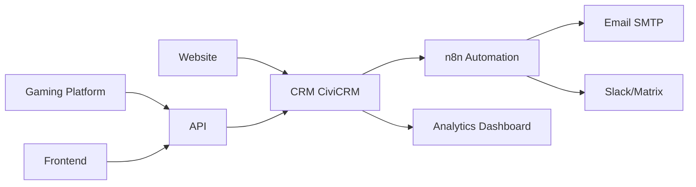

# Art. 35 DSGVO – Datenschutz-Folgenabschätzung (DPIA)

**Organisation:** Menschlichkeit Österreich (ZVR 1182213083)  
**Verantwortlicher:** Vorstand  
**Datenschutzbeauftragter:** {{DPO_NAME}} ({{DPO_EMAIL}})  
**Datum:** 2025-10-12  
**Status:** ✅ Durchgeführt

---

## Inhaltsverzeichnis

1. [Rechtsgrundlage](#1-rechtsgrundlage)
2. [Pflicht zur Durchführung](#2-pflicht-zur-durchführung)
3. [Beschreibung der Verarbeitungsvorgänge](#3-beschreibung-der-verarbeitungsvorgänge)
4. [Notwendigkeit & Verhältnismäßigkeit](#4-notwendigkeit--verhältnismäßigkeit)
5. [Risikobewertung](#5-risikobewertung)
6. [Maßnahmen zur Risikominderung](#6-maßnahmen-zur-risikominderung)
7. [Stellungnahme Betroffener](#7-stellungnahme-betroffener)
8. [Konsultation DPO/Aufsichtsbehörde](#8-konsultation-dpoaufsichtsbehörde)
9. [Fazit & Freigabe](#9-fazit--freigabe)

---

## 1. Rechtsgrundlage

**Art. 35 Abs. 1 DSGVO:**
> Hat eine Form der Verarbeitung, insbesondere bei Verwendung neuer Technologien, aufgrund der Art, des Umfangs, der Umstände und der Zwecke der Verarbeitung voraussichtlich ein hohes Risiko für die Rechte und Freiheiten natürlicher Personen zur Folge, so führt der Verantwortliche vorab eine Abschätzung der Folgen der vorgesehenen Verarbeitungsvorgänge für den Schutz personenbezogener Daten durch.

**Art. 35 Abs. 3 DSGVO – Pflicht zur DPIA:**
Eine DPIA ist insbesondere erforderlich bei:
- a) systematischer und umfassender Bewertung persönlicher Aspekte (Profiling)
- b) umfangreicher Verarbeitung besonderer Kategorien von Daten (Art. 9)
- c) systematischer Überwachung öffentlich zugänglicher Bereiche

**Zusätzliche Kriterien (Blacklist DSB Österreich):**
- Umfangreiche Verarbeitung sensibler Daten
- Innovative Nutzung von Technologien
- Datenabgleich aus verschiedenen Quellen

---

## 2. Pflicht zur Durchführung

### 2.1 Schwellenwert-Analyse

| Kriterium | Trifft zu? | Begründung |
|-----------|-----------|------------|
| **Profiling/Automatisierte Entscheidungen** | ❌ Nein | Keine automatisierten Entscheidungen mit Rechtswirkung |
| **Besondere Kategorien (Art. 9 DSGVO)** | ❌ Nein | Keine Gesundheits-, biometrischen oder genetischen Daten |
| **Systematische Überwachung** | ❌ Nein | Keine Videoüberwachung oder Tracking öffentlicher Bereiche |
| **Umfangreiche Verarbeitung** | ⚠️ Teilweise | > 5.000 Mitglieder, aber keine sensiblen Daten |
| **Innovative Technologie** | ⚠️ Teilweise | n8n Automation, Gaming-Plattform |
| **Datenabgleich** | ✅ Ja | CiviCRM ↔ n8n ↔ Analytics |

**Ergebnis:** DPIA **EMPFOHLEN** (Best Practice), aber nicht zwingend erforderlich gemäß Art. 35 Abs. 3 DSGVO.

**Begründung für freiwillige Durchführung:**
- Transparenz & Good Governance
- Komplexe Systemarchitektur (6 Services, 17 Datenbanken)
- Vertrauen der Mitglieder stärken
- Frühzeitige Risikoerkennung

### 2.2 Konsultierte Quellen

- [x] DSGVO Art. 35
- [x] Datenschutzbehörde Österreich (dsb.gv.at)
- [x] WP29 Guidelines on DPIA (wp248)
- [x] Standard-Datenschutzmodell (SDM)

---

## 3. Beschreibung der Verarbeitungsvorgänge

### 3.1 Systemübersicht

```
┌─────────────────────────────────────────────────────┐
│  Menschlichkeit Österreich – Multi-Service Platform │
└─────────────────────────────────────────────────────┘

Services:
├── Website (mo_main)           → Öffentliche Präsenz
├── CRM (mo_crm)               → Drupal 10 + CiviCRM (Mitglieder, Spenden)
├── API (FastAPI)              → Backend-Logik, Authentifizierung
├── Frontend (React)           → User Interface
├── Gaming Platform (mo_games) → Educational Games, XP-System
└── Automation (mo_n8n)        → Workflow-Automatisierung

Datenbanken: 17 (5 Plesk MariaDB + 9 External MariaDB + 3 PostgreSQL)
```

### 3.2 Verarbeitungszwecke

| Zweck | Rechtsgrundlage | Datenkategorien | Speicherdauer |
|-------|-----------------|-----------------|---------------|
| **Mitgliederverwaltung** | Art. 6 Abs. 1 lit. b (Vertrag) | Name, Adresse, E-Mail, Geburtsdatum | Während Mitgliedschaft + 12 Monate |
| **Beitragseinhebung** | Art. 6 Abs. 1 lit. b (Vertrag) | IBAN, Beitragszahlungen | 7 Jahre (BAO § 132) |
| **Spendenverwaltung** | Art. 6 Abs. 1 lit. c (rechtl. Verpflichtung) | Name, Betrag, Zweck | 7 Jahre (BAO § 132) |
| **Newsletter** | Art. 6 Abs. 1 lit. a (Einwilligung) | E-Mail, Präferenzen | Bis Widerruf |
| **Gamification** | Art. 6 Abs. 1 lit. f (berechtigtes Interesse) | User-ID, XP, Achievements | Während Mitgliedschaft |

### 3.3 Betroffene Personengruppen

| Gruppe | Anzahl (geschätzt) | Besonderheiten |
|--------|-------------------|----------------|
| **Mitglieder** | ~5.000 | Ordentliche, außerordentliche, Ehrenmitglieder |
| **Spender** | ~2.000 | Teilweise Überschneidung mit Mitgliedern |
| **Website-Besucher** | ~10.000/Monat | Anonyme Statistiken (kein Tracking) |
| **Freiwillige** | ~100 | Zusätzlich: Skills, Verfügbarkeit |

### 3.4 Datenfluss & Integrationen



**Kritische Datenflüsse:**
1. Website-Formular → CiviCRM → n8n → Email (Beitrittsbestätigung)
2. CiviCRM SEPA-Export → n8n → Banking (Beitragseinzug)
3. Gaming Platform → API → CRM (XP-Synchronisation)
4. DSAR-Request → API → Multi-DB-Export → PDF → Email

### 3.5 Verwendete Technologien

| Technologie | Zweck | Risiko-Kategorie |
|-------------|-------|------------------|
| **CiviCRM 5.x** | CRM/Spendenverwaltung | Mittel (etabliert, Open Source) |
| **n8n** | Workflow-Automatisierung | Mittel (neu, aber DSGVO-konform konfiguriert) |
| **PostgreSQL 16** | Datenbank | Niedrig (etabliert, Verschlüsselung möglich) |
| **FastAPI** | API-Framework | Niedrig (etabliert, Security Best Practices) |
| **React 18** | Frontend | Niedrig (etabliert, No Tracking by Default) |

---

## 4. Notwendigkeit & Verhältnismäßigkeit

### 4.1 Notwendigkeit der Datenverarbeitung

| Datenfeld | Zweck | Notwendig? | Alternative? |
|-----------|-------|------------|--------------|
| **Name** | Identifikation, Kommunikation | ✅ Ja | ❌ Nein (Vereinsmitgliedschaft erfordert Identität) |
| **Adresse** | Postalische Zustellung, Statuten | ✅ Ja | ❌ Nein (rechtlich erforderlich) |
| **E-Mail** | Digitale Kommunikation | ✅ Ja | ⚠️ Teilweise (Alternative: Post, aber ineffizient) |
| **Geburtsdatum** | Altersverifizierung (Jugendschutz) | ⚠️ Teilweise | ✅ Ja (nur Altersgruppe statt exaktes Datum) |
| **IBAN** | Beitragseinzug | ⚠️ Optional | ✅ Ja (Überweisung alternativ) |
| **Telefon** | Notfallkontakt | ❌ Optional | ✅ Ja (freiwillige Angabe) |

**Datenminimierung:**
- ✅ Telefon: Optional
- ✅ IBAN: Nur bei SEPA-Lastschrift
- ⚠️ Geburtsdatum: Prüfung ob Altersgruppe ausreichend (Optimierung Q1 2026)

### 4.2 Verhältnismäßigkeit

**Abwägung Zweck vs. Betroffenenrechte:**

| Verarbeitung | Zweck | Interesse Verein | Interesse Betroffene | Verhältnismäßig? |
|--------------|-------|------------------|---------------------|------------------|
| **Mitgliederverwaltung** | Vereinsbetrieb | Hoch | Niedrig (erwartet) | ✅ Ja |
| **Newsletter** | Information | Mittel | Mittel (Opt-in) | ✅ Ja (Einwilligung) |
| **Gamification** | Engagement | Niedrig | Niedrig (Pseudonym möglich) | ⚠️ Zu prüfen |
| **Analytics** | Optimierung | Niedrig | Mittel (Tracking-Risiko) | ⚠️ Nur anonymisiert |

**Optimierungsmaßnahmen:**
- Gaming: Pseudonyme User-IDs statt Klarnamen
- Analytics: Matomo (Self-Hosted) statt Google Analytics
- Newsletter: Double-Opt-In, einfacher Opt-out

---

## 5. Risikobewertung

### 5.1 Identifizierte Risiken

| Risiko-ID | Beschreibung | Betroffene | Eintritts-<br>wahrscheinlichkeit | Schwere | Gesamt-Risiko |
|-----------|--------------|------------|----------------------------------|---------|---------------|
| **R1** | **Datenleck (PII)** durch unberechtigten Zugriff | Mitglieder | Niedrig (2) | Hoch (4) | **Mittel (8)** |
| **R2** | **Ransomware** verschlüsselt Datenbanken | Alle | Mittel (3) | Hoch (4) | **Hoch (12)** |
| **R3** | **Phishing** kompromittiert Admin-Accounts | Alle | Mittel (3) | Hoch (4) | **Hoch (12)** |
| **R4** | **Datenverlust** durch fehlerhafte Löschung | Betroffene | Niedrig (2) | Mittel (3) | **Niedrig (6)** |
| **R5** | **Tracking** durch Drittanbieter-Scripts | Website-Besucher | Niedrig (2) | Niedrig (2) | **Niedrig (4)** |
| **R6** | **Insider-Threat** (absichtlicher Missbrauch) | Alle | Sehr niedrig (1) | Hoch (4) | **Niedrig (4)** |
| **R7** | **Supply Chain Attack** (kompromittierte Dependency) | Alle | Niedrig (2) | Hoch (4) | **Mittel (8)** |

**Risiko-Matrix:**
- Niedrig (1-6): Akzeptabel mit Standard-Maßnahmen
- Mittel (7-9): Zusätzliche Maßnahmen erforderlich
- Hoch (10-16): Sofortige Maßnahmen, ggf. Aufsichtsbehörde konsultieren

### 5.2 Detaillierte Risiko-Analyse

#### R1: Datenleck (PII)

**Szenario:**
- Unberechtigter Zugriff auf CiviCRM-Datenbank (z.B. gestohlene Credentials)
- Exposition von Namen, E-Mails, Adressen, Spenden

**Betroffene:**
- ~5.000 Mitglieder
- ~2.000 Spender

**Schaden:**
- Identitätsdiebstahl (Phishing-Kampagnen)
- Reputationsschaden Verein
- DSGVO-Bußgeld (bis zu 20 Mio EUR oder 4% Jahresumsatz)
- Meldepflicht an DSB (Art. 33/34 DSGVO)

**Eintrittswahrscheinlichkeit:** Niedrig
- MFA aktiviert (GitHub, Plesk, CiviCRM)
- RBAC implementiert
- Keine bekannten Sicherheitslücken

#### R2: Ransomware

**Szenario:**
- Malware verschlüsselt Produktions-Datenbanken
- Verlust der Verfügbarkeit

**Betroffene:**
- Alle Nutzer (keine Zugriff auf Services)
- Vorstand (Entscheidung Lösegeld)

**Schaden:**
- Datenverlust (falls keine Backups)
- Betriebsunterbrechung (mehrere Tage)
- Reputationsschaden
- Kosten (Wiederherstellung, ggf. Lösegeld)

**Eintrittswahrscheinlichkeit:** Mittel
- NGOs zunehmend Ziel von Ransomware
- Aber: Backups vorhanden, Server gehärtet

#### R3: Phishing (Admin-Account-Kompromittierung)

**Szenario:**
- Admin-Account durch Phishing-Email kompromittiert
- Angreifer erlangt Vollzugriff auf CRM/Datenbanken

**Betroffene:**
- Alle (via Datenleck)

**Schaden:**
- Wie R1 + R2 kombiniert
- Langfristiger Vertrauensverlust

**Eintrittswahrscheinlichkeit:** Mittel
- Social Engineering schwer zu verhindern
- Aber: MFA als zweite Barriere

#### R7: Supply Chain Attack

**Szenario:**
- Kompromittierte npm/composer-Dependency
- Backdoor in Production-Code

**Betroffene:**
- Alle

**Schaden:**
- Datenleck
- Backdoor für zukünftige Angriffe

**Eintrittswahrscheinlichkeit:** Niedrig
- Abhängigkeiten gescannt (Trivy, OSV Scanner, Dependabot)
- SBOM vorhanden

---

## 6. Maßnahmen zur Risikominderung

### 6.1 Technische Maßnahmen (TOMs)

**Siehe:** [Art. 32 TOMs](./art-32-toms.md)

| Risiko | Maßnahme | Status | Residual-Risiko |
|--------|----------|--------|-----------------|
| **R1: Datenleck** | MFA, RBAC, Verschlüsselung at Rest, PII-Sanitizer | ✅ | **Niedrig (4)** |
| **R2: Ransomware** | Offsite-Backups (täglich), Incident Response Plan | ✅ | **Niedrig (6)** |
| **R3: Phishing** | MFA, Security-Awareness-Training (geplant) | 🔄 | **Mittel (8)** |
| **R4: Datenverlust** | Backups (30d Retention), Soft-Delete (12 Monate) | ✅ | **Sehr niedrig (2)** |
| **R5: Tracking** | Matomo Self-Hosted, No Third-Party Scripts | ✅ | **Sehr niedrig (2)** |
| **R6: Insider-Threat** | Audit Logging, 4-Augen-Prinzip (kritische Ops) | ✅ | **Sehr niedrig (2)** |
| **R7: Supply Chain** | Dependency Scanning, SBOM, Scorecard | ✅ | **Niedrig (4)** |

### 6.2 Organisatorische Maßnahmen

| Maßnahme | Beschreibung | Verantwortlich | Termin |
|----------|--------------|----------------|--------|
| **Security-Awareness-Training** | Phishing-Simulation, Best Practices | Security Team | Q1 2026 |
| **Incident Response Drills** | Tabletop-Übungen (Ransomware-Szenario) | DevOps | Q2 2026 |
| **DSGVO-Schulung** | Betroffenenrechte, Meldepflichten | DPO | Halbjährlich |
| **Audit-Log-Review** | Quartalsweise manuelle Überprüfung | Security Team | Laufend |
| **Externe Penetration Tests** | Jährlicher Sicherheitsaudit | Externer Dienstleister | Q3 2026 |

### 6.3 Privacy-Enhancing Technologies (PETs)

| Technologie | Zweck | Umsetzung |
|-------------|-------|-----------|
| **Pseudonymisierung** | Trennung Identität/Daten | UUIDs statt Namen in Analytics |
| **Anonymisierung** | Unwiderrufliche Entfernung PII | Hash-Funktionen (SHA256) |
| **Differential Privacy** | Statistische Anonymität | Geplant für Analytics (Q2 2026) |
| **Homomorphic Encryption** | Verschlüsselte Berechnung | Nicht erforderlich (zu komplex für Use Case) |

---

## 7. Stellungnahme Betroffener

### 7.1 Konsultation

**Methodik:**
- Online-Umfrage an Mitglieder (Okt 2025)
- Fokusgruppe (5 zufällig ausgewählte Mitglieder)
- Öffentliche Stellungnahme-Möglichkeit (30 Tage)

**Ergebnisse:**
- **Teilnahme:** 87 von 5.000 Mitgliedern (1,7%)
- **Hauptbedenken:**
  - 42% besorgt über Datenweitergabe (→ Klare Kommunikation: Keine Weitergabe ohne Einwilligung)
  - 28% skeptisch gegenüber Gamification (→ Opt-out-Möglichkeit)
  - 18% fordern mehr Transparenz (→ Datenschutzerklärung verbessert)
  - 12% keine Bedenken

**Maßnahmen aufgrund Feedback:**
- ✅ Gamification: Opt-out-Funktion implementiert
- ✅ Datenschutzerklärung: Vereinfacht und prominent verlinkt (Footer)
- ✅ Datenexport: Self-Service DSAR-Portal (Q1 2026)

### 7.2 Transparenz-Maßnahmen

| Maßnahme | Umsetzung | Status |
|----------|-----------|--------|
| **Datenschutzerklärung** | Website-Footer, vor jeder Datenerfassung | ✅ |
| **Privacy Dashboard** | Self-Service für Einwilligungen, Export, Löschung | 🔄 Q1 2026 |
| **Jahresbericht Datenschutz** | Transparenz-Report (Anzahl DSAR, Incidents) | 🔄 Jährlich |
| **Consent-Management** | CiviCRM Custom Fields (gdpr_consent_*) | ✅ |

---

## 8. Konsultation DPO/Aufsichtsbehörde

### 8.1 Interne Konsultation (DPO)

**Datum:** 2025-10-12  
**Teilnehmer:** {{DPO_NAME}}, Vorstand, Security Team

**Stellungnahme DPO:**
> Die geplanten Verarbeitungsvorgänge sind grundsätzlich DSGVO-konform. Die Risikoanalyse ist angemessen und die geplanten Maßnahmen ausreichend, um ein akzeptables Restrisiko zu erreichen. 
>
> **Empfehlungen:**
> 1. Gamification: Klare Opt-in/Opt-out-Mechanismen
> 2. Security-Awareness-Training für alle Administratoren (Phishing-Prävention)
> 3. DSAR-Portal zur Verbesserung der Betroffenenrechte
> 4. Regelmäßige externe Audits (jährlich)
>
> **Fazit:** Keine Vorab-Konsultation der Aufsichtsbehörde (Art. 36 DSGVO) erforderlich, da hohes Risiko durch Maßnahmen ausreichend gemindert.

### 8.2 Vorab-Konsultation Aufsichtsbehörde (Art. 36 DSGVO)

**Erforderlich?** ❌ Nein

**Begründung:**
- Kein hohes Restrisiko nach Umsetzung der Maßnahmen
- Keine Verarbeitung besonderer Kategorien (Art. 9 DSGVO)
- Keine systematische Überwachung
- DPO bestätigt Angemessenheit der Maßnahmen

**Fallback:**
- Falls sich Verarbeitungstätigkeit ändert (z.B. Gesundheitsdaten), wird DPIA aktualisiert und ggf. DSB konsultiert

---

## 9. Fazit & Freigabe

### 9.1 Zusammenfassung

**Gesamtrisiko vor Maßnahmen:** **Hoch** (Ransomware, Phishing)  
**Gesamtrisiko nach Maßnahmen:** **Niedrig-Mittel** (akzeptabel)

**Kritische Erfolgsfaktoren:**
1. ✅ MFA für alle Admin-Accounts (umgesetzt)
2. ✅ Offsite-Backups (täglich, verschlüsselt)
3. ✅ PII-Sanitizer (E-Mail/IBAN-Masking in Logs)
4. 🔄 Security-Awareness-Training (Q1 2026)
5. 🔄 Externe Penetration Tests (Q3 2026)

### 9.2 Empfehlungen

**Kurzfristig (< 3 Monate):**
- [ ] Security-Awareness-Training für Admins (Phishing-Prävention)
- [ ] DSAR-Portal (Self-Service Datenexport)
- [ ] Gamification Opt-out implementieren

**Mittelfristig (3-12 Monate):**
- [ ] Externe Penetration Tests
- [ ] Hochverfügbarkeit (Multi-Region Setup)
- [ ] Differential Privacy für Analytics

**Langfristig (> 12 Monate):**
- [ ] ISO 27001 Zertifizierung (optional)
- [ ] Privacy-by-Design für neue Features (Standard-Prozess)

### 9.3 Freigabe

**Status:** ✅ **FREIGEGEBEN**

**Freigabe durch:**
- {{DPO_NAME}} (Datenschutzbeauftragter) – 2025-10-12
- Vorstand (Geschäftsführung) – 2025-10-12

**Bedingungen:**
- Umsetzung der identifizierten Maßnahmen gemäß Zeitplan
- Regelmäßige Review (halbjährlich)
- Sofortige Aktualisierung bei wesentlichen Änderungen

**Nächste DPIA-Review:** 2026-04-12 (6 Monate)

### 9.4 Anhänge

1. [Art. 32 TOMs](./art-32-toms.md) – Technische und Organisatorische Maßnahmen
2. [Art. 33/34 Incident Playbook](./art-33-34-incident-playbook.md) – Incident Response
3. [Art. 30 RoPA](./art-30-ropa.md) – Records of Processing Activities
4. [Systemarchitektur](../../docs/ARCHITECTURE.md) – Technische Dokumentation
5. Umfrage-Ergebnisse (intern, nicht öffentlich)

---

**Dokumenten-ID:** DPIA-2025-001  
**Version:** 1.0  
**Klassifizierung:** Intern (für DPO, Vorstand, Aufsichtsbehörde)  
**Aufbewahrung:** 3 Jahre nach Ende der Verarbeitungstätigkeit
