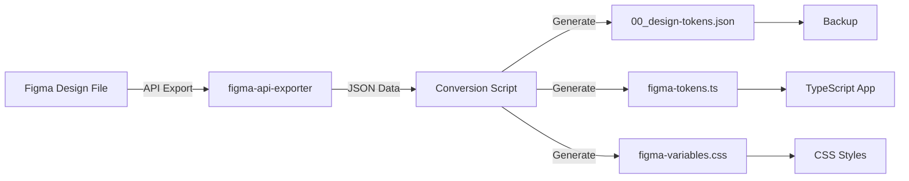

# Figma Design System - Automatische Synchronisation

## 🎨 Übersicht

Automatisches Sync-System für Design Tokens zwischen Figma und Code. Extrahiert Farben, Typography, Spacing und weitere Design Tokens aus Figma und generiert JSON, TypeScript und CSS.

## 📋 Features

- **✅ Automatischer Export** von Figma Design Tokens
- **🔄 Bidirektionale Sync** (Figma → Code)
- **📝 TypeScript Definitionen** für Type Safety
- **🎨 CSS Variables** für direkten Zugriff
- **💾 Automatisches Backup** vor Updates
- **🚨 Error Handling** mit Rollback

---

## 🚀 Setup

### 1. Figma Access Token erstellen

1. Gehe zu **Figma Settings** → **Account** → **Personal Access Tokens**
2. Klicke auf **Generate new token**
3. Benenne den Token (z.B. "Design System Sync")
4. Kopiere den Token (wird nur einmal angezeigt!)

### 2. Figma File ID ermitteln

Die File ID findest du in der Figma URL:

```
https://www.figma.com/file/{FILE_ID}/Design-System
                              ^^^^^^^^
```

### 3. Environment Variables setzen

**Option A: Lokal in Shell**

```bash
export FIGMA_ACCESS_TOKEN='figd_...'
export FIGMA_FILE_ID='abc123...'
```

**Option B: In .env Datei** (empfohlen)

```bash
# .env (im Root des Projekts)
FIGMA_ACCESS_TOKEN=figd_your_token_here
FIGMA_FILE_ID=your_file_id_here
```

**Option C: GitHub Secrets** (für CI/CD)

1. Gehe zu **Repository Settings** → **Secrets and variables** → **Actions**
2. Füge hinzu:
   - `FIGMA_ACCESS_TOKEN`
   - `FIGMA_FILE_ID`

---

## 📦 Installation

```bash
# npm Package für Figma API installieren
npm install -g figma-api-exporter

# Oder lokal im Projekt
npm install --save-dev figma-api-exporter
```

---

## 🔧 Verwendung

### Manueller Sync

```bash
# Aus dem Root-Verzeichnis
./scripts/sync-figma-tokens.sh

# Oder aus figma-design-system/
cd figma-design-system
../scripts/sync-figma-tokens.sh
```

### Automatischer Sync (GitHub Actions)

Erstelle `.github/workflows/sync-figma.yml`:

```yaml
name: Sync Figma Design Tokens

on:
  schedule:
    # Täglich um 2:00 UTC
    - cron: '0 2 * * *'
  workflow_dispatch: # Manueller Trigger

jobs:
  sync:
    runs-on: ubuntu-latest

    steps:
      - name: Checkout
        uses: actions/checkout@v4

      - name: Setup Node.js
        uses: actions/setup-node@v4
        with:
          node-version: '20'

      - name: Install Dependencies
        run: npm install -g figma-api-exporter

      - name: Sync Figma Tokens
        env:
          FIGMA_ACCESS_TOKEN: ${{ secrets.FIGMA_ACCESS_TOKEN }}
          FIGMA_FILE_ID: ${{ secrets.FIGMA_FILE_ID }}
        run: ./scripts/sync-figma-tokens.sh

      - name: Create Pull Request
        uses: peter-evans/create-pull-request@v5
        with:
          commit-message: 'chore: Sync Figma design tokens'
          title: '🎨 Sync Figma Design Tokens'
          body: |
            Automatischer Sync von Figma Design Tokens.

            **Geänderte Dateien:**
            - `figma-design-system/00_design-tokens.json`
            - `frontend/src/lib/figma-tokens.ts`
            - `figma-design-system/styles/figma-variables.css`

            **Bitte überprüfen:**
            - [ ] Breaking Changes in Farben
            - [ ] Neue Typography Tokens
            - [ ] CSS Variable Naming
          branch: figma-sync-${{ github.run_number }}
          delete-branch: true
```

### Pre-Commit Hook (Lokal)

```bash
# .husky/pre-commit
#!/bin/sh

# Sync Figma Tokens vor jedem Commit
if [ -n "$FIGMA_ACCESS_TOKEN" ] && [ -n "$FIGMA_FILE_ID" ]; then
  ./scripts/sync-figma-tokens.sh
  git add figma-design-system/00_design-tokens.json
  git add frontend/src/lib/figma-tokens.ts
  git add figma-design-system/styles/figma-variables.css
fi
```

---

## 📁 Output Files

Nach dem Sync werden folgende Dateien aktualisiert:

### 1. **Design Tokens JSON** (`figma-design-system/00_design-tokens.json`)

```json
{
  "color": {
    "austria-red": { "value": "#c8102e", "type": "color" },
    "primary-500": { "value": "#c8102e", "type": "color" }
  },
  "typography": {
    "heading-1": {
      "fontFamily": { "value": "Inter", "type": "fontFamily" },
      "fontSize": { "value": "48px", "type": "fontSize" },
      "fontWeight": { "value": 700, "type": "fontWeight" },
      "lineHeight": { "value": 1.2, "type": "lineHeight" }
    }
  }
}
```

### 2. **TypeScript Definitionen** (`frontend/src/lib/figma-tokens.ts`)

```typescript
// Auto-generated from Figma Design Tokens

export const colors = {
  'austria-red': '#c8102e',
  'primary-500': '#c8102e',
} as const;

export const typography = {
  'heading-1': {
    fontFamily: 'Inter',
    fontSize: '48px',
    fontWeight: 700,
    lineHeight: 1.2,
  },
} as const;

export type ColorToken = keyof typeof colors;
export type TypographyToken = keyof typeof typography;
```

### 3. **CSS Variables** (`figma-design-system/styles/figma-variables.css`)

```css
/* Auto-generated from Figma Design Tokens */

:root {
  /* Colors */
  --color-austria-red: #c8102e;
  --color-primary-500: #c8102e;

  /* Typography */
  --typography-heading-1-font-family: Inter;
  --typography-heading-1-font-size: 48px;
  --typography-heading-1-font-weight: 700;
  --typography-heading-1-line-height: 1.2;
}
```

---

## 🎯 Verwendung im Code

### React/TypeScript

```tsx
import { colors, typography } from '@menschlichkeit/design-system/figma-tokens';

function MyComponent() {
  return (
    <h1
      style={{
        color: colors['austria-red'],
        fontFamily: typography['heading-1'].fontFamily,
        fontSize: typography['heading-1'].fontSize,
      }}
    >
      Österreichischer NGO
    </h1>
  );
}
```

### CSS/SCSS

```css
/* Direkt CSS Variables verwenden */
.hero-title {
  color: var(--color-austria-red);
  font-family: var(--typography-heading-1-font-family);
  font-size: var(--typography-heading-1-font-size);
}
```

### Tailwind CSS

```javascript
// tailwind.config.js
const { colors } = require('./frontend/src/lib/figma-tokens');

module.exports = {
  theme: {
    extend: {
      colors: {
        'austria-red': colors['austria-red'],
      },
    },
  },
};
```

---

## 🔄 Workflow

### Figma → Code Sync Flow



### Update Process

1. **Designer** ändert Farben/Typography in Figma
2. **Automatischer Sync** läuft (GitHub Actions oder manuell)
3. **Backup** der alten Tokens wird erstellt
4. **Neue Tokens** werden generiert
5. **Pull Request** wird erstellt
6. **Review** durch Team
7. **Merge** → Neue Tokens im Code

---

## ⚙️ Konfiguration

### Figma Export Optionen

Bearbeite das Sync-Script für erweiterte Optionen:

```bash
# scripts/sync-figma-tokens.sh

# Nur bestimmte Nodes exportieren
figma-api-exporter \
  --token="$FIGMA_ACCESS_TOKEN" \
  --fileId="$FIGMA_FILE_ID" \
  --ids="123:456,789:012" \  # Nur spezifische Nodes
  --output="$TEMP_DIR/figma-export.json"

# Export mit Bildern
figma-api-exporter \
  --token="$FIGMA_ACCESS_TOKEN" \
  --fileId="$FIGMA_FILE_ID" \
  --format="png" \           # png, jpg, svg, pdf
  --scale=2 \                # 2x für Retina
  --output="$TEMP_DIR/assets/"
```

### Token Mapping anpassen

```javascript
// Eigene Mapping-Logik in sync-figma-tokens.sh

// Farbnamen transformieren
const name = style.name
  .toLowerCase()
  .replace(/\s+/g, '-')
  .replace(/primary/g, 'austria-red'); // Custom Mapping

// Spacing aus Layout Grid extrahieren
const spacing = {};
figmaData.layoutGrids?.forEach(grid => {
  spacing[`grid-${grid.count}`] = {
    value: `${grid.gutterSize}px`,
    type: 'spacing',
  };
});
```

---

## 🛡️ Fehlerbehandlung

### Backup & Rollback

```bash
# Manuelles Backup
cp figma-design-system/00_design-tokens.json \
   figma-design-system/00_design-tokens.backup.json

# Rollback zu vorherigem Stand
cp figma-design-system/00_design-tokens.backup.20250115_143000.json \
   figma-design-system/00_design-tokens.json
```

### Häufige Fehler

**❌ Fehler: "FIGMA_ACCESS_TOKEN nicht gesetzt"**

```bash
# Lösung: Token setzen
export FIGMA_ACCESS_TOKEN='figd_your_token'
```

**❌ Fehler: "Figma API rate limit exceeded"**

```bash
# Lösung: Warten oder Token Rate Limit erhöhen
# Figma Rate Limit: 1000 Requests/Stunde
```

**❌ Fehler: "File ID nicht gefunden"**

```bash
# Lösung: Richtige File ID aus Figma URL kopieren
# Format: https://www.figma.com/file/{FILE_ID}/...
```

---

## 📊 Monitoring

### Sync-Statistiken

Das Script erstellt ein Log-File:

```bash
# Letzter Sync-Bericht
cat figma-design-system/sync-log.txt

# Beispiel-Output:
# [2025-01-15 14:30:00] ✅ Sync erfolgreich
# - 42 Farben exportiert
# - 18 Typography Tokens aktualisiert
# - 0 Breaking Changes
# - Dauer: 3.2s
```

### GitHub Actions Dashboard

Im GitHub Repository unter **Actions** → **Sync Figma Design Tokens**:

- ✅ Erfolgreiche Syncs
- ❌ Fehlgeschlagene Syncs
- 📊 Sync-Frequenz
- ⏱️ Durchschnittliche Dauer

---

## 🔗 Integration mit anderen Tools

### Storybook

```javascript
// .storybook/preview.js
import '../figma-design-system/styles/figma-variables.css';
import { colors, typography } from '../frontend/src/lib/figma-tokens';

export const globalTypes = {
  theme: {
    name: 'Theme',
    description: 'Design System Theme',
    defaultValue: 'light',
    toolbar: {
      items: [
        { value: 'light', title: 'Light' },
        { value: 'dark', title: 'Dark' },
      ],
    },
  },
};
```

### Chromatic (Visual Regression Testing)

```yaml
# .github/workflows/chromatic.yml
name: Chromatic

on:
  pull_request:
    paths:
      - 'figma-design-system/00_design-tokens.json'
      - 'frontend/src/lib/figma-tokens.ts'

jobs:
  chromatic:
    runs-on: ubuntu-latest
    steps:
      - uses: chromaui/action@v1
        with:
          projectToken: ${{ secrets.CHROMATIC_PROJECT_TOKEN }}
```

---

## 📚 Best Practices

### 1. **Naming Conventions**

Verwende konsistente Naming Patterns in Figma:

```
✅ GOOD:
- color/primary-500
- typography/heading-1
- spacing/md

❌ BAD:
- Main Color (mit Leerzeichen)
- H1 Title (kein Muster)
- 16px Spacing (Wert im Namen)
```

### 2. **Version Control**

```bash
# Tagge Design Token Releases
git tag -a design-tokens-v1.0.0 -m "Initial design tokens"
git push origin design-tokens-v1.0.0

# Semantic Versioning für Breaking Changes
# v1.0.0 → v2.0.0 bei Breaking Changes (z.B. Farbe gelöscht)
# v1.0.0 → v1.1.0 bei neuen Tokens (z.B. neue Farbe)
# v1.0.0 → v1.0.1 bei Bugfixes (z.B. Hex-Wert Korrektur)
```

### 3. **Testing nach Sync**

```bash
# Automatische Tests nach Sync
npm run test              # Unit Tests
npm run test:visual       # Visual Regression Tests
npm run lint              # Code Quality
npm run build             # Build Check
```

---

## 🚀 Erweiterte Features

### Multi-Brand Support

```javascript
// Mehrere Figma Files für verschiedene Brands
const brands = {
  austria: 'FIGMA_FILE_ID_AUSTRIA',
  germany: 'FIGMA_FILE_ID_GERMANY',
};

Object.entries(brands).forEach(([brand, fileId]) => {
  // Sync für jedes Brand
  syncFigmaTokens(fileId, `tokens-${brand}.json`);
});
```

### Token Transformation Pipeline

```javascript
// Token Pipeline mit Plugins
const pipeline = [
  extractColors,
  extractTypography,
  extractSpacing,
  transformToTailwind, // Custom Transform
  validateTokens,
  generateTypeScript,
];

pipeline.reduce((tokens, transform) => transform(tokens), rawFigmaData);
```

---

## 📞 Support

Bei Fragen oder Problemen:

1. **Dokumentation**: Siehe [README.md](../README.md)
2. **Issues**: [GitHub Issues](https://github.com/menschlichkeit-oesterreich/issues)
3. **Team Chat**: Slack #design-system
4. **E-Mail**: <design@menschlichkeit-oesterreich.at>

---

## 📝 Changelog

### v1.0.0 (2025-01-15)

- ✨ Initial Release
- 🎨 Figma → Code Sync
- 📝 TypeScript Definitionen
- 🎨 CSS Variables Generation
- 💾 Automatisches Backup
- 🚨 Error Handling

---

**Nächste Schritte:**

1. Figma Access Token erstellen
2. Environment Variables setzen
3. Ersten Sync durchführen: `./scripts/sync-figma-tokens.sh`
4. GitHub Actions Workflow aktivieren
