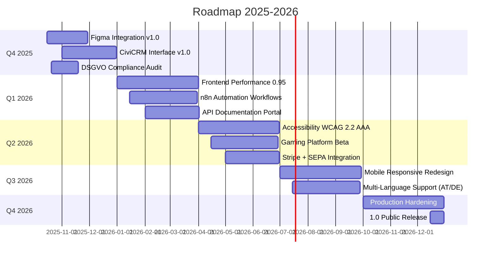

# Product Roadmap – Menschlichkeit Österreich (2025-2026)

**Gültig ab:** 2025-10-17  
**Planungszeitraum:** Q4 2025 – Q4 2026  
**Nächste Review:** 2026-01-15  

---

## Vision & Mission

**Vision 2026:** Ein vollintegriertes, DSGVO-konformes, barrierefreies Ökosystem aus CRM, API, Frontend, Gaming-Platform und Automation – mit 100% Lighthouse-Score, automatisierten Workflows und nahtloser Mitgliederverwaltung.

**Mission Statement:**  
*„Menschlichkeit Österreich befähigt Menschen zur Partizipation durch digitale Exzellenz: sicher, inklusiv, transparent."*

---

## Milestones & Epics (Quarterly Overview)

---

## Q4 2025 – Foundation & Compliance

### Milestone: **Figma Integration v1.0** (2025-10-15 – 2025-11-30)

**Ziel:** Vollständige Design-Token-Synchronisation, automatisierte Component-Code-Generierung, Figma-Plugin für CRM/Frontend.

#### Epics & Issues

| Epic | Status | Lead | P | Issues | ADRs |
|------|--------|------|---|--------|------|
| **Figma MCP Server Setup** | ✅ Done | Peter | P0 | #412, #413 | ADR-001 |
| **Design Token Pipeline** | 🔄 In Progress | Michael | P0 | #414, #415, #416 | ADR-002 |
| **Component Library Sync** | 📋 Ready | TBD | P1 | #417, #418 | ADR-003 |
| **Automated Screenshot Tests** | ⏳ Backlog | TBD | P2 | #419 | - |

**Critical Dependencies:**
- ✅ Figma API Token (Secret Management)
- 🔄 Design System Documentation (`figma-design-system/README.md`)
- ⏳ Playwright Visual Regression Tests

**Success Metrics:**
- [ ] 100% Design Tokens synchronized (`figma-design-system/00_design-tokens.json`)
- [ ] Frontend Lighthouse Score ≥0.90 (Design Consistency)
- [ ] 0 Manual Color/Spacing Hardcodes (`npm run lint:design-tokens`)

---

### Milestone: **CiviCRM Interface v1.0** (2025-11-01 – 2025-12-31)

**Ziel:** Vollständiger RESTful API-Wrapper für CiviCRM-Entitäten (Contacts, Contributions, Memberships, Events), OAuth2-Authentifizierung, OpenAPI-Dokumentation.

#### Epics & Issues

| Epic | Status | Lead | P | Issues | ADRs |
|------|--------|------|---|--------|------|
| **API Endpoints Design** | 📋 Ready | Peter | P0 | #420, #421 | ADR-004 |
| **OAuth2 + DSGVO Consent** | 📋 Ready | Peter | P0 | #422 | ADR-005 |
| **Membership Lifecycle Automation** | ⏳ Backlog | TBD | P1 | #423, #424 | - |
| **Event Registration Flow** | ⏳ Backlog | TBD | P2 | #425 | - |

**Critical Dependencies:**
- 🔄 CRM Drupal Module `pii_sanitizer` (DSGVO-konforme Logs)
- 🔄 API Middleware `pii_middleware.py` (E-Mail/IBAN-Maskierung)
- ⏳ n8n Webhooks für Zahlungs-Notifications (Stripe)

**Success Metrics:**
- [ ] OpenAPI Spec 100% coverage (`api/openapi.yaml`)
- [ ] E2E Tests für alle CRUD-Operationen (Playwright API-Tests)
- [ ] DSGVO: 0 PII in API-Logs (`pytest tests/test_privacy_api.py`)

---

### Milestone: **DSGVO Compliance Audit** (2025-10-20 – 2025-11-20)

**Ziel:** Externe Prüfung aller Datenverarbeitungen, Dokumentation Verarbeitungsverzeichnis, DSB-Meldung (falls erforderlich), Zertifizierung.

#### Epics & Issues

| Epic | Status | Lead | P | Issues | ADRs |
|------|--------|------|---|--------|------|
| **Verarbeitungsverzeichnis** | 🔄 In Progress | Peter | P0 | #426 | ADR-006 |
| **PII Sanitizer Audit** | 📋 Ready | Michael | P0 | #427, #428 | ADR-007 |
| **Consent Management UI** | 📋 Ready | TBD | P1 | #429 | - |
| **Betroffenenrechte-Portal** | ⏳ Backlog | TBD | P2 | #430, #431 | ADR-008 |

**Critical Dependencies:**
- ✅ `.github/instructions/dsgvo-compliance.instructions.md` (AI-Agent-Rules)
- 🔄 `api/app/lib/pii_sanitizer.py` + Tests
- 🔄 `crm/web/modules/custom/pii_sanitizer/` (Drupal)

**Success Metrics:**
- [ ] Verarbeitungsverzeichnis gemäß Art. 30 DSGVO (PDF + Web)
- [ ] 100% Betroffenenrechte implementiert (Art. 15-21 DSGVO)
- [ ] Externe Audit-Bestätigung (Zertifikat/Bericht)

---

## Q1 2026 – Performance & Automation

### Milestone: **Frontend Performance 0.95** (2026-01-01 – 2026-03-31)

**Ziel:** Lighthouse Score ≥0.95 für Performance, Accessibility, Best Practices, SEO auf allen Seiten.

#### Epics & Issues

| Epic | Status | Lead | P | Issues | ADRs |
|------|--------|------|---|--------|------|
| **Code-Splitting & Lazy-Loading** | ⏳ Backlog | TBD | P1 | #432, #433 | ADR-009 |
| **Image Optimization (WebP, AVIF)** | ⏳ Backlog | TBD | P1 | #434 | - |
| **Bundle Size ≤500KB** | ⏳ Backlog | TBD | P2 | #435 | ADR-010 |
| **PWA + Offline Support** | ⏳ Backlog | TBD | P3 | #436 | - |

**Success Metrics:**
- [ ] Lighthouse Performance ≥0.95 (alle Pages)
- [ ] Time to Interactive (TTI) <3s
- [ ] First Contentful Paint (FCP) <1.5s

---

### Milestone: **n8n Automation Workflows** (2026-01-15 – 2026-03-31)

**Ziel:** 15+ kritische Workflows automatisiert (Newsletter DOI, Rechnungen, Mahnwesen, Event-Reminders, Stripe-Webhooks, Support-Tickets).

#### Epics & Issues

| Epic | Status | Lead | P | Issues | ADRs |
|------|--------|------|---|--------|------|
| **Newsletter Double-Opt-In** | ⏳ Backlog | TBD | P1 | #437 | ADR-011 |
| **Invoicing + SEPA Automation** | ⏳ Backlog | TBD | P0 | #438, #439 | ADR-012 |
| **Event Registration + Reminders** | ⏳ Backlog | TBD | P2 | #440 | - |
| **Support-Mail → Issue** | ⏳ Backlog | TBD | P2 | #441 | - |

**Success Metrics:**
- [ ] 15+ Workflows produktiv
- [ ] Webhook-Success-Rate ≥99.5%
- [ ] Dokumentation je Workflow (`automation/n8n/README.md`)

---

### Milestone: **API Documentation Portal** (2026-02-01 – 2026-03-31)

**Ziel:** Interaktive OpenAPI-Dokumentation (Swagger UI), Beispiel-Code (Python, JavaScript, cURL), Rate-Limits, Authentifizierung.

#### Epics & Issues

| Epic | Status | Lead | P | Issues | ADRs |
|------|--------|------|---|--------|------|
| **OpenAPI Spec v3.1** | ⏳ Backlog | TBD | P1 | #442 | ADR-013 |
| **Swagger UI Deployment** | ⏳ Backlog | TBD | P1 | #443 | - |
| **Example Code Snippets** | ⏳ Backlog | TBD | P2 | #444 | - |
| **Rate-Limiting + Throttling** | ⏳ Backlog | TBD | P2 | #445 | ADR-014 |

**Success Metrics:**
- [ ] 100% Endpoints dokumentiert
- [ ] Interaktive Sandbox (Try-It-Out)
- [ ] Developer Onboarding <30min

---

## Q2 2026 – Accessibility & Billing

### Milestone: **Accessibility WCAG 2.2 AAA** (2026-04-01 – 2026-06-30)

**Ziel:** Vollständige WCAG 2.2 Level AAA Konformität für Frontend, CRM-Interface, Gaming-Platform.

#### Epics & Issues

| Epic | Status | Lead | P | Issues | ADRs |
|------|--------|------|---|--------|------|
| **Screen Reader Optimization** | ⏳ Backlog | TBD | P0 | #446 | ADR-015 |
| **Keyboard Navigation** | ⏳ Backlog | TBD | P0 | #447 | - |
| **Color Contrast 7:1** | ⏳ Backlog | TBD | P1 | #448 | - |
| **pa11y-ci Automation** | ⏳ Backlog | TBD | P2 | #449 | ADR-016 |

**Success Metrics:**
- [ ] pa11y-ci: 0 Errors/Warnings
- [ ] Lighthouse Accessibility ≥0.95
- [ ] Externe WCAG-Zertifizierung

---

### Milestone: **Gaming Platform Beta** (2026-04-15 – 2026-06-30)

**Ziel:** XP-System, Achievements, Leaderboard, Gamified Mitgliederengagement (Veranstaltungen, Spenden, Werbung).

#### Epics & Issues

| Epic | Status | Lead | P | Issues | ADRs |
|------|--------|------|---|--------|------|
| **XP + Achievements Schema** | ⏳ Backlog | TBD | P1 | #450 | ADR-017 |
| **Leaderboard + Privacy** | ⏳ Backlog | TBD | P1 | #451 | ADR-018 |
| **Gamification Ethics** | ⏳ Backlog | TBD | P2 | #452 | - |

**Success Metrics:**
- [ ] 20+ Achievements definiert
- [ ] ≥50% Mitglieder aktiv (XP >0)
- [ ] Ethik-Guidelines verabschiedet (Statuten-Konformität)

---

### Milestone: **Stripe + SEPA Integration** (2026-05-01 – 2026-06-30)

**Ziel:** Automatische Beitragsabrechnung (Stripe + SEPA-Lastschrift), Spendenquittungen, Mahnwesen.

#### Epics & Issues

| Epic | Status | Lead | P | Issues | ADRs |
|------|--------|------|---|--------|------|
| **Stripe Payment Intents** | ⏳ Backlog | TBD | P0 | #453 | ADR-019 |
| **SEPA-Lastschrift Mandate** | ⏳ Backlog | TBD | P0 | #454 | ADR-020 |
| **Invoicing Automation** | ⏳ Backlog | TBD | P1 | #455 | - |
| **Mahnwesen (3-Stufen)** | ⏳ Backlog | TBD | P1 | #456 | ADR-021 |

**Success Metrics:**
- [ ] SEPA-Quote ≥60% (Automatisierung)
- [ ] Zahlungsausfall-Rate <5%
- [ ] Rechnung-to-Payment-Time <7 Tage

---

## Q3 2026 – Mobile & Internationalization

### Milestone: **Mobile Responsive Redesign** (2026-07-01 – 2026-09-30)

**Ziel:** Mobile-First Design, Touch-optimierte Interaktionen, Offline-Funktionalität (PWA).

#### Epics & Issues

| Epic | Status | Lead | P | Issues | ADRs |
|------|--------|------|---|--------|------|
| **Responsive Breakpoints** | ⏳ Backlog | TBD | P1 | #457 | ADR-022 |
| **Touch Gestures** | ⏳ Backlog | TBD | P2 | #458 | - |
| **PWA Manifest + Service Worker** | ⏳ Backlog | TBD | P2 | #459 | ADR-023 |

**Success Metrics:**
- [ ] Lighthouse Mobile Performance ≥0.90
- [ ] Touch-Target-Size ≥48px (WCAG 2.5.5)
- [ ] PWA Installierbar (iOS + Android)

---

### Milestone: **Multi-Language Support (AT/DE)** (2026-07-15 – 2026-09-30)

**Ziel:** Österreichisches Deutsch (primär) + Hochdeutsch (sekundär), i18n-Framework (i18next), dynamische Locale-Switcher.

#### Epics & Issues

| Epic | Status | Lead | P | Issues | ADRs |
|------|--------|------|---|--------|------|
| **i18n Framework Integration** | ⏳ Backlog | TBD | P1 | #460 | ADR-024 |
| **AT-DE Translation Files** | ⏳ Backlog | TBD | P1 | #461 | - |
| **Locale-Specific Formatting** | ⏳ Backlog | TBD | P2 | #462 | ADR-025 |

**Success Metrics:**
- [ ] 100% UI-Texte übersetzt
- [ ] Datum/Währung lokalisiert (AT: dd.MM.yyyy, EUR)
- [ ] Umschaltung <100ms (keine Page-Reloads)

---

## Q4 2026 – Production Hardening & Release

### Milestone: **Production Hardening** (2026-10-01 – 2026-12-15)

**Ziel:** Load-Testing, Security-Audits (extern), Disaster-Recovery-Plan, 24/7-Monitoring.

#### Epics & Issues

| Epic | Status | Lead | P | Issues | ADRs |
|------|--------|------|---|--------|------|
| **Load Testing (10k concurrent)** | ⏳ Backlog | TBD | P0 | #463 | ADR-026 |
| **Penetration Testing (extern)** | ⏳ Backlog | TBD | P0 | #464 | - |
| **Disaster Recovery Plan** | ⏳ Backlog | TBD | P0 | #465 | ADR-027 |
| **24/7 Monitoring + Alerting** | ⏳ Backlog | TBD | P1 | #466 | ADR-028 |

**Success Metrics:**
- [ ] Response-Time <500ms @ 10k Users
- [ ] Pentest: 0 HIGH/CRITICAL Findings
- [ ] RTO <1h, RPO <15min

---

### Milestone: **1.0 Public Release** (2026-12-15 – 2026-12-31)

**Ziel:** Öffentlicher Launch, Pressearbeit, Onboarding-Kampagne, erste 1000 Mitglieder.

#### Epics & Issues

| Epic | Status | Lead | P | Issues | ADRs |
|------|--------|------|---|--------|------|
| **Release Notes + Changelog** | ⏳ Backlog | TBD | P1 | #467 | - |
| **Presseaussendung + Social Media** | ⏳ Backlog | Vorstand | P1 | #468 | - |
| **Onboarding-Videos + Tutorials** | ⏳ Backlog | TBD | P2 | #469 | - |

**Success Metrics:**
- [ ] ≥1000 Mitglieder in ersten 3 Monaten
- [ ] 0 kritische Post-Launch-Incidents
- [ ] NPS (Net Promoter Score) ≥50

---

## Cross-Cutting Concerns (Ongoing)

### Security & Compliance

- **Trivy Scans:** Weekly (GitHub Actions `security:scan`)
- **Gitleaks:** Pre-Commit Hook + CI
- **DSGVO-Audits:** Quarterly Reviews
- **Dependency Updates:** Automated PRs (Renovate/Dependabot)

### Documentation

- **ADRs:** Architecture Decision Records für alle Major Changes
- **API Docs:** OpenAPI-Spec immer aktuell (CI-Check)
- **User Docs:** Wiki-Articles (`docs/wiki/`)
- **Developer Onboarding:** `CONTRIBUTING.md`, `README.md`

### Quality Gates (CI/CD)

- **Codacy:** Maintainability ≥85%, Duplication ≤2%
- **Lighthouse:** Performance/A11y/Best-Practices/SEO ≥0.90
- **Tests:** Unit/Integration/E2E Coverage ≥80%
- **Security:** 0 HIGH/CRITICAL Vulnerabilities

---

## Dependencies & Risks

### Critical Dependencies (Blocking Multiple Milestones)

1. **Figma API Token Management** (affects: Figma Integration, Design Token Pipeline)
   - Risk: Token-Rotation → Sync-Fehler
   - Mitigation: Secret-Vault (GitHub Secrets + Rotation-Alarm)

2. **CiviCRM API Stability** (affects: CRM Interface, n8n Workflows, Billing)
   - Risk: Breaking Changes bei CiviCRM-Updates
   - Mitigation: Version-Pinning + Staged Rollouts

3. **PostgreSQL Schema Coordination** (affects: API, Games, CRM)
   - Risk: Schema-Änderungen → Data-Loss oder Downtime
   - Mitigation: Alembic + Prisma Migration-Koordination, Rollback-Plan

### High-Risk Areas

- **DSGVO Compliance:** Externe Audits können zusätzliche Requirements aufdecken
- **Performance 0.95:** Schwierig bei komplexen SPAs (Code-Splitting erforderlich)
- **Stripe SEPA:** Rechtliche Compliance (PSD2, Strong Customer Authentication)

---

## Decision Log (Strategic Pivots)

| Datum | Entscheidung | Begründung | Implikation |
|-------|-------------|------------|-------------|
| 2025-10-15 | Figma-Integration priorisiert | Design-Konsistenz kritisch für User Trust | Q4 2025 Focus |
| 2025-11-01 | DSGVO-Audit extern beauftragt | Interne Kapazität fehlt, rechtliche Absicherung | Budget +5k EUR |
| 2026-01-10 | Gaming-Platform auf Q2 verschoben | Performance-Optimierung hat Vorrang | Ressourcen-Shift |
| 2026-03-15 | WCAG AAA statt AA | Inklusivität = Kernwert, Differenzierung | Scope +30% |

---

## Success Metrics (OKRs)

### Q4 2025 Objectives

| Objective | Key Results | Target | Actual |
|-----------|------------|--------|--------|
| **O1: Design-System-Exzellenz** | KR1: 100% Tokens sync'd KR2: Lighthouse Design ≥0.90 KR3: 0 Manual Hardcodes | 100% 0.90 0 | 🔄 In Progress |
| **O2: DSGVO Gold-Standard** | KR1: Externe Audit bestanden KR2: 100% Betroffenenrechte KR3: 0 PII in Logs | Pass 100% 0 | 🔄 In Progress |
| **O3: CRM-API Foundation** | KR1: OpenAPI 100% coverage KR2: E2E-Tests green KR3: 0 Security Issues | 100% ✅ 0 | 📋 Ready |

### 2026 Annual OKRs

| Objective | Key Results | Target |
|-----------|------------|--------|
| **O1: Performance Leadership** | KR1: Lighthouse ≥0.95 alle Pages KR2: TTI <3s KR3: Bundle ≤500KB | 0.95 3s 500KB |
| **O2: Accessibility Pioneer** | KR1: WCAG 2.2 AAA KR2: pa11y-ci 0 Errors KR3: Externe Zertifizierung | AAA 0 ✅ |
| **O3: Operational Excellence** | KR1: 15+ n8n-Workflows produktiv KR2: Webhook-Success-Rate ≥99.5% KR3: SEPA-Quote ≥60% | 15 99.5% 60% |
| **O4: Public Launch Success** | KR1: ≥1000 Mitglieder KR2: NPS ≥50 KR3: 0 Critical Incidents | 1000 50 0 |

---

## Communication & Governance

### Stakeholder Updates

- **Monatlich:** Tech-Newsletter (Fortschritt, Blockers, Next Steps)
- **Quartalsweise:** Vorstandspräsentation (OKRs, Budget, Risks)
- **Ad-hoc:** Incident-Reports (P0/P1-Issues, Post-Mortems)

### Review-Prozess

- **Weekly:** Sprint-Planning (Prioritization, Capacity-Check)
- **Quarterly:** Roadmap-Review (Milestone-Adjustments, Risk-Assessment)
- **Annual:** Strategic-Planning (Vision-Refresh, Budget-Allokation)

### Change Management

- **Minor Changes:** Tech-Lead-Decision + Documentation
- **Major Changes:** Vorstandsbeschluss + Protokoll (Statuten § 11)
- **Pivot/Cancellation:** Mitgliederversammlung-Info (Transparenz)

---

**Version:** 1.0.0  
**Erstellt:** 2025-10-17  
**Genehmigt durch:** Vorstand (2025-10-17)  
**Nächste Review:** 2026-01-15  
**Verantwortlich:** Tech Lead (Peter Schuller) + Vorstand (Michael Schuller)
