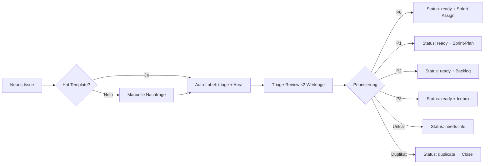

# Issue Triage-Regeln & SLA-Matrix

**Gültig ab:** 2025-10-17  
**Verantwortlich:** Tech Lead + Vorstand  
**Review:** Quartalsweise

---

## 1. Eingang & Triage-Workflow



### Auto-Labeling (GitHub Actions)

- **Trigger:** `issues.opened`, `issues.edited`
- **Logik:**
  - Pfad/Modul in Titel/Body → Area-Label (`area/frontend`, `area/api` etc.)
  - Keywords: `bug`, `feature`, `security`, `docs` → Type-Label
  - Alle starten mit `triage` + `needs-info` (falls Template-Felder leer)

---

## 2. Priorisierungs-Matrix (SLA)

| Priority | Beschreibung | Beispiele | Analyse-SLA | Umsetzungs-SLA | Assignee |
|----------|-------------|-----------|-------------|----------------|----------|
| **P0-Critical** | Produktions-Blocker, Sicherheitslücken HIGH/CRITICAL, Datenverlust-Risiko, rechtliche Compliance-Verletzung | - Zero-Day Security Exploit<br>- DSGVO-Verstoß (PII-Leak)<br>- Komplette Service-Ausfälle<br>- Zahlungs-Gateway down | ≤ 4h | ≤ 24h (Workaround)<br>≤ 72h (Fix) | Tech Lead + Domain-Expert |
| **P1-High** | Feature-Blocker im aktuellen Release, Performance-Degradation >50%, kritische Bugs ohne Workaround | - Login-Fehler (50% User)<br>- Mitgliederantrag nicht absendbar<br>- API-Response-Time >5s<br>- n8n-Webhooks fehlschlagen | ≤ 1 Werktag | ≤ 1 Woche | Domain-Expert |
| **P2-Medium** | Qualitätsverbesserungen, Tech-Debt, kleinere Bugs mit Workaround, Feature Requests für nächste Releases | - UI-Inkonsistenzen<br>- Lighthouse Score <0.90<br>- Fehlende Tests (Coverage <80%)<br>- Dokumentations-Lücken | ≤ 1 Woche | 1-3 Wochen | Team Rotation |
| **P3-Low** | Nice-to-have, kosmetische Fixes, Optimierungen ohne Dringlichkeit | - Tooltip-Texte<br>- README-Verbesserungen<br>- Code-Style-Anpassungen | Nach Kapazität | Nach Kapazität | Good First Issue |

### Arbeitszeiten (Europa/Vienna)

- **Werktage:** Mo-Fr 09:00-17:00 CET/CEST
- **On-Call (P0):** 24/7 via GitHub Notifications + n8n Alerting
- **Stale-Policy:** Inaktiv ≥60 Tage → Auto-Comment (`needs-info`); ≥90 Tage ohne Reaktion → Close mit Rückhol-Hinweis

---

## 3. Definition of Ready (DoR) – Bevor Issue → `ready`

### Pflichtfelder (alle Priorities)

- ✅ **Titel:** Klar, action-orientiert (Verb + Objekt: "Implementiere X", "Behebe Y")
- ✅ **Type-Label:** `bug`, `feature`, `task`, `chore`, `documentation`, `refactor`, `spike`
- ✅ **Priority-Label:** `P0-Critical`, `P1-High`, `P2-Medium`, `P3-Low`
- ✅ **Area-Label:** `area/frontend`, `area/api`, `area/crm`, `area/drupal`, `area/devops`, `area/security`, `area/n8n`, `area/billing`, `area/i18n`, `area/a11y`
- ✅ **Kontext:** Was ist das Problem/die Anforderung? (User Story Format bevorzugt: "Als [Rolle] möchte ich [Aktion], damit [Nutzen]")

### P0/P1 zusätzlich

- ✅ **Akzeptanzkriterien (Gherkin):**
  ```gherkin
  Gegeben sei [Ausgangslage]
  Wenn [Aktion]
  Dann [Erwartetes Ergebnis]
  ```
- ✅ **Reproduktions-Schritte (Bugs):** 1-2-3 Steps to Reproduce, Expected vs. Actual
- ✅ **Messgrößen/KPIs:** Wie wird Erfolg gemessen? (z. B. "Lighthouse Performance ≥0.90", "API Response-Time <500ms")
- ✅ **Abhängigkeiten:** Blockiert durch / Blockiert andere Issues (Cross-Links)

### P2/P3 optional

- 📋 **Lösungsvorschlag:** Technischer Ansatz (falls bekannt)
- 📋 **Risiken:** Security/DSGVO/Performance-Implikationen
- 📋 **Verweise:** ADRs, Docs, PRs, externe Tickets

---

## 4. Definition of Done (DoD) – Bevor Issue → `done`

### Alle Issues

- ✅ **Code gemerged:** PR approved + merged in `main`
- ✅ **Tests bestanden:** Alle relevanten Tests grün (Unit, Integration, E2E)
- ✅ **Quality Gates:** `npm run quality:gates` erfolgreich
  - Codacy ≥85% Maintainability, ≤2% Duplication
  - Trivy: 0 HIGH/CRITICAL Vulnerabilities
  - Gitleaks: 0 Secrets
  - Lighthouse: ≥0.90 (Performance, A11y, Best Practices, SEO)
  - DSGVO: 0 PII in Logs
- ✅ **Dokumentation:** README/ADR/CHANGELOG aktualisiert (falls relevant)
- ✅ **Deployment:** Staging erfolgreich deployed + Smoke-Tests OK

### P0/P1 zusätzlich

- ✅ **Post-Mortem:** Incident-Report erstellt (bei P0-Bugs: `quality-reports/incident-*.md`)
- ✅ **Regression-Tests:** Neue Tests für Bug-Fix (Coverage-Diff ≥0%)
- ✅ **Stakeholder-Bestätigung:** Product Owner / Tech Lead Signoff

---

## 5. Stale-Policy & Auto-Close

### Inaktivitäts-Schwellen

| Status | Inaktiv | Aktion | Bot-Comment |
|--------|---------|--------|-------------|
| `triage` | ≥14 Tage | → `needs-info` | "Benötigte Informationen fehlen. Bitte Template vollständig ausfüllen." |
| `needs-info` | ≥30 Tage | Auto-Comment | "Ping: Fehlende Infos? Issue wird in 30 Tagen geschlossen." |
| `needs-info` | ≥60 Tage | → Close (stale) | "Geschlossen wegen fehlender Informationen. Reaktivierung jederzeit möglich via Comment." |
| `ready` / `in-progress` | ≥90 Tage | → `needs-info` | "Keine Aktivität seit 90 Tagen. Noch relevant? Bitte Status aktualisieren." |
| `blocked` | ≥60 Tage | Manuelle Review | Tech Lead prüft Abhängigkeiten, ggf. Scope-Änderung oder Close |

### Ausnahmen (keine Auto-Close)

- `P0-Critical`, `P1-High` (manuelle Entscheidung)
- `milestone/*` (explizit zugeordnet)
- Label `keep-alive` (bei langfristigen Epics/Spikes)

---

## 6. Duplikat-Handling

### Identifikation

- **Manuell:** Triage-Reviewer erkennt Ähnlichkeit
- **Automatisiert:** GitHub Action mit Fuzzy-Match (Titel + Body Similarity >80%)

### Workflow

1. **Markieren:** `duplicate` Label + Comment mit Link zum Kanon-Issue
2. **Inhalte migrieren:** Relevante Details/Comments aus Duplikat kopieren
3. **Schließen:** Status → Closed, Referenz: "Duplicate of #123"
4. **Kanonisches Issue:** Cross-Link ergänzen: "See also #456 (duplicate)"

---

## 7. Eskalations-Pfad

```text
P3 → P2 → P1 → P0
   ↑     ↑     ↑
   │     │     └─ Tech Lead Entscheidung (bei Produktions-Impact)
   │     └─ Domain-Expert Eskalation (bei Feature-Block)
   └─ Team-Vote (bei steigender User-Nachfrage)
```

### Eskalations-Kriterien

- **P3 → P2:** ≥5 User-Votes (👍 Reactions) oder repeated Mentions
- **P2 → P1:** Blockiert aktuellen Release-Plan (Milestone-Deadline gefährdet)
- **P1 → P0:** Sicherheitslücke entdeckt, Datenverlust-Risiko, rechtliche Compliance-Verletzung

---

## 8. Beispiel-Template-Snippets

### Bug Report (`.github/ISSUE_TEMPLATE/bug_report.md`)

```markdown
## Kontext
**Was ist passiert?** [Kurze Beschreibung]
**Erwartetes Verhalten:** [Was sollte passieren?]

## Reproduktion
1. Gehe zu [URL/Seite]
2. Klicke auf [Element]
3. Beobachte [Fehler]

## Akzeptanzkriterien (Gherkin)
Gegeben sei [Ausgangslage]
Wenn [Aktion]
Dann [Erwartetes Ergebnis]

## Umgebung
- **Browser/OS:** Chrome 120 / Windows 11
- **Service:** Frontend / API / CRM
- **Version/Commit:** `abc123` oder Production

## Logs/Screenshots
[Anhängen oder Link zu quality-reports/]
```

### Feature Request (`.github/ISSUE_TEMPLATE/feature_request.md`)

```markdown
## Ziel/Outcome
**Als** [Rolle] **möchte ich** [Aktion], **damit** [Nutzen].

## Akzeptanzkriterien (Gherkin)
Gegeben sei [Kontext]
Wenn [User-Aktion]
Dann [System-Verhalten]

## Messgrößen/KPIs
- [ ] Lighthouse Performance ≥0.90
- [ ] API Response-Time <500ms
- [ ] Test Coverage ≥80%

## Lösungsvorschlag (optional)
[Technischer Ansatz / UI-Mockups / Architektur-Skizze]

## Abhängigkeiten
- Blockiert durch: #123
- Blockiert: #456

## Risiken
- [ ] Security-Review erforderlich
- [ ] DSGVO-Impact (PII-Verarbeitung)
- [ ] Performance-Impact (DB-Schema-Änderung)
```

---

## 9. Automatisierungs-Hooks (Beispiele)

### GitHub Actions

**Label-Normalizer** (`.github/workflows/label-normalize.yml`):
```yaml
name: Label Normalizer
on: [issues, pull_request]
jobs:
  normalize:
    runs-on: ubuntu-latest
    steps:
      - uses: actions/labeler@v5
        with:
          configuration-path: .github/label-mapping.yml
```

**Stale-Bot** (`.github/workflows/stale.yml`):
```yaml
name: Stale Issue Handler
on:
  schedule:
    - cron: '0 2 * * *' # Daily 02:00 CET
jobs:
  stale:
    runs-on: ubuntu-latest
    steps:
      - uses: actions/stale@v9
        with:
          days-before-stale: 60
          days-before-close: 30
          stale-issue-label: 'needs-info'
          exempt-issue-labels: 'P0-Critical,P1-High,keep-alive'
```

### n8n Workflows

**Support-Mail → Issue**:
- Trigger: E-Mail an `support@menschlichkeit-oesterreich.at`
- Aktion: GitHub API `POST /repos/{owner}/{repo}/issues` mit Template-Felder aus E-Mail-Body

**Stripe Payment Failed → Billing Issue**:
- Trigger: Stripe Webhook `payment_intent.payment_failed`
- Aktion: GitHub Issue mit Label `area/billing`, `P1-High`, Link zu Stripe Dashboard

---

## 10. Compliance & Audit-Trail

### DSGVO-Relevanz

- **Issue-Bodies:** Keine PII im Klartext (E-Mails/IBANs maskieren: `t**@example.com`, `AT61***`)
- **Screenshots:** Vor Upload PII schwärzen (Tools: `pii_sanitizer.py`)
- **Comments:** Automatische PII-Maskierung via GitHub App (geplant)

### Aufbewahrung

- **Offene Issues:** Unbegrenzt (aktive Arbeit)
- **Geschlossene Issues:** Permanent (Audit-Trail, Compliance, Knowledge Base)
- **Stale/Closed (Duplikat):** Permanent, aber `archive` Label nach 1 Jahr

---

## 11. Review & Updates

- **Quartalsweise Review:** Tech Lead + Vorstand prüfen SLA-Einhaltung, Triage-Qualität, Stale-Rate
- **Anpassungen:** Via PR mit Label `governance`, Approval durch CODEOWNERS
- **Change Log:** Versionsnummer + Datum in diesem Dokument (Footer)

---

**Version:** 1.0.0  
**Erstellt:** 2025-10-17  
**Zuletzt aktualisiert:** 2025-10-17  
**Verantwortlich:** Tech Lead (Peter Schuller)  
**Genehmigt durch:** Vorstand (Statuten § 11)
