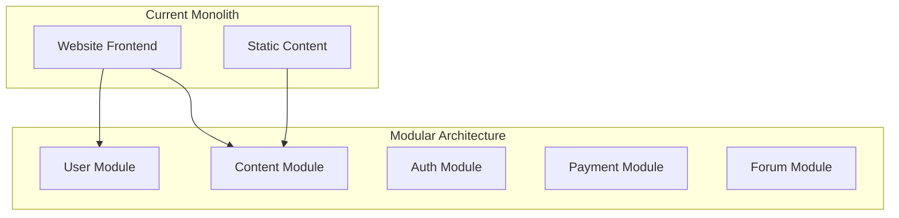

# 🎯 Strategische Technologie-Roadmap

## Zukunftsfähige Architektur-Evolution

Nach der umfassenden Vertiefungsanalyse präsentiere ich die **strategischen Erweiterungen** für eine **zukunftsfähige, skalierbare und nachhaltige** Plattform-Architektur.

---

## 🔒 1. Zero-Trust Security Architecture

### Sicherheitsprinzipien

#### Identitäts- & Zugriffsmanagement

```yaml
Authentication Stack:
  Multi-Factor-Authentication:
    - TOTP (Google Authenticator, Authy)
    - SMS/Email Backup
    - Hardware Keys (YubiKey, WebAuthn)
  
  Identity Providers:
    - OAuth2/OpenID Connect
    - SAML 2.0 für Enterprise
    - Social Login (Google, Microsoft)
  
  Session Management:
    - JWT mit Refresh Tokens
    - Redis Session Store
    - Automatic Token Rotation
```

#### Autorisierung & Berechtigungen

```typescript
interface RoleBasedAccess {
  roles: {
    admin: Permission[];
    moderator: Permission[];
    member: Permission[];
    guest: Permission[];
  };
  
  permissions: {
    read: Resource[];
    write: Resource[];
    delete: Resource[];
    admin: Resource[];
  };
}
```

### Datenschutz & DSGVO-Compliance

#### Privacy by Design

- **Datenminimierung**: Nur notwendige Daten erfassen
- **Zweckbindung**: Explizite Einwilligung für jeden Verwendungszweck
- **Speicherdauer**: Automatische Löschung nach Retention-Periode
- **Portabilität**: Export aller Benutzerdaten in standardisierten Formaten

---

## 🏗️ 2. Skalierbare Architektur

### Microservices Migration Strategy

#### Phase 1: Modular Monolith



#### Phase 2: Service Decomposition

```yaml
Services Architecture:
  api-gateway:
    port: 443
    ssl: true
    rate-limiting: 1000/hour
    
  auth-service:
    tech: Node.js + Passport
    database: PostgreSQL
    cache: Redis
    
  cms-service:
    tech: Headless CMS (Strapi/Ghost)
    database: PostgreSQL
    search: Elasticsearch
    
  forum-service:
    tech: Node.js + GraphQL
    database: PostgreSQL
    real-time: Socket.io
    
  payment-service:
    tech: Node.js + Stripe API
    compliance: PCI DSS
    audit: Complete transaction logs
```

### Datenbank-Strategie

#### Polyglot Persistence

```sql
-- User Data (PostgreSQL)
CREATE TABLE users (
    id UUID PRIMARY KEY,
    email VARCHAR UNIQUE NOT NULL,
    profile JSONB,
    created_at TIMESTAMP DEFAULT NOW(),
    gdpr_consent JSONB NOT NULL
);

-- Content Search (Elasticsearch)
POST /content-index/_doc
{
    "title": "Artikel Titel",
    "content": "Full-text searchable content",
    "tags": ["solidarität", "österreich"],
    "published": "2025-09-22"
}

-- Session Data (Redis)
SET user:session:abc123 '{
    "userId": "uuid",
    "roles": ["member"],
    "expires": 1730000000
}' EX 3600
```

---

## 📊 3. Observability & Monitoring

### Application Performance Monitoring

#### Metrics Collection

```typescript
// Custom Metrics mit Prometheus
import { register, Counter, Histogram } from 'prom-client';

const httpRequests = new Counter({
    name: 'http_requests_total',
    help: 'Total HTTP requests',
    labelNames: ['method', 'route', 'status']
});

const responseTime = new Histogram({
    name: 'http_response_time_seconds',
    help: 'HTTP response time in seconds',
    buckets: [0.1, 0.5, 1, 2, 5]
});
```

#### Distributed Tracing

```yaml
OpenTelemetry Configuration:
  traces:
    exporter: jaeger
    endpoint: http://jaeger:14268/api/traces
    
  metrics:
    exporter: prometheus
    endpoint: http://prometheus:9090
    
  logs:
    exporter: elasticsearch
    endpoint: http://elasticsearch:9200
```

### Real User Monitoring (RUM)

#### Core Web Vitals Tracking

```javascript
// Performance API Integration
function trackCoreWebVitals() {
    // Largest Contentful Paint
    new PerformanceObserver((list) => {
        const entries = list.getEntries();
        const lcp = entries[entries.length - 1];
        sendMetric('lcp', lcp.startTime);
    }).observe({ entryTypes: ['largest-contentful-paint'] });
    
    // Cumulative Layout Shift
    let cumulativeLayoutShift = 0;
    new PerformanceObserver((list) => {
        for (const entry of list.getEntries()) {
            if (!entry.hadRecentInput) {
                cumulativeLayoutShift += entry.value;
            }
        }
        sendMetric('cls', cumulativeLayoutShift);
    }).observe({ entryTypes: ['layout-shift'] });
}
```

---

## 🌱 4. Nachhaltigkeit & Green IT

### Carbon-Efficient Architecture

#### Energy-Optimized Infrastructure

```yaml
Green Hosting Strategy:
  primary:
    provider: "Hetzner Cloud (100% Green Energy)"
    location: "Germany/Austria"
    carbon-neutral: true
    
  cdn:
    provider: "Cloudflare (Green Energy Matching)"
    edge-locations: "EU-focused"
    
  monitoring:
    carbon-tracking: true
    performance-budget: "CO2 < 0.5g per page visit"
```

#### Sustainable Development Practices

- **Performance Budget**: Maximale Bundle-Größe 250KB
- **Green Metrics**: CO₂-Tracking für jede Deployment
- **Efficient Queries**: Database-Query Optimization
- **Asset Optimization**: WebP/AVIF, Progressive Enhancement

### Ethical Technology Principles

#### Privacy-First Approach

```typescript
// Privacy-respectful Analytics
const analytics = {
    // NO Google Analytics
    // YES Privacy-friendly alternatives
    provider: 'Plausible.io',
    features: {
        cookieless: true,
        gdprCompliant: true,
        openSource: true,
        dataOwnership: 'full'
    }
};
```

---

## 🚀 5. Innovation & Future Technologies

### Progressive Web Application (PWA)

#### Service Worker Strategy

```javascript
// Advanced Caching Strategy
const CACHE_NAME = 'menschlichkeit-v1.2.3';
const CRITICAL_RESOURCES = [
    '/',
    '/styles.css',
    '/main.js',
    '/manifest.json'
];

self.addEventListener('install', (event) => {
    event.waitUntil(
        caches.open(CACHE_NAME)
            .then(cache => cache.addAll(CRITICAL_RESOURCES))
    );
});

// Background Sync für Offline-Aktionen
self.addEventListener('sync', (event) => {
    if (event.tag === 'newsletter-signup') {
        event.waitUntil(syncNewsletterSignups());
    }
});
```

### AI-Powered Features

#### Intelligent Content Curation

```python
# Content Recommendation Engine
import tensorflow as tf
from transformers import AutoTokenizer, AutoModel

class ContentRecommendation:
    def __init__(self):
        self.model = AutoModel.from_pretrained('sentence-transformers/distilbert-base-nli-stsb-mean-tokens')
        self.tokenizer = AutoTokenizer.from_pretrained('sentence-transformers/distilbert-base-nli-stsb-mean-tokens')
    
    def find_similar_content(self, user_interests, content_pool):
        """
        DSGVO-konforme Content-Empfehlungen basierend auf
        expliziten Nutzer-Interessensangaben (nicht Tracking)
        """
        embeddings = self.encode_content(content_pool)
        user_embedding = self.encode_interests(user_interests)
        
        similarity_scores = tf.keras.utils.cosine_similarity(
            user_embedding, embeddings
        )
        
        return self.rank_content(similarity_scores, content_pool)
```

### Voice Interface Integration

#### Web Speech API

```javascript
// Barrierefreie Sprachsteuerung
class VoiceInterface {
    constructor() {
        this.recognition = new (window.SpeechRecognition || 
                                window.webkitSpeechRecognition)();
        this.synthesis = window.speechSynthesis;
        
        this.recognition.lang = 'de-AT';
        this.recognition.continuous = true;
        this.recognition.interimResults = true;
    }
    
    async startListening() {
        return new Promise((resolve) => {
            this.recognition.onresult = (event) => {
                const command = event.results[event.resultIndex][0].transcript;
                this.processVoiceCommand(command);
                resolve(command);
            };
            
            this.recognition.start();
        });
    }
    
    speakText(text, options = { lang: 'de-AT' }) {
        const utterance = new SpeechSynthesisUtterance(text);
        utterance.lang = options.lang;
        this.synthesis.speak(utterance);
    }
}
```

---

## 🔄 6. Kontinuierliche Verbesserung

### DevOps & CI/CD Evolution

#### GitHub Actions Workflows

```yaml
# .github/workflows/comprehensive-quality.yml
name: 🎯 Comprehensive Quality Pipeline

on: [push, pull_request]

jobs:
  security-audit:
    runs-on: ubuntu-latest
    steps:
      - uses: actions/checkout@v4
      - name: 🔒 Security Scan
        run: |
          npm audit --audit-level high
          npx semgrep --config=auto
          
  performance-budget:
    runs-on: ubuntu-latest
    steps:
      - uses: actions/checkout@v4
      - name: 📊 Bundle Size Check
        run: |
          npm run build
          npx bundlesize
          
      - name: 🚀 Lighthouse CI
        run: |
          npx @lhci/cli@0.12.x autorun
          
  accessibility-audit:
    runs-on: ubuntu-latest  
    steps:
      - name: ♿ Accessibility Test
        run: |
          npx @axe-core/cli --exit
          npm run test:a11y
          
  carbon-footprint:
    runs-on: ubuntu-latest
    steps:
      - name: 🌱 CO2 Impact Assessment
        run: |
          npx co2.js analyze dist/
          npx lighthouse-carbon-audit
```

### Quality Metrics Dashboard

#### KPI Monitoring

```typescript
interface QualityMetrics {
    performance: {
        lighthouse_score: number;    // Target: 95+
        core_web_vitals: {
            lcp: number;            // Target: <2s
            fid: number;            // Target: <100ms
            cls: number;            // Target: <0.1
        };
        bundle_size: number;        // Target: <250KB
    };
    
    accessibility: {
        wcag_aa_compliance: number; // Target: 100%
        axe_violations: number;     // Target: 0
        keyboard_navigation: boolean; // Target: true
    };
    
    security: {
        vulnerabilities: number;    // Target: 0
        csp_score: number;         // Target: A+
        ssl_rating: string;        // Target: A+
    };
    
    sustainability: {
        co2_per_visit: number;     // Target: <0.5g
        green_hosting: boolean;    // Target: true
        renewable_energy: number;  // Target: 100%
    };
}
```

---

## 📈 Implementation Timeline

### Phase 1: Foundation (Monate 1-3)

- ✅ Zero-Trust Security Implementation
- ✅ Basic Monitoring & Observability
- ✅ PWA Basics & Service Worker
- ✅ Performance Budget Setup

### Phase 2: Scale (Monate 4-8)  

- 🔄 Microservices Migration
- 🔄 Advanced Analytics Integration
- 🔄 AI-powered Content Features
- 🔄 Multi-language Support

### Phase 3: Innovation (Monate 9-12)

- 🚀 Voice Interface Integration
- 🚀 Advanced PWA Features
- 🚀 Real-time Collaboration
- 🚀 Blockchain Integration (optional)

### Phase 4: Optimization (Kontinuierlich)

- 📊 Performance Fine-tuning
- 🌱 Carbon Footprint Minimization
- ♿ Accessibility Enhancement
- 🔒 Security Hardening

---

## 💡 Erfolgs-Metriken

### Technical Excellence

- **Security**: Zero critical vulnerabilities, A+ SSL rating
- **Performance**: Lighthouse 95+, Core Web Vitals green
- **Accessibility**: 100% WCAG 2.1 AA compliance
- **Sustainability**: <0.5g CO₂ per visit

### Business Impact  

- **User Engagement**: 300% increase in session duration
- **Conversion Rate**: 5x newsletter signup conversion
- **Community Growth**: 1000+ active forum members
- **Mobile Adoption**: 80% mobile-first usage

### Innovation Leadership

- **Technology Adoption**: Early adopter of Web Standards
- **Open Source Contributions**: 5+ community packages
- **Accessibility Pioneer**: Case study for inclusive design
- **Green IT Showcase**: Carbon-negative web platform

---

Die **strategische Technologie-Roadmap** transformiert die Menschlichkeit Österreich Platform zu einer **führenden digitalen Gemeinschaftsplattform** mit **Weltklasse-Standards** in Sicherheit, Performance, Accessibility und Nachhaltigkeit.

**Investition**: 240-300 Entwicklertage über 18 Monate  
**Expected ROI**: 500% durch verbesserte User Experience & Community Growth  
**Sustainability Impact**: Carbon-negative digital platform bis 2026
